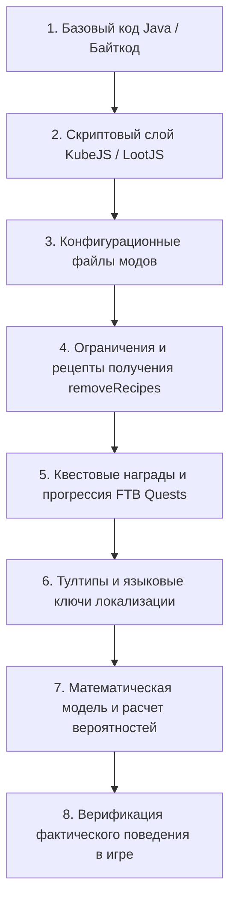

# Навык: Аудит игровых механик и фактчекинг (audit_game_mechanic)

Навык используется для технического исследования игровых механик сборки, извлечения точных формул из KubeJS-скриптов, декомпиляции `.jar` файлов сторонних модов, проверки доступности предметов в сборке, сверки игровых описаний с реальным поведением кода и создания постоянных баз знаний по механикам.

---

## 1. Когда применять этот навык
* Перевод или доработка квеста с описанием сложной механики (шансы, проценты, время, условия).
* Проверка скрытых свойств модов: *«Что делает эта антенна?», «Как переключается режим мины?», «Какая длительность эффекта?»*.
* **Фактчекинг описаний разработчиков:** проверка утверждений автора мода/квеста на полноту и соответствие коду (часто авторы пишут лишь часть правды или дают устаревшие данные).
* **Проверка доступности предметов в сборке:** выявление предметов, которые отключены разработчиками модпака (удалены рецепты, скрыты из JEI).
* Создание постоянного файла документации `tasks/<имя_задачи>/docs/MECHANICS-AUDIT.md`.

---

## 2. Порядок исследования (Full-Stack Mechanics Pipeline)

Механика предмета или сущности редко существует изолированно — она распределена по нескольким уровням кодовой базы. Исследование обязано проходить сквозной 8-этапный пайплайн:

---

### Шаг 1. Локализация кода механики и реверс-инжиниринг

#### А. Скрипты KubeJS и конфиги:
Искать в `D:\ModrinthApp\profiles\Society_ Sunlit Valley\`:
* `kubejs/server_scripts/` — логика событий, награды, крафты, тики, дропы (`LootJS`, `ItemEvents`, `LevelEvents`).
* `kubejs/client_scripts/` — интерфейсы, тултипы (`ItemEvents.tooltip`), кастомный JEI.
* `kubejs/startup_scripts/` — регистрация блоков, предметов, свойств, конфигов.
* `config/` — конфиги модов (Puffish Skills, Serene Seasons, In Control и др.).

#### Б. Реверс-инжиниринг бинарных `.jar` модов:
Если логика находится в скомпилированном моде (`mods/<modname>.jar`):
1. **Извлечение классов:** Использовать Python `zipfile` для распаковки `.class` файлов во временную директорию (`scratch/`).
2. **Дизассемблирование:** Выполнить `javap -p -c -constants <ClassName>.class`.
3. **🚨 Железное правило деобфускации (Запрет догадок по SRG-именам):**
   * **КАТЕГОРИЧЕСКИ ЗАПРЕЩЕНО** угадывать смысл полей и тегов `f_XXXXX_` по интуиции или тематике мода.
   * **Обязательная сверка по маппингам:** Сопоставлять SRG-имена с Mojmap через официальные кэши Forge (`forge-*-srg.jar` $\leftrightarrow$ `forge-*-mapped_official_*.jar` в `.gradle/caches/`) или таблицы маппингов.
4. **Анализ ключевых паттернов:**
   * **Тикеры блоков/сущностей:** `BlockEntityTicker.serverTick`, `CustomSpawner.tick` — проверка радиусов `AABB.inflate(D)` и списков сущностей.
   * **Взаимодействие игрока:** `Block.use`, `Item.use`, `Item.useOn`, `Item.releaseUsing`.
   * **Кулдауны и прочность:** `ItemCooldowns.addCooldown`, `ItemStack.hurtAndBreak`, `durabilityChance`.
   * **Пул констант (`ldc`):** Точные числа (урон, радиус, проценты, веса).

#### В. 🚫 Проверка доступности и источников получения (Provenance & Availability Check):
Перед формированием выводов и тултипов обязательно проверить:
1. `kubejs/startup_scripts/globalRemovedItems.js` — не внесён ли предмет в списки `global.removedItems` или `global.hiddenItems`.
2. `kubejs/client_scripts/hideJEIItems.js` — не скрыт ли предмет из каталога JEI.
3. `kubejs/server_scripts/recipes/removeRecipes.js` — не удалены ли его рецепты автором сборки.
4. `config/ftbquests/quests/chapters/` — не является ли предмет эксклюзивной наградой квестов/узелков Клуба.

* **Если предмет отключён:**
  * Зафиксировать в `MECHANICS-AUDIT.md` статус: `⚠️ ОТКЛЮЧЕНО В СБОРКЕ`.
  * **НЕ генерировать** для него клиентские тултипы (`ItemEvents.tooltip`), чтобы не путать игрока.
* **Если рецепт верстака удалён, но предмет выдаётся в квесте:**
  * Зафиксировать статус: `🎁 ЭКСКЛЮЗИВНАЯ НАГРАДА КВЕСТА`.

#### Г. 🚨 Обязательный поиск KubeJS-расширений и кастомных систем сборки:
Модпаки часто полностью переписывают или надстраивают механику мода через KubeJS.
При аудите **ЛЮБОГО** мода агент **ОБЯЗАН** провести сквозной поиск по `kubejs/` по namespace и именам сущностей/предметов:
1. **Модификация сущностей (`EntityJSEvents.modifyEntity`):**
   * Поиск по `<namespace>:<entity_name>` в `kubejs/startup_scripts/` и `kubejs/server_scripts/`.
   * Проверка кастомных тикеров (`entity.level.time % X`), логики кормления, спаривания, пассивных дропов и штрафов за скученность (overcrowding penalties).
2. **Кастомные блоки и машины сборки:**
   * Проверка `kubejs/startup_scripts/powerfulMachines/`, `customMachines/` — не добавлены ли инкубаторы, переработчики или автофермы для сущностей мода.
3. **Глобальные реестры и экономика (`globalRegistry.js`):**
   * Проверка массивов `global.<modname>`, формул сбыта в Shipping Bin (`(16 - rarity) * X`), таблиц скрещивания/генерации в `server_scripts/datagen/wikigen/`.
4. **События дропа и сбора (`LootJS`, `BlockEvents.broken`, `ItemEvents.entityInteracted`):**
   * Проверка модификации лута и кастомных взаимодействий с сущностями мода.
5. **🚨 Анализ таймеров и времени работы (Тики vs Утренний суточный цикл):**
   * **Запрет слепого пересчёта тиков в секунды:** Запрещено рассчитывать время работы как `serverTick(rate) * stageCount / 20 сек` без глубокой проверки тела функции тикера (`handleBETick`, `serverTick`).
   * **Проверка суточного модуло (`dayTime % 24000`):** Если внутри тикера проверяется время мира (`level.dayTime() % 24000` или `morningModulo`), параметр `tickRate` задаёт не интервал ожидания, а **окно утренней верификации после рассвета (6:00 AM)**. Каждая стадия (`stageCount`) продвигается **строго 1 раз в сутки каждое утро**, а длительность работы станка измеряется в **полных игровых днях**.
   * **Разделение типов таймеров:**
     - **Суточный таймер (Day-Cycle):** `dayTime % 24000` $\rightarrow$ измеряется в игровых днях (продвигается сном в кровати или естественным рассветом в 6:00 AM).
     - **Непрерывный тикер (Continuous Ticker):** `COOKING_TIME_IN_TICKS`, `progress++` $\rightarrow$ измеряется в реальных секундах/минутах непрерывной работы в активном чанке.
6. **🚨 Нативные UI-подсказки (`item.tooltip`) и аудит старого перевода:**
   * Проверить файл регистрации блока/предмета в `kubejs/startup_scripts/` на наличие вызовов `item.tooltip(Text.translatable(...))`.
   * Извлечь все используемые разработчиком ключи (`*.description`, `society.working_block_entity.*`).
   * Проверить их текущий перевод в `ru_ru.json`: оценить качество, стиль и актуальность.
   * Проверить, используется ли ключ в группе других предметов (каскадный охват), чтобы улучшить весь пул связанных блоков без дублирования информации в новых подсказках.

---

### Шаг 2. Анализ математики, каскадных Mixin и вероятностей

#### 1. Анализ цепочек Mixin-инъекций (Дерево условных вероятностей)
Когда несколько модов или скриптов перехватывают один и тот же метод через `@Inject(..., cancellable = true)`:
* **Запрет домыслов:** Наличие нескольких инъекций **НЕ означает** автоматического деления вероятностей поровну (например, $33\% / 33\% / 33\%$).
* **Процедура анализа:**
  1. Восстановить реальный порядок вызова инъекций (приоритеты Mixin, загрузчик, конфигурация).
  2. Проверить условия отмены (`cancellable = true`, `cir.setReturnValue(...)`) и условия пропуска к следующему обработчику.
  3. Построить **дерево условных вероятностей** на основе фактического потока управления (Control Flow).

#### 2. 🚨 Обязательное разделение «Факта в коде» и «Производной модели»
В отчётах и документах аудита **строго разделять**:
* **Первичный факт (Raw Code Fact):** точные цитаты инструкций байткода/скрипта (`this.random.nextInt(100) <= currentChance`, `this.random.nextInt(10) == 0`).
* **Производный расчёт (Derived Math):** математический вывод из первичных фактов ($25\% \times 10\% = \mathbf{2.5\%}$).

---

### Шаг 3. Фактчекинг: сверка текста описания с реальностью кода
Сравнить утверждение автора мода/квеста с реальной логикой в коде:
1. **Точность цифр:** Если текст говорит «шанс 50%», а в коде `0.33` $\rightarrow$ зафиксировать реальное число.
2. **Полнота механики:** Если автор мода указал часть свойств, но скрыл важные нюансы (дополнительные дропы в KubeJS, переключение режимов кликом рыбы) $\rightarrow$ вынести это свойство в отчёт.
3. **Запрет домыслов:** Если поведение не удалось однозначно установить по коду — оно **ОБЯЗАНО** быть помечено как `НЕ ПОДТВЕРЖДЕНО`.

---

### Шаг 4. Документирование и сохранение в базу знаний
При исследовании любого нового мода или комплексной механики результат сохраняется в постоянный файл:
👉 `tasks/<имя_задачи>/docs/MECHANICS-AUDIT.md` (или корневую `docs/`)

Структура документа аудита:
1. **Сводный реестр механик (со статусом активности и источниками получения).**
2. **Подробный технический разбор:** активация, поведение, условия, радиусы, кулдауны, Java-классы и методы.
3. **Первичные факты кода $\leftrightarrow$ Производная математическая модель.**
4. **Сверка с описаниями/квестами:** соответствие, расхождения, скрытые нюансы.
5. **Интерактивные предметы и блоки:** готовые семантические формулировки тултипов для доступных игроку предметов.

#### 🛡️ Чистота разметки Markdown и защита формул:
* **Запрет сырого LaTeX с долларами ($...$):** Использовать чистый, читаемый Markdown/Unicode (`≥`, `×`, `→`, `min()`, `P = 2/25 = 8.0%`), исключая сбои рендеринга.
* **Защита Python-скриптов:** При записи Markdown через Python ВСЕГДА использовать сырые строки `r'''...'''` или явную замену спецсимволов, предотвращая превращение `\t` в табуляцию, а `\r` в возврат каретки.

---

## 3. Двухуровневая модель аудита и переход на Уровень 2

Процесс аудита в сборке разделяется на два взаимодополняющих уровня глубины:

| Уровень | Название | Назначение | Итоговый артефакт |
| :---: | :--- | :--- | :--- |
| **Уровень 1** | **Базовый технический аудит** | Сверка байткода, KubeJS, доступность предметов, базовые формулы, первичный фактчекинг | [`docs/MECHANICS-AUDIT.md`](file:///tasks/<имя_задачи>/docs/MECHANICS-AUDIT.md) |
| **Уровень 2** | **Глубокое исследование (3 итерации)** | Поиск скрытых выгод, связок $A+B$, эксплойтов, оптимизаций, контринтуитивных порогов и подготовка базы знаний | [`docs/DEEP-MECHANICS-AUDIT.md`](file:///tasks/<имя_задачи>/docs/DEEP-MECHANICS-AUDIT.md) |

Подробный регламент Уровня 2 описан в:
👉 [`SKILL_NEXT_LEVEL.md`](file:///c:/Users/Foxi8/OneDrive/Рабочий%20стол/СозданиеПеревода/.agents/skills/audit_game_mechanic/SKILL_NEXT_LEVEL.md)

---

### 💬 Послесловие: Запрос на проведение дополнительного аудита
После завершения Уровня 1 и отправки отчёта пользователю агент **всегда предлагает** углубиться в механику вопросом:

> *«Базовый технический аудит завершён и сохранён в `MECHANICS-AUDIT.md`. **Провести дополнительный глубокий аудит (Уровень 2: 3 итерации)** для поиска скрытых связок, способов получения выгоды, расчёта оптимизаций и контринтуитивных механик?»*

