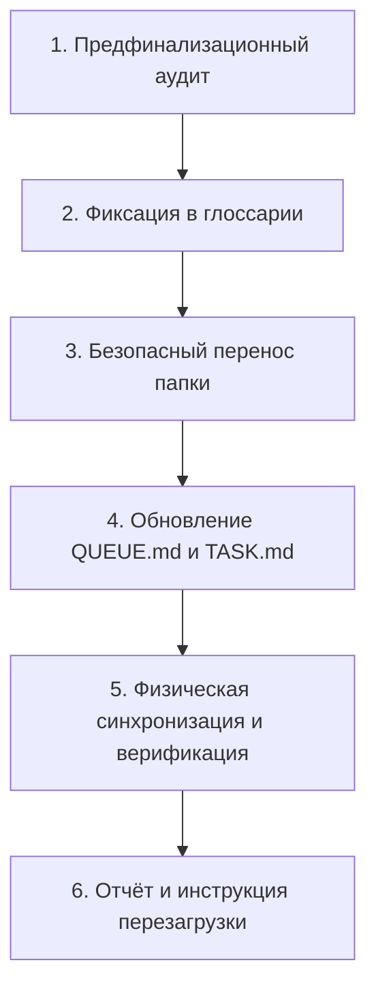

# Навык: Завершение перевода мода (finalize_mod_translation)

Навык регламентирует и автоматизирует финальный шаг конвейера локализации модов: от сверки точности аудита механик до переноса папки задачи в архив и обновления общей очереди модов.



---

## 🚨 ЖЕЛЕЗНЫЕ ПРАВИЛА И ИНВАРИАНТЫ:

1. **ЗАПРЕТ ПЕРЕНОСА БЕЗ 100% ПЕРЕВОДА**:
   - В `translations/mods/<namespace>.json` должно быть ровно 0 непереведённых строк и 0 английских заглушек.
   
2. **СВЕРКА АУДИТА С РЕАЛЬНЫМ БАЙТКОДОМ**:
   - Перед завершением убедиться, что описания в `docs/MECHANICS-AUDIT.md` и `docs/DEEP-MECHANICS-AUDIT.md` соответствуют реальному коду Java/KubeJS (например, не писать о несуществующих комбинациях клавиш вроде Shift+ПКМ, если в коде их нет).

3. **ПРОВЕРКА СКРИПТОВ ТУЛТИПОВ И JEI**:
   - Если для мода созданы тултипы (`kubejs_scripts/client/<namespace>Tooltips.js`) или вкладки JEI (`kubejs_scripts/client/<namespace>Jei.js`), они ОБЯЗАНЫ быть зарегистрированы в `sync_all_to_game.js` в секции синхронизации клиентских скриптов.

4. **ЗАПРЕТ МАССОВОЙ ПЕРЕНУМЕРАЦИИ ОЧЕРЕДИ**:
   - При переносе задачи (например, `01_etcetera` $\rightarrow$ `completed/translate_etcetera`) **КАТЕГОРИЧЕСКИ ЗАПРЕЩЕНО** переименовывать оставшиеся 100+ папок (`02_...` в `01_...`). Это создаёт лишний шум в git и ломает историю. В `QUEUE.md` строка просто помечается как завершённая со ссылкой на `completed/`.

---

## 📋 Пошаговый регламент:

### 1️⃣ Предфинализационный аудит
* Запустить проверку словаря:
  ```bash
  python tools/inspect_mod_lang.py <namespace>
  ```
* Проверить, что `translations/mods/<namespace>.json` содержит все актуальные правки из `new_translate.md`.
* Проверить `docs/MECHANICS-AUDIT.md` и `docs/DEEP-MECHANICS-AUDIT.md` на предмет точности формул, радиусов, шансов и триггеров.

### 2️⃣ Фиксация в глоссарии (`glossary.md`)
* Добавить в корневой [`glossary.md`](file:///c:/Users/Foxi8/OneDrive/Рабочий%20стол/СозданиеПеревода/glossary.md) утверждённые названия ключевых предметов, блоков, руд и профессий мода.

### 3️⃣ Автоматизированная финализация скриптом
Использовать специализированный инструмент:
```bash
python tools/finalize_mod.py <folder_name_or_namespace>
```
Скрипт выполняет:
1. Проверку валидности JSON и 100% перевода.
2. Обновление `TASK.md` в папке задачи на статус `✅ ЗАВЕРШЕНО (100.0%)`.
3. Перемещение папки из `tasks/Translate_Mods/<folder>` в `tasks/Translate_Mods/completed/translate_<namespace>`.
4. Обновление `tasks/Translate_Mods/QUEUE.md`:
   - Зачёркивание в таблице активной очереди (`[~~<folder>~~ -> completed]`).
   - Добавление строки в таблицу `🟢 Полностью переведённые моды`.
   - Пересчёт общего счётчика активных и завершённых модов.
5. Запуск `node ./sync_all_to_game.js`.

### 4️⃣ Физическая верификация
* Прочитать напрямую измененные ключи из файла игры:
  `D:\ModrinthApp\profiles\Society_ Sunlit Valley\kubejs\assets\<namespace>\lang\ru_ru.json`.
* Вывести проверенные строки пользователю.

### 5️⃣ Отчёт и инструкция перезагрузки
* **Тексты и тултипы:** перезагружаются по **`F3 + T`**.
* **Категории JEI / Рецепты:** требуют **перезапуска клиента Minecraft**.
* Предложить пользователю следующий мод из очереди `tasks/Translate_Mods/QUEUE.md`.
