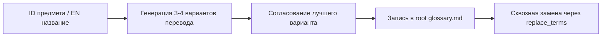

# Навык: Подбор названий и стандартизация предметов (item_naming_and_translation)

Навык обеспечивает быстрый, качественный и согласованный перевод названий предметов, блоков и сущностей по всей сборке.

---

## 1. Процесс работы (Workflow)



---

## 2. Принципы генерации вариантов перевода

Для каждого предмета генерируется **от 3 до 4 вариантов** с указанием их стилистики:

1. **Буквальный / Дословный** — максимально точный перевод всех составляющих частей англоязычного ID/имени.
2. **Атмосферный / Игровой** — литературно адаптированный вариант, звучащий органично в игровом мире Minecraft / Stardew Valley.
3. **Компактный (для инвентаря)** — укороченный вариант без лишних определений, чтобы название легко читалось в слоте инвентаря и JEI.
4. **Контекстный к моду** — с учётом специфики конкретного мода (например, кулинарный стиль для *Bakery/Farmer's Delight*, мебельный стиль для *Cluttered*).

### Пример генерации:
> **Предмет:** `cluttered:row_of_small_books_pastel_shelved`
> 1. *Буквальный:* «Ряд маленьких пастельных книг на полке»
> 2. *Атмосферный (Рекомендуемый):* «Полка с пастельными книгами»
> 3. *Компактный:* «Пастельные книги на полке»
> 4. *Минималистичный:* «Пастельные книги»

---

## 3. Правила наименования (Конвенции сборки)

* **Регистр:** Все названия предметов пишутся с **Заглавной буквы** в начале, остальные слова со строчной (кроме имён собственных).
  * *Правильно:* «Сервировочная доска», «Красный гаечный ключ».
  * *Неправильно:* «Сервировочная Доска», «красный гаечный ключ».
* **Без феминитивов:** Для профессий и титулов всегда мужской род («Пастух», «Библиотекарь»).
* **Качество предметов:** Всегда указывать цветное качество в начале или в скобках согласно [`glossary.md`](file:///c:/Users/Foxi8/OneDrive/Рабочий%20стол/СозданиеПеревода/glossary.md) (`&6Золотое&r`, `&bАлмазное&r`).

---

## 4. Регистрация и синхронизация

После выбора лучшего варианта:
1. Добавить строку в соответствующую секцию [`glossary.md`](file:///c:/Users/Foxi8/OneDrive/Рабочий%20стол/СозданиеПеревода/glossary.md).
2. Немедленно внести новый перевод и тултип в рабочий файл задачи `tasks/<имя_задачи>/new_translate.md` (как в Блок 1 с визуальным макетом, так и в Блок 2 JSON).
3. Запустить сквозную замену через навык `replace_terms`:
   ```bash
   python tools/replace_term.py "<Старое_название>" "<Новое_название>"
   ```
4. Проверить результат в физическом файле игры (`kubejs/assets/<namespace>/lang/ru_ru.json`).

