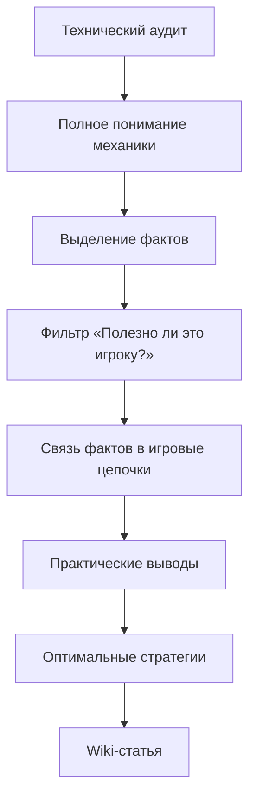

# Навык: Игровая База Знаний (player_knowledge_base)

Навык предназначен для преобразования сложных технических аудитов кодовой базы (`docs/*-AUDIT.md`, KubeJS-скрипты, декомпилированные Java-классы, таблицы лута и NBT) в **красивые, доступные и практичные гайды для игроков** на GitHub (Wiki / Markdown).

Главная цель — создать визуально приятную, логичную и удобную Вики (справочник), которую игрок может открыть в браузере или на мобильном устройстве во время игры и мгновенно найти ответ на любой вопрос.

---

## 🎯 Главный принцип: Wiki должна отвечать на вопросы игрока, а не пересказывать аудит

Технический аудит — это **источник знаний**, а не шаблон будущей статьи.

Перед созданием Wiki-статьи необходимо полностью проанализировать аудит и отфильтровать информацию по принципу:

> **«Зачем игроку это знать и что он сможет сделать благодаря этой информации?»**

Не переноси в Wiki всё, что было найдено в коде. Из нескольких десятков технических фактов полезны игроку могут быть только 5–10. Остальное должно быть отброшено, объединено или спрятано в технический спойлер `<details>`.

### 🧠 Приоритет информации

Каждый найденный факт оцени по следующей шкале:

| Приоритет | Что означает | Что делать |
| :--- | :--- | :--- |
| 🔴 **Критический** | Без этого игрок не поймёт, как получить/использовать предмет или пройти механику | Обязательно показать |
| 🟠 **Практический** | Позволяет избежать ошибки, сэкономить ресурсы или получить больше выгоды | Показать |
| 🟡 **Полезный** | Помогает оптимизировать производство или стратегию | Показать, если относится к теме |
| 🟢 **Интересный** | Неочевидная механика, которую интересно знать | Кратко показать |
| ⚪ **Технический** | Нужен разработчику, но практически бесполезен игроку | Не показывать |
| ⚫ **Мусорный** | Внутренние ID, переменные, реализация, служебные детали без игровой пользы | Полностью удалить |

---

## 🚨 Критические правила генерации Markdown

Генерируемые `.md` файлы должны содержать **стандартный, чистый GitHub Flavored Markdown**.

### 1. Категорический запрет экранирования Markdown-символов
**НЕ экранируй Markdown-синтаксис обратным слешем (`\`).**
Движки рендеринга (GitHub, Gramax, GitBook, MkDocs) должны получать настоящий Markdown, а не экранированный сырой текст.

| ✅ Правильно | ❌ Неправильно (Запрещено!) |
| :--- | :--- |
| `# Заголовок H1` | `\# Заголовок H1` |
| `## Заголовок H2` | `\## Заголовок H2` |
| `**жирный текст**` | `\*\*жирный текст\*\*` |
| `* пункт списка` или `- пункт` | `\- пункт` или `\* пункт` |
| `[Ссылка](path)` | `[Ссылка]\(path\)` |
| `\| Колонка 1 \| Колонка 2 \|` (в таблице `\|`) | `\| Колонка 1 \|` |
| `> [!TIP]` | `\[!TIP\]` |
| ```` ```mermaid ```` | ```` \`\`\`mermaid ```` |

### 2. Запрет внешних кавычек и JSON-экранирования
* **НЕ оборачивай** весь Markdown-документ во внешние кавычки (`"..."`).
* **НЕ представляй** содержимое `.md` как экранированную JSON-строку.
* Не выполняй дополнительное escaping перед записью файла на диск.

### 3. Запрет LaTeX / KaTeX формул
В статьях базы знаний **НЕ используй** формулы со знаками доллара (`$...$`).
* **Правильно:** `3 × 3 блока`, `±6 блоков`, `13 × 13 × 13 блоков`, `множитель ×1.25`, `-25 очков`, `шанс 25%`.
* **Неправильно:** `$3 \times 3$`, `$\pm 6$`, `$\times 1.25$`.

### 4. Стандартные GitHub Alerts вместо кастомных HTML-тегов
* **НЕ используй** нестандартные теги вроде `<note type="quote">` или `<alert>`.
* **Всегда используй** стандартные блоки GitHub Markdown Alerts:
  - `> [!NOTE]` — справочная информация
  - `> [!TIP]` — советы, лайфхаки, TL;DR
  - `> [!IMPORTANT]` — важные требования
  - `> [!WARNING]` — опасности, штрафы, потери предметов

---

## 🔍 1. Сначала восстанови реальную механику

Перед написанием статьи агент должен разобраться в механике на уровне кода.

Нужно установить:

**Что игрок делает → что происходит → что получает → какие условия влияют на результат → какие ограничения существуют → как получить необходимые ресурсы.**

Особое внимание уделять цепочкам:

```text
Нужен ресурс
    ↓
Как его получить?
    ↓
Что для этого требуется?
    ↓
Где взять требуемый предмет?
    ↓
Что требуется для следующего предмета?
```

Если существует скрытая цепочка получения, она должна быть отражена в Wiki.

### Пример

* ❌ **Плохо:** *«Для получения Ивового бревна используется сборщик смолы.»*
* ✅ **Хорошо:** *«**Ивовое бревно** получают с ивы. Для выращивания ивы нужен **саженец ивы**, который требует **саженец мрачного дерева**. Саженец мрачного дерева может случайно появиться при сборе культур.»*

Игрок должен понимать **не только непосредственный рецепт, но и путь к ресурсу**.

---

## 🎮 2. Пиши с позиции игрока

Статья должна отвечать на реальные вопросы:

### Получение
* Как это получить?
* Где это найти?
* Когда это становится доступно?
* Что нужно подготовить?
* Есть ли альтернативный способ получения?

### Использование
* Для чего это нужно?
* В каких рецептах используется?
* Какой станок нужен?
* Что получится на выходе?

### Оптимизация
* Что выгоднее использовать?
* Какой вариант быстрее?
* Какой вариант дешевле?
* Как увеличить количество продукции?
* Как повысить качество?
* Как автоматизировать процесс?

### Ограничения
* Что нельзя сделать?
* Какие условия обязательны?
* Что сбрасывает качество?
* Что нельзя автоматизировать?
* Что происходит при ошибке?

### Подводные камни
Особенно искать механики, которые игрок **не сможет понять из интерфейса игры**.

Например:
* ❌ *«Сыр требует 90 секунд»* — мало полезно.
* ✅ *«**Автоматический пресс сыра работает 90 секунд и требует сычужный фермент. Он полностью автоматизируется, но сбрасывает качество молока.**»* — спасает игрока от потери ценного сырья.

---

## 🚫 3. Не превращай Wiki в технический аудит

Запрещено без необходимости переносить в статью:
* названия JavaScript-функций;
* внутренние переменные (`goldChance`, `seedQuality`, `fertilizer`);
* технические ID предметов;
* пути к файлам;
* координаты строк кода;
* исходный код;
* внутренние названия Java-классов;
* NBT-структуры;
* названия функций и обработчиков;
* технические формулы;
* промежуточные коэффициенты.

| Вместо кодового выражения | Писать на языке игрока |
| :--- | :--- |
| `goldChance = 0.432` | **Шанс получить качественный урожай — 93,9%.** |
| `fertilizer > 1 && seedQuality < 1` | **Высокое и Безупречное удобрение автоматически повышают обычные семена до минимального уровня качества.** |
| `random.nextFloat() < 0.25` | **25% шанс получить дополнительный предмет.** |
| `global.getAnimalIsNotCramped` | **Правило 5 соседей: в кубе 3 × 3 блока нельзя держать более 5 животных.** |
| `mood -= 96, affection -= 25` | **Животное теряет настроение, а при поглаживании злится и теряет 25 очков дружбы.** |

---

## 📊 4. Показывай конечный результат, а не математическую кухню

Если механика рассчитывается сложной формулой, игроку нужен **результат расчёта**.

* ❌ **Плохо:**
  ```text
  goldChance = 0.2 × ((seedQuality × 4.6) / 10) + 0.2 × fertilizer × (...) + 0.01
  ```
* ✅ **Хорошо:**

| Условие | Серебро | Золото | Иридий |
| :--- | :---: | :---: | :---: |
| **Без удобрения** | 2,0% | 1,0% | 0,0% |
| **Базовое удобрение** | 8,3% | 4,3% | 0,0% |
| **Высокое удобрение** | 36,6% | 27,0% | 16,1% |
| **Безупречное удобрение** | 38,5% | 33,9% | 21,6% |

Если формула действительно представляет интерес для продвинутых игроков, её можно убрать под спойлер:

<details>
<summary><b>🔬 Технические детали (формула и переменные)</b></summary>

Здесь можно разместить исходную формулу, внутренние коэффициенты и подробности реализации.

</details>

Основной текст статьи должен оставаться понятным без открытия этого блока.

---

## 💰 5. Всегда ищи практический вывод

Если аудит содержит числа, не оставляй их без интерпретации.

* ❌ *Время обработки — 90 секунд.*
  👉 ✅ **Автоматический пресс медленнее ремесленного в 4,5 раза, зато полностью работает без участия игрока.**

* ❌ *Дополнительный урожай +25%.*
  👉 ✅ **Изобильное удобрение выгоднее использовать на сырье для станков, которые не сохраняют качество: дополнительный урожай превращается в дополнительную продукцию.**

* ❌ *Саженец имеет шанс выпадения.*
  👉 ✅ **Саженец можно получить случайно при сборе культур. Точный шанс — X%, поэтому для получения саженца может потребоваться несколько урожаев.**

Каждое число должно отвечать на вопрос: **«И что мне с этого?»**

---

## 🔗 6. Проверяй всю цепочку зависимостей

Если в аудите найден предмет, который требуется для другого предмета, не останавливайся на первом уровне:

```text
Ивовое бревно ──► Ива ──► Саженец ивы ──► Саженец мрачного дерева ──► Случайный дроп при сборе культур
```

Wiki должна по возможности закрывать эту цепочку целиком.

Если информации в коде недостаточно, **не придумывай её**. Вместо этого явно укажи:
> ⚠️ *Способ получения саженца найден, но точный шанс в исходном коде не указан.*

---

## 🧩 7. Разделяй «что нужно знать» и «что интересно знать»

### Игроку обязательно (видно сразу в тексте):
* способ получения;
* необходимые предметы;
* стоимость и время;
* условия и ограничения;
* результат и качество;
* возможность автоматизации;
* выгодный способ использования.

### Игроку может быть интересно (в отдельный блок или `<details>`):
* скрытые механики и необычные взаимодействия;
* точные математические шансы;
* особые исключения и редкие комбинации;
* технические детали.

### Игроку не нужно (полностью исключить):
* внутренняя архитектура скрипта;
* названия функций и переменных;
* реализация обработчиков;
* код ради самого кода.

---

## 🏆 8. В каждой статье ищи «лучшую стратегию»

Если аудит позволяет сделать вывод об оптимальной стратегии, Wiki должна его сформулировать.

* ❌ *Существуют три типа удобрений.*
  👉 ✅ **Для продукции, которая сохраняет качество, используйте Безупречное удобрение. Для станков, сбрасывающих качество, выгоднее Изобильное удобрение, потому что оно увеличивает количество сырья.**

* ❌ *Существуют два пресса для сыра.*
  👉 ✅ **Используйте Ремесленный пресс для качественного молока. Автоматический пресс подходит для массового производства, когда качество не имеет значения.**

Если невозможно определить однозначно лучший вариант, покажи **компромисс**:
> **Ремесленный пресс быстрее и сохраняет качество, но требует участия игрока. Автоматический медленнее, зато полностью автоматизируется.**

---

## 🧹 9. Удаляй информацию, которая не помогает принять решение

Перед добавлением каждого факта задай вопрос:
> **«Изменит ли эта информация действие игрока?»**

Если игрок, узнав факт, всё равно будет делать то же самое — факт не нужен в основной статье.

* *«Переменная `goldChance` используется в трёх последовательных проверках»* $\rightarrow$ **Не помогает** (удалить).
* *«При Безупречном удобрении иридиевый урожай становится возможен»* $\rightarrow$ **Помогает** (оставить).

---

## 📖 10. Итоговый стандарт хорошей Wiki-статьи

Хорошая статья должна позволять игроку открыть её и за несколько секунд понять:
1. **Что это?**
2. **Зачем мне это?**
3. **Как это получить?**
4. **Что для этого нужно?**
5. **Сколько это занимает?**
6. **Как это использовать?**
7. **Как сделать это эффективнее?**
8. **Какие ошибки нельзя допустить?**

### Главный критерий качества
> **Wiki — это не сокращённая версия аудита.**
> **Wiki — это результат анализа аудита, из которого удалено всё техническое, что не помогает игроку принимать решения.**



---

## 📐 11. Стандарты оформления GitHub Markdown

Все статьи базы знаний должны использовать современные возможности **GitHub Flavored Markdown (GFM)**:

### А. Навигация и Хлебные крошки (Breadcrumbs)
```markdown
[🏠 Главная Wiki](../../wiki/README.md) ▸ [🐾 Животноводство](../README.md) ▸ **Гайд по фермерским животным**
```

### Б. Карточки-бейджы метаданных
```markdown
> **Категория:** 🐾 Животноводство | **Сложность:** ⭐⭐ Средняя | **Версия сборки:** 1.20.1 Forge
```

### В. GitHub Alerts (Информационные блоки)
```markdown
> [!NOTE]
> Базовое пояснение или фоновая механика.

> [!TIP]
> Полезный совет, лайфхак или оптимальная стратегия для игрока.

> [!IMPORTANT]
> Критически важное условие (например, необходимое улучшение или инструмент).

> [!WARNING]
> Подводные камни, действия, приводящие к штрафам, гибели мобов или потере предметов.
```

### Г. Сворачиваемые блоки (`<details><summary>`)
```markdown
<details>
<summary><b>🔍 Показать подробные формулы и шансы (кликните, чтобы развернуть)</b></summary>

| Параметр | Значение | Описание |
| :--- | :--- | :--- |
| Базовый шанс | 15% | Без улучшений |
| Шанс с клевером | 35% | При наличии цветка удачи |

</details>
```

### Д. Наглядные схемы Mermaid


---

## 🗂️ 12. Рекомендуемая структура каталогов Wiki (`wiki/`)

```text
wiki/
├── README.md                     # Главная страница (Карта всей Вики, поиск по темам)
├── assets/                       # Изображения, схемы и диаграммы
│   └── images/
├── husbandry/                    # 🐾 Животноводство и питомцы
│   ├── README.md                 # Обзор раздела
│   ├── animals_guide.md          # Фермерские животные (Тиры, корма, теснота)
│   ├── pets_guide.md             # Питомцы и их артефакты
│   └── automation.md             # Кормушки, чесалки, сборщики
├── fish_ponds/                   # 🐟 Рыбные пруды и аквакультура
│   ├── README.md
│   ├── pond_tiers.md             # 10 уровней пруда и все квесты улучшения
│   └── rare_fish_rewards.md      # Особые дропы (икра, жемчуг, артефакты)
├── villagers/                    # 👥 Отношения и жители Долины
│   ├── README.md
│   ├── gifts_and_likes.md        # Таблица любимых и нелюбимых подарков
│   ├── schedules.md              # Расписания и места встреч
│   └── heart_events.md           # События сердец и уникальные награды
├── skills/                       # ⚔️ Профессии, Навыки и Мастерство
│   ├── README.md
│   ├── mastery_altar.md          # Алтарь мастерства и великие перки
│   └── skill_books.md            # Книги навыков и скрытые способности
├── seasons_and_weather/          # 🍂 Сезоны, Климат и Теплицы
│   ├── README.md
│   ├── seasonal_crops.md         # Календарь посадок
│   └── greenhouses.md            # Механика теплиц и защита от заморозков
└── entomology/                   # 🦋 Бабочки и насекомые
    ├── README.md
    └── longwings_guide.md        # Виды бабочек, места обитания и поимка
```

---

## 🛠️ 13. Инструменты и автоматизация

В папке навыка находится скрипт автоматизации:
* `python .agents/skills/player_knowledge_base/scripts/build_index.py`
  - Сканирует все `.md` файлы в каталоге `wiki/`.
  - Автоматически обновляет оглавление, ссылки и статистику на главной странице `wiki/README.md`.
