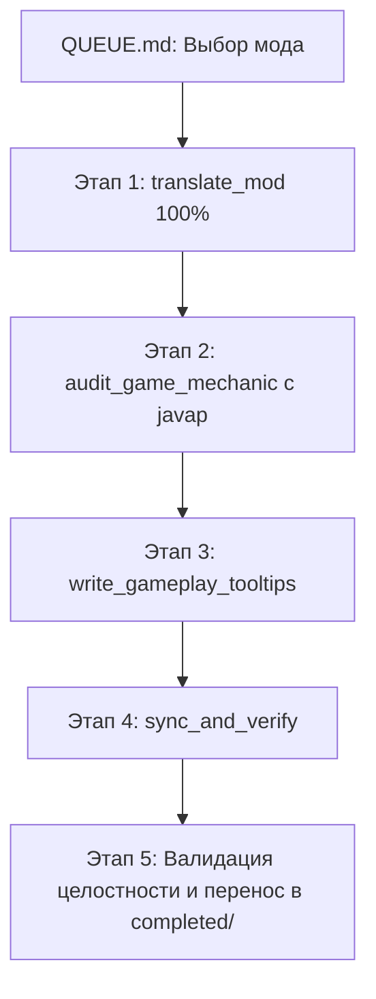

# Навык: Сквозной конвейер обработки модов (process_mod_pipeline)

Навык выступает **главным оркестратором** для комплексной обработки модов из очереди `tasks/Translate_Mods/QUEUE.md`. Агент обязан последовательно вызывать и исполнять специализированные дочерние навыки на каждом этапе:

---

## 🚨 ЖЕЛЕЗНЫЕ ПРАВИЛА И ИНВАРИАНТЫ КОНВЕЙЕРА:

1. **ПРИОРИТЕТ РЕАЛЬНОГО ГЕЙМПЛЕЯ (GAMEPLAY-FIRST & PROVENANCE CHECK)**:
   - Перед переводом провести аудит: какие предметы реально доступны игроку в сборке (`society_trading/shops/`, квесты `ftbquests/`, контракты `bountiful`, крафты KubeJS), а какие вырезаны (`hideJEIItems.js`, `removeRecipes.js`).
   - 100% фокуса и глубокого аудита направлять на активные игровые предметы сборки.

2. **СТРОГО ПО 1 МОДУ ЗА РАЗ (ЗАПРЕТ СЛЕПЫХ ПАКЕТНЫХ СКРИПТОВ)**:
   - Запрещено переходить к следующему моду в очереди, пока текущий не пройдёт все 5 этапов на 100%.
   - Запрещено использовать пакетные автоскрипты, генерирующие неполные переводы или пустые папки.

3. **ИНВАРИАНТ 100.0% ПЕРЕВОДА (ZERO ENGLISH IN VALUES)**:
   - Перед переходом к этапу аудита агент обязан программно проверить, что 100% ключей переведены на русский язык (`re.search(r'[а-яА-ЯёЁ]', val)`).
   - Никаких остаточных английских названий предметов/блоков/GUI!

4. **ОБЯЗАТЕЛЬНЫЙ РЕАЛЬНЫЙ АУДИТ БАЙТКОДА (JAVAP + KUBEJS)**:
   - Файл `docs/MECHANICS-AUDIT.md` обязан содержать реальные выжимки реверс-инжиниринга:
     * Декомпиляцию ключевых классов (`javap -p -c`).
     * Описание работы блоков, GUI, радиусов, кулдаунов и рецептов.
     * Точный список предметов, отключённых автором сборки в `game_data/startup_scripts/globalRemovedItems.js`.
   - Запрещены формальные 2-строчные шаблоны-заглушки!

5. **ПРОВЕРКА ЦЕЛОСТНОСТИ ПЕРЕД ПЕРЕНОСОМ В `completed/`**:
   - Перенос в `tasks/Translate_Mods/completed/translate_<namespace>` разрешён ТОЛЬКО если присутствуют и не пусты:
     1. `TASK.md` (описание задачи).
     2. `new_translate.md` (визуальный шаблон + 100% JSON).
     3. `docs/MECHANICS-AUDIT.md` (подробный аудит механик).
     4. `translations/mods/<namespace>.json` (100% русский словарь).
     5. Физическая запись в `D:\ModrinthApp\...\assets\<namespace>\lang\ru_ru.json`.
     6. Раздел в `glossary.md`.

---

## 📋 Пошаговый регламент с вызовом дочерних навыков:

### 0️⃣ Этап 0: Выбор задачи из очереди
1. Открыть `tasks/Translate_Mods/QUEUE.md`.
2. Взять верхнюю активную папку по приоритету (например, `07_pamhc2trees`).
3. Проверить структуру: наличие `TASK.md` и `new_translate.md`.

---

### 1️⃣ Этап 1: Локализация мода (Вызов навыка `translate_mod`)
> 👉 **ОБЯЗАТЕЛЬНО ПРОЧИТАТЬ:** [`.agents/skills/translate_mod/SKILL.md`](file:///c:/Users/Foxi8/OneDrive/Рабочий%20стол/СозданиеПеревода/.agents/skills/translate_mod/SKILL.md)  
> *(При сложных/спорных названиях предметов также использовать [`.agents/skills/item_naming_and_translation/SKILL.md`](file:///c:/Users/Foxi8/OneDrive/Рабочий%20стол/СозданиеПеревода/.agents/skills/item_naming_and_translation/SKILL.md))*

1. Заполнить `tasks/Translate_Mods/<номер_мода>/new_translate.md`:
   * **Блок 1 (Визуальный):** Ключевые группы предметов, блоки, форматирование `§e●`, описания.
   * **Блок 2 (JSON):** 100% переведённый JSON-словарь без заглушек и без английских слов.
2. Программно проверить 100% покрытие русского языка:
   `sum(1 for v in data.values() if re.search(r'[а-яА-ЯёЁ]', v)) == len(data)`.
3. Сверить терминологию с [glossary.md](file:///c:/Users/Foxi8/OneDrive/Рабочий%20стол/СозданиеПеревода/glossary.md) (строго без феминитивов, термины с Заглавной буквы).

---

### 2️⃣ Этап 2: Аудит механик (Вызов навыка `audit_game_mechanic`)
> 👉 **ОБЯЗАТЕЛЬНО ПРОЧИТАТЬ:** [`.agents/skills/audit_game_mechanic/SKILL.md`](file:///c:/Users/Foxi8/OneDrive/Рабочий%20стол/СозданиеПеревода/.agents/skills/audit_game_mechanic/SKILL.md)

1. Декомпилировать ключевые классы JAR через `javap -p -c -constants`.
2. Проверить доступность предметов в сборке: сверить с `game_data/startup_scripts/globalRemovedItems.js` и `client_scripts/hideJEIItems.js` (исключить заблокированные предметы).
3. Проверить кастомные серверные обработчики в `game_data/server_scripts/`.
4. Зафиксировать результат в `tasks/Translate_Mods/<номер_мода>/docs/MECHANICS-AUDIT.md`.

---

### 3️⃣ Этап 3: Создание подсказок (Вызов навыков `write_gameplay_tooltips` и `ui_formatting_and_layout`)
> 👉 **ОБЯЗАТЕЛЬНО ПРОЧИТАТЬ:** [`.agents/skills/write_gameplay_tooltips/SKILL.md`](file:///c:/Users/Foxi8/OneDrive/Рабочий%20стол/СозданиеПеревода/.agents/skills/write_gameplay_tooltips/SKILL.md) и [`.agents/skills/ui_formatting_and_layout/SKILL.md`](file:///c:/Users/Foxi8/OneDrive/Рабочий%20стол/СозданиеПеревода/.agents/skills/ui_formatting_and_layout/SKILL.md)

1. Для доступных предметов со скрытыми свойствами, особым топливом или неочевидным крафтом создать клиентский скрипт `kubejs_scripts/client/<namespace>Tooltips.js` с раскрывающимся блоком `[SHIFT]`.
2. Зарегистрировать синхронизацию нового скрипта в `sync_all_to_game.js`.

---

### 4️⃣ Этап 4: Синхронизация и верификация (Вызов навыка `sync_and_verify`)
> 👉 **ОБЯЗАТЕЛЬНО ПРОЧИТАТЬ:** [`.agents/skills/sync_and_verify/SKILL.md`](file:///c:/Users/Foxi8/OneDrive/Рабочий%20стол/СозданиеПеревода/.agents/skills/sync_and_verify/SKILL.md)

1. Применить изменения: `python tools/apply_task.py <номер_папки>`.
2. Напрямую прочитать `D:\ModrinthApp\profiles\Society_ Sunlit Valley\kubejs\assets\<namespace>\lang\ru_ru.json`.
3. Вывести реальные проверенные строки в ответ пользователю.
4. Выдать инструкцию перезагрузки (`F3 + T`).

---

### 5️⃣ Этап 5: Завершение и продвижение очереди (Вызов навыка `finalize_mod_translation`)
> 👉 **ОБЯЗАТЕЛЬНО ПРОЧИТАТЬ:** [`.agents/skills/finalize_mod_translation/SKILL.md`](file:///c:/Users/Foxi8/OneDrive/Рабочий%20стол/СозданиеПеревода/.agents/skills/finalize_mod_translation/SKILL.md)

1. Зафиксировать новые ключевые термины мода в [glossary.md](file:///c:/Users/Foxi8/OneDrive/Рабочий%20стол/СозданиеПеревода/glossary.md).
2. Выполнить автоматическую финализацию скриптом:
   `python tools/finalize_mod.py <folder_or_namespace>`
   *(Скрипт проверит 100% покрытие, обновит TASK.md, переместит папку в completed/, актуализирует QUEUE.md без перенумерации остальных папок, запустит sync_all_to_game.js и верифицирует файл игры).*
3. Предложить пользователю следующий мод в очереди `QUEUE.md`.

