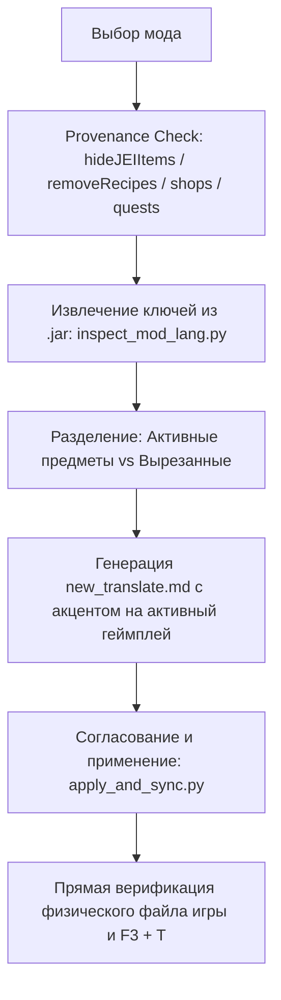

# Навык: Локализация модов и аудит ключей (translate_mod)

Навык используется для аудита, извлечения и локализации модов сборки Society: Sunlit Valley (например: `twigs`, `cozycafe`, `whimsy_deco`, `vintagedelight`, `brewery` и др.).

---

## 1. Классификация модов при аудите

Перед переводом моды разделяются на две категории:

### 🎮 А. Пользовательские / Игровые моды (Приоритет: ВЫСОКИЙ)
Моды, с которыми игрок непосредственно взаимодействует в игре:
* **Предметы и блоки в JEI:** `item.<mod>.*`, `block.<mod>.*`
* **Интерфейсы и меню:** `gui.<mod>.*`, `container.<mod>.*`, `screen.<mod>.*`, `menu.<mod>.*` (кнопки управления, менеджеры, кастомные окна крафта)
* **Подсказки и тултипы:** `tooltip.<mod>.*`, `desc.<mod>.*`, подсказки клавиш `[Shift]`
* **Сущности и категории:** `entity.<mod>.*`, `category.<mod>.*`, `subtitles.<mod>.*`

### ⚙️ Б. Технические моды, API и библиотеки (Приоритет: НИЗКИЙ / НЕ ТРЕБУЕТСЯ)
* Внутренние библиотеки, служебные API, скрытые RPG-атрибуты сущностей (например, `additional_attributes`, `ali`, `titanium`, `balm`, `pandalib`).
* В JEI физических предметов не имеют, игроку напрямую не видны.

---

---

## 2. Принцип Gameplay-First & Provenance Check (Проверка участия в геймплее)

Перед переводом ключей мода агент ОБЯЗАН провести проверку доступности и участия в геймплее сборки:
1. **Проверка отключенного контента:**
   - Сверить ID предметов мода по `kubejs/client_scripts/hideJEIItems.js`.
   - Проверить удаление рецептов в `kubejs/server_scripts/recipes/removeRecipes.js` и `globalRemovedItems.js`.
2. **Проверка активных точек входа игрока:**
   - **Магазины и жители:** `kubejs/server_scripts/society_trading/shops/`
   - **Квесты FTB Quests:** `ftbquests/quests/chapters/` и `ftbquestlocalizer`
   - **Контракты Доски объявлений:** `kubejs/data/bountiful/`
   - **Кастомные рецепты и цепочки:** `kubejs/server_scripts/recipes/`
3. **Фокусировка усилий:**
   - 🔴 **АКТИВНЫЙ ГЕЙМПЛЕЙ:** Предметы, которые игрок может скрафтить, купить или получить за квест $\rightarrow$ глубокий аудит механики (`audit_game_mechanic_deep`), качественный перевод, Tooltip (`[Shift]`), проверка отображения в JEI.
   - ⚪ **ВЫРЕЗАННЫЙ / ДЕКОРАТИВНЫЙ БАЛЛАСТ:** Скрытые или отключенные разработчиком предметы не должны отнимать время на глубокие аудиты и составление подсказок.

---

## 3. Порядок работы (Workflow)



---

## 3. Команды аудита и генерации задач

### Общий аудит всех модов сборки:
```bash
python tasks/Translate_Mods/scripts/audit_mods.py
```
*Сканирует все JAR-файлы в mods/, разделяет на игровые и технические моды, генерирует `tasks/Translate_Mods/audit.md` с точным составом строк.*

### Инспекция конкретного мода:
```bash
python tools/inspect_mod_lang.py <namespace>
# Примеры:
python tools/inspect_mod_lang.py twigs
python tools/inspect_mod_lang.py cozycafe
python tools/inspect_mod_lang.py splendid_slimes:slimy
```

---

## 4. Обязательная структура задачи локализации мода

Для каждого переводимого мода создаётся директория `tasks/Translate_Mods/translate_<namespace>/`:
1. `TASK.md` — цели задачи и описание мода.
2. `new_translate.md` — рабочий файл согласования перевода:
   * **Блок 1:** Визуальный макет / контекст (GUI, тултипы, форматирование `§e●`).
   * **Блок 2:** JSON со строками для перевода (включая `item`, `block`, `gui`, `tooltip`).
3. `scripts/apply_and_sync.py` — рабочий скрипт:
   * Считывает перевод напрямую из `new_translate.md`.
   * Сохраняет в `translations/mods/<namespace>.json`.
   * Напрямую записывает в `D:\ModrinthApp\...\kubejs\assets\<namespace>\lang\ru_ru.json`.
   * Запускает общий `node sync_all_to_game.js` и считывает файл игры для верификации.

---

## 5. Правила локализации элементов модов

1. **Предметы и блоки:** Начинаются с заглавной буквы, строгий учёт глоссария [`glossary.md`](file:///c:/Users/Foxi8/OneDrive/Рабочий%20стол/СозданиеПеревода/glossary.md).
2. **GUI и кнопки:** Краткие, ёмкие названия в повелительном наклонении или инфинитиве (*«Открыть кафе»*, *«Настроить меню»*).
3. **Монеты и валюта:** В тултипах и GUI модов использовать знак монеты `§e●` (`U+25CF`), а не `$`.
4. **Тултипы:** Цветовое кодирование клавиш согласно `ui_formatting_and_layout` (`§6ПКМ§7`, `§6Shift + ПКМ§7`).
5. **Обучающие подсказки к сложным механикам:** Если предмет мода имеет скрытые функции, специфические виды топлива, редстоун-триггеры или неочевидный крафт (стазис-камеры, кастомизаторы, прогрузчики чанков) — ассистент обязан исследовать механику в коде JAR и создать KubeJS-тултип с раскрывающимся блоком `[SHIFT]`.
6. **Обязательное внесение в глоссарий:** Все ключевые предметы, уникальные материалы, станки и механики мода обязательно фиксируются в [`glossary.md`](file:///c:/Users/Foxi8/OneDrive/Рабочий%20стол/СозданиеПеревода/glossary.md).
7. **Единство источника правды (`new_translate.md`):** Любые точечные правки отдельных предметов, названий или тултипов обязаны немедленно вноситься в файл задачи `new_translate.md` (в оба блока), гарантируя, что последующий запуск `apply_and_sync.py` никогда не затрёт свежие переводы.


