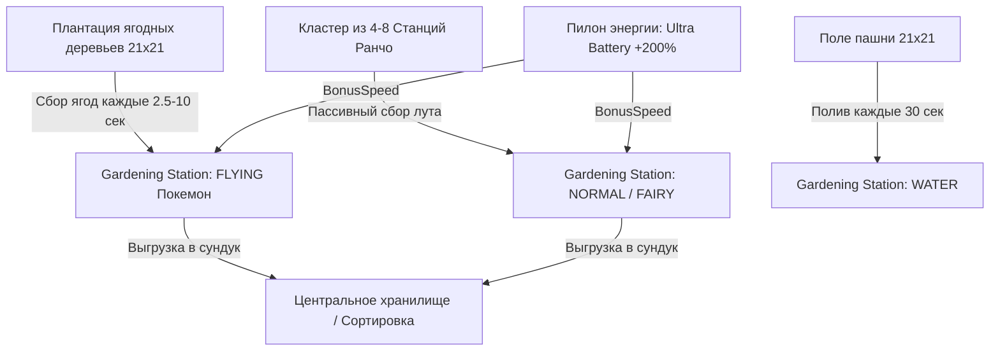

# 🌿 Станция садоводства (Gardening Station)

> **Мод / Исходники:** `cobblemon_farmers` (Cobblemon Farmers 2.4)  
> **Классы байткода:** `GardeningStationBlockEntity.class`, `GardeningStationBlock.class`, `ElementalTypeUtils.class`  
> **Предмет / Блок:** `cobblemon_farmers:gardening_station`  
> **Статус проверки:** 🟢 100% подтверждено декомпиляцией байткода Forge (`javap -p -c -constants`)

---

## 1. 🏗️ Суть механики, крафт и интерфейс

**Станция садоводства (`Gardening Station`)** — центральный агропромышленный блок мода Cobblemon Farmers. Позволяет покемонам автономно обслуживать пашни, ягодные деревья и соседние загоны Ранчо:
* Автоматический сбор урожая ягод с кустов Cobblemon (`Harvest Berries`).
* Автоматический сбор продукции с соседних Станций Ранчо (шерсть, молоко, яйца, перья).
* Полив сухой пашни в радиусе.
* Ускорение роста растений эффектом костной муки.
* Пассивная генерация Конфет Опыта (Exp Candies).

### 1.1. Рецепт крафта (`gardening_station.json`) [FACT]:
```
[ Доски ]   [ Доски ]       [ Доски ]
[ Доски ]   [ Покебол ]     [ Доски ]
[ Доски ]   [   пусто   ]   [ Доски ]
```

### 1.2. Интерфейс и элементы управления [FACT]:
1. **Слот покемона (Worker Slot):** Сюда помещается покемон из команды или ПК. При размещении проверяется доступность слота игрока `hasWorkerSlot(player)`.
2. **Кнопка смены приоритета (Swap Priority Button):** Для покемонов с двумя типами (например, *Vivillon: Bug/Flying*, *Whimsicott: Grass/Fairy*, *Pidgeot: Normal/Flying*) переключает активную роль между Первичным и Вторичным типом (`swapPriority = !swapPriority`).

---

## 2. 🧠 Формулы и математика (Реверс-инжиниринг байткода)

### 2.1. Таблица стихийных ролей в коде (`GardeningStationBlockEntity.runAction`) [FACT]:

| Стихия работника (`ElementalType`) | Выполняемый метод | Профильный стат (`getScalingStat`) | Базовый таймер (`getActionTime`) | Реальное действие в мире |
| :--- | :--- | :---: | :---: | :--- |
| 🪽 **Летающий (`FLYING`)** | `harvestNearbyBerries(radius)` | `SPECIAL_DEFENCE` | **200 тиков** *(10 сек)* | Облетает область и **собирает зрелые ягоды** (`BerryItem`) с кустов Cobblemon в радиусе $AoE$. |
| 🌾 **Обычный (`NORMAL`)** | `harvestFromRanchingStation(radius, false)` | `SPEED` | **300 тиков** *(15 сек)* | **Сбор с соседних Станций Ранчо:** собирает готовую продукцию из загонов без стрижки. |
| ✨ **Волшебный (`FAIRY`)** | `harvestFromRanchingStation(radius, true)` | `SPECIAL_ATTACK` | **800 тиков** *(40 сек)* | **Магический сбор с Ранчо:** улучшенный сбор с поддержкой автоматической стрижки шерсти. |
| 💧 **Водный (`WATER`)** | `waterFarmland(radius)` | `SPECIAL_ATTACK` | **600 тиков** *(30 сек)* | Увлажняет всю сухую пашню (`minecraft:farmland`) в радиусе $AoE$ на глубину/высоту $Y \pm 2$. |
| 🌿 **Трава (`GRASS`)** | `growCropsInRadius(...)` | `SPEED` | **24 000 тиков** *(1200 сек)* | Применяет эффект костной муки (`bonemeal`) ко всем созревающим культурам в радиусе. |
| 🌑 **Тёмный (`DARK`)** | `generateExp(radius * 4)` | `HP` | **20 000 тиков** *(1000 сек)* | Синтезирует конфеты опыта `Exp Candy XS` / `Exp Candy S`. |

---

### 2.2. Математические формулы характеристик [FACT]:

#### 1. 📐 Радиус действия в блоках (`fetchAoeRadius()`):
[FACT: Байткод `GardeningStationBlockEntity.fetchAoeRadius`]
В Станции садоводства радиус рассчитывается строго от **Уровня покемона (`Level`)**:

$$\text{AoeRadius} = \operatorname{clamp}\left(\left\lfloor \frac{\text{Pokemon Level}}{10} \right\rfloor, 1, 10\right)$$

* **Покрытие области в блоках:** $\text{Зона} = (2 \times \text{AoeRadius} + 1) \times (2 \times \text{AoeRadius} + 1)$ при высоте $Y \pm 2$.
* **Уровень 10–19:** Радиус $R = 1$ (зона $3 \times 3$ = 8 грядок).
* **Уровень 50–59:** Радиус $R = 5$ (зона $11 \times 11$ = 120 грядок).
* **Уровень 100:** Максимальный радиус **$R = 10$ (зона $21 \times 21$ = 441 блок территории!)**.

#### 2. ⚡ Множитель скорости работы (`SpeedModifier`):
[FACT: Байткод `StationBaseBlockEntity.fetchSpeedModifier`]

$$\text{SpeedModifier} = \frac{\left\lfloor \frac{\text{ScalingStat}}{127.5} \times 100 \right\rfloor}{100} \times (\text{isShiny ? } 2.0 : 1.0)$$

* При профильном стате $128 \rightarrow \mathbf{1.0\times}$ скорости.
* При профильном стате $255 \rightarrow \mathbf{2.0\times}$ скорости.
* 🔴 **Шайни-бонус (Shiny):** Удваивает скорость до **$4.0\times$** (сокращает базовый 10-секундный сбор ягод до **2.5 секунд** на цикл!).

---

## 3. 🥇 Практический тир-лист и лучшие покемоны

| Роль на ферме | Стихия | Лучшие виды покемонов | Профильный стат | Практическая польза |
| :--- | :---: | :--- | :---: | :--- |
| 🪽 **Сборщик ягод (`Harvest Berries`)** | `FLYING` | **Corviknight, Pidgeot, Staraptor, Talonflame, Vivillon** | `SPECIAL_DEFENCE` $\ge 250$ | Моментальный сбор сотен ягод с плантации $21 \times 21$ за 2.5–5 секунд. |
| 🌾 **Логист Ранчо (Сбор загонов)** | `NORMAL` | **Snorlax, Slaking, Ursaluna, Wooloo, Eevee** | `SPEED` $\ge 250$ | Автоматическая выгрузка молока, яиц и перьев с соседних станций Ранчо в сундук. |
| ✨ **Магический сборщик Ранчо** | `FAIRY` | **Togekiss, Gardevoir, Hatterene, Xerneas** | `SPECIAL_ATTACK` $\ge 250$ | Сбор шерсти и редкого лута с загонов Ранчо. |
| 💧 **Авто-полив (Ирригатор)** | `WATER` | **Kyogre, Blastoise, Vaporeon, Kingdra, Swampert** | `SPECIAL_ATTACK` $\ge 250$ | Поддержание 100% влажности пашни на гигантском поле $21 \times 21$ без открытой воды. |
| 🌿 **Ускоритель роста (Костная мука)** | `GRASS` | **Sceptile, Meowscarada, Shaymin, Whimsicott** | `SPEED` $\ge 250$ | Пассивное ускорение роста редких культур без расхода костной муки. |
| 🌑 **Генератор опыта (Exp Candies)** | `DARK` | **Tyranitar, Hydreigon, Umbreon, Darkrai, Yveltal** | `HP` $\ge 250$ | Пассивный синтез `Exp Candy S` при радиусе $R=10$. |

---

## 4. 🔄 Автоматизация и синергии на базе



### 💡 Главные правила эффективной базы:
1. **Сбор ягод (Flying):** Для автоматизации ягодных садов назначайте высокоуровневых летающих покемонов (Lv. 100 для $R=10$) с максимальной Special Defence.
2. **Обслуживание Ранчо (Normal / Fairy):** Размещайте Станцию садоводства в центре кластера Станций ранчо — покемон Normal/Fairy избавит от необходимости бегать по загонам и собирать продукцию вручную.
3. **Разгон Пилоном:** Установите Пилон энергии с Ультра-батареей ($+200\%$) рядом со станцией сбора, чтобы ускорить цикл работы в 3 раза.