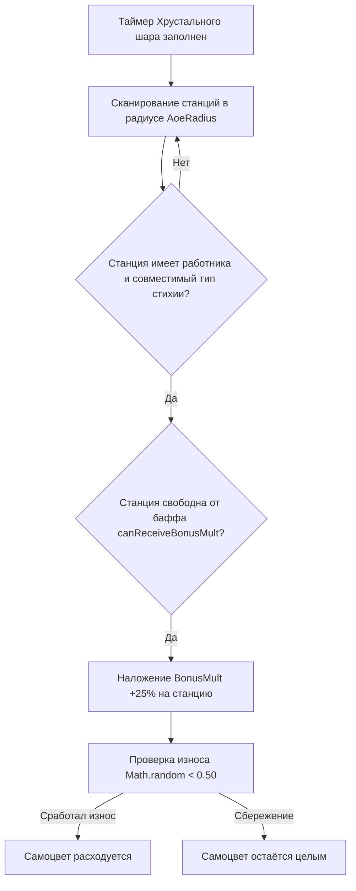

# 🔮 Хрустальный шар (Crystal Ball)

> **Мод / Исходники:** `cobblemon_farmers` (Cobblemon Farmers 2.4)  
> **Классы байткода:** `CrystalBallBlockEntity.class`, `CrystalBallBlock.class`, `CrystalBallRecipe.class`  
> **Предмет / Блок:** `cobblemon_farmers:crystal_ball`  
> **Статус проверки:** 🟢 100% подтверждено реверс-инжинирингом байткода Forge

---

## 1. 🏗️ Суть механики, крафт и интерфейс

**Хрустальный шар (`Crystal Ball`)** — это мистическая станция-усилитель (аналог Пилона энергии, но для **умножения дропа**). Если Пилон энергии разгоняет *скорость* станций, то Хрустальный шар проецирует астральные импульсы, наделяющие соседние станции **бонусом шанса мульти-дропа (`BonusMult`)**, гарантируя удвоение, утроение и учетверение готовой продукции.

### Рецепт крафта (`crystal_ball.json`):
* **Верхний ряд:** `Пурпурный ковёр` | `Алмазный блок` | `Пурпурный ковёр`
* **Средний ряд:** `Камень` | `Камень` | `Камень`
* **Нижний ряд:** `Камень` | `Ультрабол (Ultra Ball)` | `Камень`

```
[ 🟣 ]   [ 💎 ]   [ 🟣 ]
[ 🪨 ]   [ 🪨 ]   [ 🪨 ]
[ 🪨 ]   [ 🟡 ]   [ 🪨 ]
```

### Интерфейс:
1. **Слот сырья / Фокуса (Input):** Загружаются **Стихийные самоцветы (`cobblemon:*_gem`)** или **Кристаллы призмарина**.
2. **Слот работника (Worker Slot):** Сюда устанавливается **строго покемон Психического типа (`PSYCHIC`)**.

---

## 2. 🧠 Формулы и математика (Реверс-инжиниринг байткода)

### А. 🔌 Требования к работнику и расчёт характеристик:

* **Требуемый тип:** Психический (`PSYCHIC`) — проверка в `PokeUtils.validWorkerType`.
* **⚡ Скорость зарядки импульса (`SpeedModifier`):**
  Зависит от **Специальной атаки (`SPECIAL_ATTACK`)**:
  $$\text{SpeedModifier} = \left(\frac{\lfloor (\text{Sp.Atk} / 127.5) \times 100 \rfloor}{100}\right) \times (\text{isShiny ? } 2.0 : 1.0)$$
* **📐 Манхэттенский радиус покрытия (`AoeRadius`):**
  Зависит от характеристики **Здоровье (`HP`)**:
  $$\text{AoeRadius} = \operatorname{clamp}\Big(\lfloor (\text{HP} / 500.0) \times 10.0 \times (\text{isShiny ? } 2.0 : 1.0) \rfloor, 0, 10\Big)$$
  * При $HP \ge 250$ у обычного покемона радиус $R = 5$ блоков, у Шайни — **максимальный радиус $R = 10$ блоков**.

---

### Б. 💎 Топливо и величина бонуса (`bonus_chance`):

| Загружаемый фокус / самоцвет | Совместимые типы станций (`affected_types`) | Бонус шанса мульти-дропа (`BonusMult`) | Шанс износа (`consume_chance`) |
| :--- | :--- | :---: | :---: |
| **Стихийный самоцвет**<br>(*Fire / Water / Grass / Steel / Dragon / Electric / Rock / Ice...*) | Станции с покемоном **соответствующей стихии** | **$+25\%$ к шансу мульти-дропа** | **$50\%$**<br>*(в 50% случаев самоцвет не тратится)* |
| **Кристаллы призмарина**<br>`minecraft:prismarine_crystals` | Станции с покемонами **Водного, Ледяного или Травяного** типа | **$+8\%$ к шансу мульти-дропа** | **$100\%$** |

---

### В. ⚙️ Алгоритм баффа станций (`buffNearestStation`):



* Хрустальный шар накладывает `BonusMult` на целевую станцию. При завершении операции станция выдаёт дополнительный умноженный дроп, после чего бафф сбрасывается.
* Если свободных станций в радиусе нет, шар сбрасывает 20 тиков прогресса и ожидает, **не сжигая самоцвет впустую**.

---

## 3. 🥇 Лучшие покемоны для Хрустального шара

Для обслуживания базы шар требует высоких показателей **`Special Attack`** (для быстроты импульсов) и **`HP`** (для охвата всей базы радиусом до 10 блоков):

| Покемон | Стихия | Профильные статы | Почему идеален |
| :--- | :---: | :---: | :--- |
| 🥇 **Mewtwo / Alakazam / Reuniclus** | `PSYCHIC` | $\text{Sp.Atk} \ge 250$, $\text{HP} \ge 250$ | Максимальный темп астральных импульсов и максимальный радиус $R=10$. |
| 🥇 **Slowbro / Slowking / Reuniclus** | `PSYCHIC` | $\text{HP} \ge 250$, $\text{Sp.Atk} \ge 200$ | Танки с гигантским запасом здоровья для максимального радиуса покрытия. |
| 🥈 **Gardevoir / Espeon / Delphox** | `PSYCHIC` | $\text{Sp.Atk} \ge 250$ | Сверхбыстрые медиумы для локального ускорения компактных мастерских. |

---

## 4. 🔄 Автоматизация и синергии базы

```
                    ┌───────────────────────────────┐
                    │     Хрустальный шар (Шанс x3) │
                    └───────────────┬───────────────┘
                                    │ (Астральный импульс BonusMult +25%)
                                    ▼
       [ Сырьё ] ──► [ Станция ремесла / Шахта ] ◄── [ Пилон энергии (Скорость +200%) ]
                                    │
                       (В 3-5 раз быстрее И в 3-5 раз больше дропа!)
                                    │
                                    ▼
                        [ Склад готовой продукции ]
```

### Главные связки базы (A + B → C):
1. **Сверх-комбинация «Пилон + Хрустальный шар»:**
   Размещение `Energy Pylon` (дает $+200\%$ к скорости) и `Crystal Ball` (дает $+25\% - 50\%$ к шансу удвоения/утроения) вокруг одной Станции ремесла создаёт **абсолютный промышленный мультипликатор**: станок работает с максимальной скоростью и выдаёт максимальный выход ресурсов из единицы сырья!
2. **Связка с Загадочной шахтой:**
   Хрустальный шар со `Steel Gem` или `Rock Gem` передаёт `BonusMult` в Загадочную шахту, поднимая шанс выпадения алмазов, золота и древних окаменелостей.

🌟 Главные механические открытия по Хрустальному шару:
Зеркальный аналог Пилона: Если Пилон разгоняет скорость станций, то Хрустальный шар проецирует астральные импульсы, наделяющие станции бонусом шанса мульти-дропа (BonusMult).
Топливо (Стихийные самоцветы): Загрузка стихийного самоцвета (Fire Gem, Water Gem, Steel Gem...) даёт $+25%$ к шансу мульти-дропа всем станциям соответствующей стихии в радиусе до 10 блоков (в 50% случаев самоцвет сберегается!).
Психический медиум (PSYCHIC): Скорость импульсов зависит от Special Attack, а радиус охвата базы — от HP.
Супер-комбинация «Пилон + Хрустальный шар»: Одновременная установка Пилона ($+200%$ к скорости) и Хрустального шара ($+25%-50%$ к мульти-дропу) вокруг Станции ремесла даёт максимально возможный темп производства и максимальный выход готовой продукции.