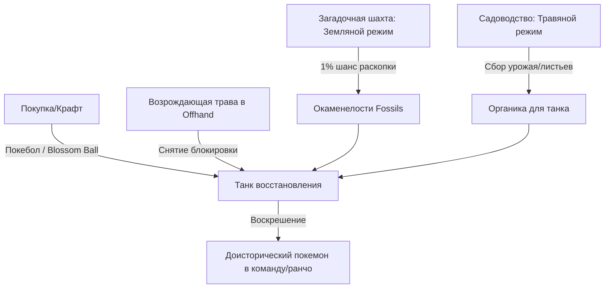

# Танк восстановления окаменелостей (Restoration Tank)

> **Глубокий технический аудит и руководство по воскрешению древних покемонов**  
> *Содержит формулы, проверки KubeJS-скриптов (`cobblemonBlockInteractions.js`), условия оживления и защиту мячей.*

---

## 1. Суть блока, крафт и интерфейс

**Танк восстановления (`cobblemon:restoration_tank`)** — специализированное лабораторное устройство мода Cobblemon, предназначенное для регенерации живых доисторических покемонов из окаменелостей (Fossils), добываемых в **Загадочной шахте** (`04_MYSTERY_MINE.md`), при археологических раскопках или вылавливаемых на рыбалке.

### Крафт устройства
```
[Железный слиток]     [Стекло]             [Железный слиток]
[Стекло]              [Возрождающая трава] [Стекло]
[Гладкий камень]      [Красный камень]     [Гладкий камень]
```

### Основные компоненты процесса:
1. **Окаменелость (Fossil)** — закладывается внутрь танка (Правый клик с ископаемым в руке).
2. **Органический материал (Organic Matter)** — заполняет биологический резервуар танка для синтеза ДНК (трава, саженцы, листья, ягоды).
3. **Покебол (Pokeball)** — вставляется для автоматического захвата только что оживлённого покемона.

---

## 2. Логика скриптов и защита Blossom Ball

В сборке *Society Sunlit Cobblemon* поведение Танка восстановления контролируется и защищается серверным скриптом `cobblemonBlockInteractions.js`.

### Блокировка потери Blossom Ball без Возрождающей травы
При попытке поместить особый мяч **Цветущий шар (`cobblemon:blossom_ball`)** в Танк восстановления срабатывает проверка инвентаря:

```javascript
BlockEvents.rightClicked("cobblemon:restoration_tank", (e) => {
  const { item, player, hand } = e;
  if (hand == "OFF_HAND") return;
  if (hand == "MAIN_HAND") {
    if (item.id === "cobblemon:blossom_ball" && player.getHeldItem("OFF_HAND").id !== "cobblemon:revival_herb") {
      player.tell(Text.translatable("sunlit_cobblemon.blossom_ball.fossil").red())
      e.cancel()
    };
  }
});
```

### Механика защиты:
- **Условие:** Если игрок держит в главной руке `cobblemon:blossom_ball`, во второй руке (Off-Hand) **ОБЯЗАТЕЛЬНО** должна находиться **Возрождающая трава (`cobblemon:revival_herb`)**.
- **Причина:** Цветущий шар обладает редким свойством при ловле/воскрешении, гарантируя улучшенные параметры покемона. Без катализатора в виде возрождающей травы скрипт отменяет клик (`e.cancel()`) и предупреждает игрока красным текстом в чате, предотвращая случайную трату ценного шара впустую.

---

## 3. Таблица окаменелостей и восстанавливаемых покемонов

Все окаменелости добываются рабочими **Земляного типа (Ground)** на станции **Загадочной шахты** (см. `04_MYSTERY_MINE.md`) с базовой вероятностью $1.0\%$ (увеличивается талантами и блестящими покемонами):

| Ископаемое (Fossil) | Восстанавливаемый покемон | Тип покемона | Стартовый уровень |
| :--- | :--- | :--- | :--- |
| **Helix Fossil** (Спиральная) | **Omanyte** $\rightarrow$ Omastar | Каменный / Водный | Lv. 20 |
| **Dome Fossil** (Купольная) | **Kabuto** $\rightarrow$ Kabutops | Каменный / Водный | Lv. 20 |
| **Old Amber** (Старый янтарь) | **Aerodactyl** | Каменный / Летающий | Lv. 20 |
| **Root Fossil** (Корневая) | **Lileep** $\rightarrow$ Cradily | Каменный / Травяной | Lv. 20 |
| **Claw Fossil** (Когтевая) | **Anorith** $\rightarrow$ Armaldo | Каменный / Насекомый | Lv. 20 |
| **Skull Fossil** (Черепная) | **Cranidos** $\rightarrow$ Rampardos | Каменный | Lv. 20 |
| **Armor Fossil** (Панцирная) | **Shieldon** $\rightarrow$ Bastiodon | Каменный / Стальной | Lv. 20 |
| **Cover Fossil** (Пластинчатая) | **Tirtouga** $\rightarrow$ Carracosta | Водный / Каменный | Lv. 20 |
| **Plume Fossil** (Перистая) | **Archen** $\rightarrow$ Archeops | Каменный / Летающий | Lv. 20 |
| **Jaw Fossil** (Челюстная) | **Tyrunt** $\rightarrow$ Tyrantrum | Каменный / Драконий | Lv. 20 |
| **Sail Fossil** (Парусная) | **Amaura** $\rightarrow$ Aurorus | Каменный / Ледяной | Lv. 20 |
| **Fossilized Bird/Fish/Drake/Dino** | **Dracozolt / Dracovish / Arctozolt / Arctovish** | Комбинированные Галар-формы | Lv. 10–25 |

---

## 4. Синергия с другими станциями и фермами



### Резюме для игрока:
1. **Сбор окаменелостей:** Назначьте Земляных покемонов (Garchomp, Excadrill, Groudon) в Загадочную шахту для пассивного фарма всех 12+ типов ископаемых.
2. **Топливо для биомассы:** Используйте излишки ягод с Садовой станции или листву.
3. **Безопасность Blossom Ball:** Всегда берите `cobblemon:revival_herb` в левую руку перед кликом Цветущим шаром по баку!
