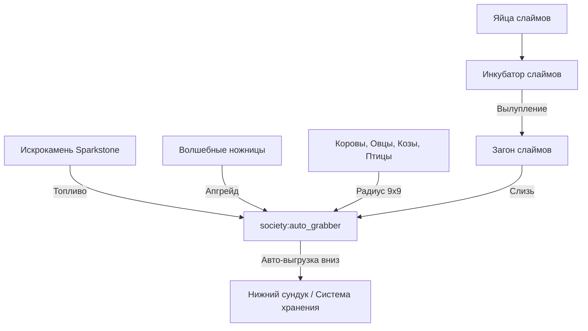

# Инкубатор слаймов и Авто-граббер (Slime Incubator & Auto-Grabber)

> **Глубокий технический аудит систем автоматического сбора ресурсов животных и инкубации слаймов**  
> *Содержит радиусы действия, требования к топливу (Искрокамень), механику апгрейда Волшебными ножницами и логику инкубации.*

---

## 1. Авто-граббер (`society:auto_grabber`)

**Авто-граббер** — стационарный механизм для автоматизированного, безвредного сбора продукции с домашних животных (коров, овец, коз, кур, уток) и выгрузки её в хранилище под собой.

### 1.1. Базовые характеристики и топливо:
- **Радиус действия:** Сканирует кубическую область $9 \times 9 \times 5$ блоков вокруг себя.
- **Топливо:** Работает на **Искрокамне (`society:sparkstone`)**. Один искрокамень обеспечивает длительную работу машины.
- **Инвентарь выгрузки:** Автоматически сбрасывает собранные предметы в любой контейнер (сундук, бочку, ящик), расположенный **непосредственно под блоком авто-граббера**.

### 1.2. Базовый функционал:
- Доение коров и коз (наполнение ведер/кувшинов молоком).
- Сбор яиц, перьев и периодически сбрасываемого животного лута.

### 1.3. Апгрейд Волшебными ножницами (`society:magic_shears`):
- При применении **Волшебных ножниц** на блок Авто-граббера (`upgraded = true`) активируется модуль стрижки:
  - Автоматическая стрижка шерсти с овец без нанесения урона.
  - Сбор редких волокон и шерсти с модовых животных.

---

## 2. Инкубатор слаймов (`splendid_slimes:slime_incubator`)

**Инкубатор слаймов** — специализированный блок мода Splendid Slimes, предназначенный для выведения редких пород декоративных и продуктивных слаймов из яиц слаймов.

### 2.1. Механика процесса:
1. **Загрузка яйца:** Игрок помещает яйцо слайма (Slime Egg) в инкубатор.
2. **Время созревания:** Инкубатор поддерживает необходимую температуру и влажность в течение определённого времени тиков.
3. **Вылупление:** По завершении цикла рядом с инкубатором появляется детеныш слайма соответствующего цвета и породы.

### 2.2. Породы и продуктивность слаймов:
- Слаймы производят уникальные шарики слизи (Slimeballs) различных типов, используемые в алхимии, кулинарии и для создания специализированных покеболов.
- Обеспечивает замкнутый цикл разведения для ферм слизи без необходимости поиска болот или чанков со слаймами.

---

## 3. Схема комплексной автоматизации животноводства

---

## 4. Резюме для игрока
1. **Размещение:** Устанавливайте *Auto-Grabber* строго над сундуком в центре загона $9 \times 9$.
2. **Обязательный апгрейд:** Примените *Magic Shears*, чтобы собирать шерсть со всех овец автоматически.
3. **Поддержание энергии:** Не забывайте регулярно пополнять запас *Sparkstone*.
