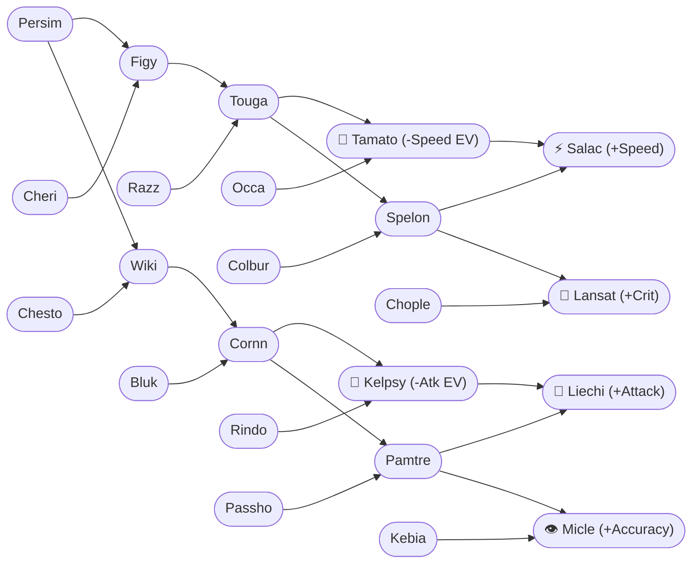
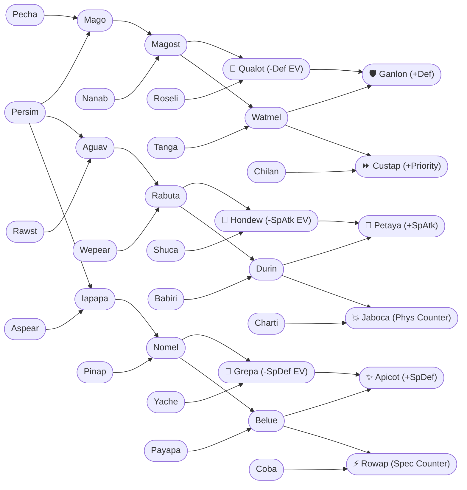
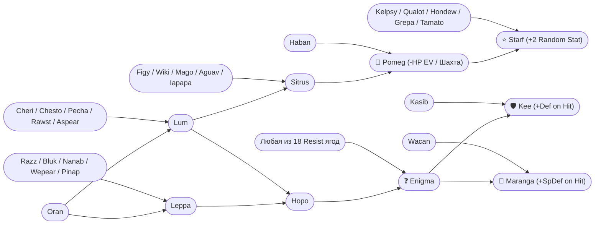

# 🍓 Полное руководство по селекции и мутациям ягод в Cobblemon

> 📖 **Игровой справочник садовода и селекционера**
> Все рецепты, шансы и механики подтверждены файлами игры и серверным кодом.

---

## 📑 Содержание
1. [Правила механики и агротехника](#1-правила-механики-и-агротехника)
2. [Полная таблица рецептов (Все 72 комбинации)](#2-полная-таблица-рецептов-все-72-комбинации)
3. [Путь к цели (Пошаговые маршруты для каждой редкой ягоды)](#3-путь-к-цели-пошаговые-маршруты-для-каждой-редкой-ягоды)
4. [Карта селекции (Интерактивные графы)](#4-карта-селекции-интерактивные-графы)
5. [Эффективные схемы ферм и рассадки](#5-эффективные-схемы-ферм-и-рассадки)

---

## 1. Правила механики и агротехника

### 🌿 Как работает мутация
1. **Соседство:** Для мутации два родительских куста (Родитель A и Родитель B) должны расти на соседних клетках по сторонам света (север, юг, восток, запад). По диагонали мутация не работает.
2. **Шанс срабатывания:**
   - **12.5%** — базовый шанс при каждом цикле созревания плода.
   - **50.0%** — шанс при использовании **Сюрприз-мульчи (`Surprise Mulch`)** (увеличивает шанс в **4 раза**!).
3. **Что происходит при неудаче:**
   - Если шанс не сработал (87.5%), куст просто даёт свой обычный урожай (ягоду своего родительского вида).
   - При следующем цикле плодоношения куст сделает новую попытку мутации.
4. **Сохранение куста:**
   - **Куст не ломается и не исчезает!** Он остаётся на грядке и продолжает бесконечно плодоносить. При мутации меняется только сам плод, который вы срываете.
5. **Почва и биомы:**
   - Мутации работают на **любой** вспаханной земле. Биом и тип почвы не блокируют появление гибридов.
   - Соответствие типа почвы предпочтению ягоды (`Loamy`, `Peat`, `Sandy` и т.д.) даёт только **бонусный урожай (+1..+2 ягоды)** при сборе.

---

## 2. Полная таблица рецептов (Все 72 комбинации)

> 💡 *Все мутации взаимны: не имеет значения, какой из родителей посажен слева, а какой справа.*

| # | Результат | Родитель A | Родитель B | Базовый шанс | С Сюрприз-мульчой | Первое созревание | Повторный урожай | Назначение / Эффект |
| :-: | :--- | :--- | :--- | :-: | :-: | :-: | :-: | :--- |
| **1** | **Figy** | Cheri | Persim | 12.5% | 50.0% | 20 мин | 4 мин | Восст. 1/3 HP (конфуз при -Atk) |
| **2** | **Wiki** | Chesto | Persim | 12.5% | 50.0% | 20 мин | 4 мин | Восст. 1/3 HP (конфуз при -SpAtk) |
| **3** | **Mago** | Pecha | Persim | 12.5% | 50.0% | 20 мин | 4 мин | Восст. 1/3 HP (конфуз при -Spe) |
| **4** | **Aguav** | Rawst | Persim | 12.5% | 50.0% | 20 мин | 4 мин | Восст. 1/3 HP (конфуз при -SpDef) |
| **5** | **Iapapa** | Aspear | Persim | 12.5% | 50.0% | 20 мин | 4 мин | Восст. 1/3 HP (конфуз при -Def) |
| **6** | **Lum** | Oran | Cheri | 12.5% | 50.0% | 48 мин | 12 мин | Снимает **любой** статус |
| **7** | **Lum** | Oran | Chesto | 12.5% | 50.0% | 48 мин | 12 мин | Снимает **любой** статус |
| **8** | **Lum** | Oran | Pecha | 12.5% | 50.0% | 48 мин | 12 мин | Снимает **любой** статус |
| **9** | **Lum** | Oran | Rawst | 12.5% | 50.0% | 48 мин | 12 мин | Снимает **любой** статус |
| **10** | **Lum** | Oran | Aspear | 12.5% | 50.0% | 48 мин | 12 мин | Снимает **любой** статус |
| **11** | **Leppa** | Oran | Razz | 12.5% | 50.0% | 60 мин | 15 мин | Восстанавливает 10 PP |
| **12** | **Leppa** | Oran | Bluk | 12.5% | 50.0% | 60 мин | 15 мин | Восстанавливает 10 PP |
| **13** | **Leppa** | Oran | Nanab | 12.5% | 50.0% | 60 мин | 15 мин | Восстанавливает 10 PP |
| **14** | **Leppa** | Oran | Wepear | 12.5% | 50.0% | 60 мин | 15 мин | Восстанавливает 10 PP |
| **15** | **Leppa** | Oran | Pinap | 12.5% | 50.0% | 60 мин | 15 мин | Восстанавливает 10 PP |
| **16** | **Hopo** | Leppa | Lum | 12.5% | 50.0% | 60 мин | 15 мин | Восстанавливает PP / Основа Enigma |
| **17** | **Sitrus** | Lum | Figy | 12.5% | 50.0% | 36 мин | 8 мин | Восстанавливает 25% HP |
| **18** | **Sitrus** | Lum | Wiki | 12.5% | 50.0% | 36 мин | 8 мин | Восстанавливает 25% HP |
| **19** | **Sitrus** | Lum | Mago | 12.5% | 50.0% | 36 мин | 8 мин | Восстанавливает 25% HP |
| **20** | **Sitrus** | Lum | Aguav | 12.5% | 50.0% | 36 мин | 8 мин | Восстанавливает 25% HP |
| **21** | **Sitrus** | Lum | Iapapa | 12.5% | 50.0% | 36 мин | 8 мин | Восстанавливает 25% HP |
| **22** | **Touga** | Figy | Razz | 12.5% | 50.0% | 60 мин | 15 мин | Мост к Tamato и Spelon |
| **23** | **Cornn** | Wiki | Bluk | 12.5% | 50.0% | 60 мин | 15 мин | Мост к Kelpsy и Pamtre |
| **24** | **Magost** | Mago | Nanab | 12.5% | 50.0% | 60 мин | 15 мин | Мост к Qualot и Watmel |
| **25** | **Rabuta** | Aguav | Wepear | 12.5% | 50.0% | 60 мин | 15 мин | Мост к Hondew и Durin |
| **26** | **Nomel** | Iapapa | Pinap | 12.5% | 50.0% | 60 мин | 15 мин | Мост к Grepa и Belue |
| **27** | **Tamato** | Touga | Occa | 12.5% | 50.0% | 72 мин | 18 мин | **-10 Speed EV** (+Счастье) |
| **28** | **Kelpsy** | Cornn | Rindo | 12.5% | 50.0% | 72 мин | 18 мин | **-10 Attack EV** (+Счастье) |
| **29** | **Qualot** | Magost | Roseli | 12.5% | 50.0% | 72 мин | 18 мин | **-10 Defense EV** (+Счастье) |
| **30** | **Hondew** | Rabuta | Shuca | 12.5% | 50.0% | 72 мин | 18 мин | **-10 Sp. Atk EV** (+Счастье) |
| **31** | **Grepa** | Nomel | Yache | 12.5% | 50.0% | 72 мин | 18 мин | **-10 Sp. Def EV** (+Счастье) |
| **32** | **Pomeg** | Sitrus | Haban | 12.5% | 50.0% | 72 мин | 18 мин | **-10 HP EV** (+Счастье / Шахта) |
| **33** | **Pamtre** | Cornn | Passho | 12.5% | 50.0% | 72 мин | 18 мин | Компонент Liechi и Micle |
| **34** | **Watmel** | Magost | Tanga | 12.5% | 50.0% | 72 мин | 18 мин | Компонент Ganlon и Custap |
| **35** | **Durin** | Rabuta | Babiri | 12.5% | 50.0% | 72 мин | 18 мин | Компонент Petaya и Jaboca |
| **36** | **Belue** | Nomel | Payapa | 12.5% | 50.0% | 72 мин | 18 мин | Компонент Apicot и Rowap |
| **37** | **Spelon** | Touga | Colbur | 12.5% | 50.0% | 72 мин | 18 мин | Компонент Salac и Lansat |
| **38** | **Enigma** | Hopo | Occa | 12.5% | 50.0% | 96 мин | 24 мин | Восст. 25% HP от суперэффект. атак |
| **39** | **Enigma** | Hopo | Passho | 12.5% | 50.0% | 96 мин | 24 мин | Восст. 25% HP от суперэффект. атак |
| **40** | **Enigma** | Hopo | Wacan | 12.5% | 50.0% | 96 мин | 24 мин | Восст. 25% HP от суперэффект. атак |
| **41** | **Enigma** | Hopo | Rindo | 12.5% | 50.0% | 96 мин | 24 мин | Восст. 25% HP от суперэффект. атак |
| **42** | **Enigma** | Hopo | Yache | 12.5% | 50.0% | 96 мин | 24 мин | Восст. 25% HP от суперэффект. атак |
| **43** | **Enigma** | Hopo | Chople | 12.5% | 50.0% | 96 мин | 24 мин | Восст. 25% HP от суперэффект. атак |
| **44** | **Enigma** | Hopo | Kebia | 12.5% | 50.0% | 96 мин | 24 мин | Восст. 25% HP от суперэффект. атак |
| **45** | **Enigma** | Hopo | Shuca | 12.5% | 50.0% | 96 мин | 24 мин | Восст. 25% HP от суперэффект. атак |
| **46** | **Enigma** | Hopo | Coba | 12.5% | 50.0% | 96 мин | 24 мин | Восст. 25% HP от суперэффект. атак |
| **47** | **Enigma** | Hopo | Payapa | 12.5% | 50.0% | 96 мин | 24 мин | Восст. 25% HP от суперэффект. атак |
| **48** | **Enigma** | Hopo | Tanga | 12.5% | 50.0% | 96 мин | 24 мин | Восст. 25% HP от суперэффект. атак |
| **49** | **Enigma** | Hopo | Charti | 12.5% | 50.0% | 96 мин | 24 мин | Восст. 25% HP от суперэффект. атак |
| **50** | **Enigma** | Hopo | Kasib | 12.5% | 50.0% | 96 мин | 24 мин | Восст. 25% HP от суперэффект. атак |
| **51** | **Enigma** | Hopo | Haban | 12.5% | 50.0% | 96 мин | 24 мин | Восст. 25% HP от суперэффект. атак |
| **52** | **Enigma** | Hopo | Colbur | 12.5% | 50.0% | 96 мин | 24 мин | Восст. 25% HP от суперэффект. атак |
| **53** | **Enigma** | Hopo | Babiri | 12.5% | 50.0% | 96 мин | 24 мин | Восст. 25% HP от суперэффект. атак |
| **54** | **Enigma** | Hopo | Chilan | 12.5% | 50.0% | 96 мин | 24 мин | Восст. 25% HP от суперэффект. атак |
| **55** | **Enigma** | Hopo | Roseli | 12.5% | 50.0% | 96 мин | 24 мин | Восст. 25% HP от суперэффект. атак |
| **56** | **Salac** | Spelon | Tamato | 12.5% | 50.0% | 96 мин | 24 мин | **+1 стадия Скорости** при HP $\le 25\%$ |
| **57** | **Liechi** | Kelpsy | Pamtre | 12.5% | 50.0% | 96 мин | 24 мин | **+1 стадия Атаки** при HP $\le 25\%$ |
| **58** | **Ganlon** | Qualot | Watmel | 12.5% | 50.0% | 96 мин | 24 мин | **+1 стадия Защиты** при HP $\le 25\%$ |
| **59** | **Petaya** | Durin | Hondew | 12.5% | 50.0% | 96 мин | 24 мин | **+1 стадия Спец. Атаки** при HP $\le 25\%$ |
| **60** | **Apicot** | Belue | Grepa | 12.5% | 50.0% | 96 мин | 24 мин | **+1 стадия Спец. Защиты** при HP $\le 25\%$ |
| **61** | **Lansat** | Chople | Spelon | 12.5% | 50.0% | 96 мин | 24 мин | **+2 стадии Шанса Крита** при HP $\le 25\%$ |
| **62** | **Starf** | Pomeg | Kelpsy | 12.5% | 50.0% | 96 мин | 24 мин | **+2 стадии Случайного стата** при HP $\le 25\%$ |
| **63** | **Starf** | Pomeg | Qualot | 12.5% | 50.0% | 96 мин | 24 мин | **+2 стадии Случайного стата** при HP $\le 25\%$ |
| **64** | **Starf** | Pomeg | Hondew | 12.5% | 50.0% | 96 мин | 24 мин | **+2 стадии Случайного стата** при HP $\le 25\%$ |
| **65** | **Starf** | Pomeg | Grepa | 12.5% | 50.0% | 96 мин | 24 мин | **+2 стадии Случайного стата** при HP $\le 25\%$ |
| **66** | **Starf** | Pomeg | Tamato | 12.5% | 50.0% | 96 мин | 24 мин | **+2 стадии Случайного стата** при HP $\le 25\%$ |
| **67** | **Micle** | Kebia | Pamtre | 12.5% | 50.0% | 96 мин | 24 мин | **+20% к Точности** приёма при HP $\le 25\%$ |
| **68** | **Custap** | Chilan | Watmel | 12.5% | 50.0% | 96 мин | 24 мин | **Приоритет первого хода** при HP $\le 25\%$ |
| **69** | **Jaboca** | Charti | Durin | 12.5% | 50.0% | 96 мин | 24 мин | Ответный физ. урон $1/8$ HP врага |
| **70** | **Rowap** | Belue | Coba | 12.5% | 50.0% | 96 мин | 24 мин | Ответный спец. урон $1/8$ HP врага |
| **71** | **Kee** | Enigma | Kasib | 12.5% | 50.0% | 96 мин | 24 мин | **+1 стадия Защиты** при физ. ударе |
| **72** | **Maranga** | Enigma | Wacan | 12.5% | 50.0% | 96 мин | 24 мин | **+1 стадия Спец. Защиты** при спец. ударе |

---

## 3. Путь к цели (Пошаговые маршруты для каждой редкой ягоды)

### 🔻 Маршруты к ягодам сброса EV (Tier 3)

#### 1. 🍅 Tamato (-10 Speed EV)
1. `Cheri + Persim` $\rightarrow$ **Figy**
2. `Figy + Razz` $\rightarrow$ **Touga**
3. `Touga + Occa` $\rightarrow$ **Tamato**

#### 2. 🥦 Kelpsy (-10 Attack EV)
1. `Chesto + Persim` $\rightarrow$ **Wiki**
2. `Wiki + Bluk` $\rightarrow$ **Cornn**
3. `Cornn + Rindo` $\rightarrow$ **Kelpsy**

#### 3. 🍈 Qualot (-10 Defense EV)
1. `Pecha + Persim` $\rightarrow$ **Mago**
2. `Mago + Nanab` $\rightarrow$ **Magost**
3. `Magost + Roseli` $\rightarrow$ **Qualot**

#### 4. 🍐 Hondew (-10 Sp. Atk EV)
1. `Rawst + Persim` $\rightarrow$ **Aguav**
2. `Aguav + Wepear` $\rightarrow$ **Rabuta**
3. `Rabuta + Shuca` $\rightarrow$ **Hondew**

#### 5. 🍇 Grepa (-10 Sp. Def EV)
1. `Aspear + Persim` $\rightarrow$ **Iapapa**
2. `Iapapa + Pinap` $\rightarrow$ **Nomel**
3. `Nomel + Yache` $\rightarrow$ **Grepa**

#### 6. 🍎 Pomeg (-10 HP EV & Топливо Таинственной Шахты)
1. `Oran + (Cheri / Chesto / Pecha / Rawst / Aspear)` $\rightarrow$ **Lum**
2. `Lum + (Figy / Wiki / Mago / Aguav / Iapapa)` $\rightarrow$ **Sitrus**
3. `Sitrus + Haban` $\rightarrow$ **Pomeg**

---

### ⚡ Маршруты к легендарным Pinch-ягодам (Tier 4)

| Целевая ягода | Пошаговый маршрут |
| :--- | :--- |
| **Liechi** (+Atk) | `(Wiki + Bluk $\rightarrow$ Cornn)` $\rightarrow$ `(Cornn + Rindo $\rightarrow$ Kelpsy)` + `(Cornn + Passho $\rightarrow$ Pamtre)` $\rightarrow$ **Liechi** |
| **Ganlon** (+Def) | `(Mago + Nanab $\rightarrow$ Magost)` $\rightarrow$ `(Magost + Roseli $\rightarrow$ Qualot)` + `(Magost + Tanga $\rightarrow$ Watmel)` $\rightarrow$ **Ganlon** |
| **Salac** (+Spe) | `(Figy + Razz $\rightarrow$ Touga)` $\rightarrow$ `(Touga + Occa $\rightarrow$ Tamato)` + `(Touga + Colbur $\rightarrow$ Spelon)` $\rightarrow$ **Salac** |
| **Petaya** (+SpAtk) | `(Aguav + Wepear $\rightarrow$ Rabuta)` $\rightarrow$ `(Rabuta + Shuca $\rightarrow$ Hondew)` + `(Rabuta + Babiri $\rightarrow$ Durin)` $\rightarrow$ **Petaya** |
| **Apicot** (+SpDef) | `(Iapapa + Pinap $\rightarrow$ Nomel)` $\rightarrow$ `(Nomel + Yache $\rightarrow$ Grepa)` + `(Nomel + Payapa $\rightarrow$ Belue)` $\rightarrow$ **Apicot** |
| **Lansat** (+Crit) | `(Figy + Razz $\rightarrow$ Touga)` $\rightarrow$ `(Touga + Colbur $\rightarrow$ Spelon)` + `Chople` $\rightarrow$ **Lansat** |
| **Starf** (+2 Stat) | `Pomeg` + любая из 5 EV-ягод (`Kelpsy` / `Qualot` / `Hondew` / `Grepa` / `Tamato`) $\rightarrow$ **Starf** |
| **Custap** (Приоритет) | `(Mago + Nanab $\rightarrow$ Magost $\rightarrow$ + Tanga $\rightarrow$ Watmel)` + `Chilan` $\rightarrow$ **Custap** |
| **Micle** (+Точность) | `(Wiki + Bluk $\rightarrow$ Cornn $\rightarrow$ + Passho $\rightarrow$ Pamtre)` + `Kebia` $\rightarrow$ **Micle** |
| **Jaboca** (Физ. ответ) | `(Aguav + Wepear $\rightarrow$ Rabuta $\rightarrow$ + Babiri $\rightarrow$ Durin)` + `Charti` $\rightarrow$ **Jaboca** |
| **Rowap** (Спец. ответ) | `(Iapapa + Pinap $\rightarrow$ Nomel $\rightarrow$ + Payapa $\rightarrow$ Belue)` + `Coba` $\rightarrow$ **Rowap** |
| **Enigma** (Анти-стихия) | `(Oran + Razz $\rightarrow$ Leppa)` + `(Oran + Cheri $\rightarrow$ Lum)` $\rightarrow$ `Hopo` + `[Любая из 18 Resist]` $\rightarrow$ **Enigma** |
| **Kee** (+Def при ударе) | `Enigma` + `Kasib` $\rightarrow$ **Kee** |
| **Maranga** (+SpDef удар)| `Enigma` + `Wacan` $\rightarrow$ **Maranga** |

---

## 4. Карта селекции (Интерактивные графы)

### ⚔️ Ветка 1: Атака, Скорость, Точность и Крит


### 🛡️ Ветка 2: Защита, Спец. Атака/Защита и Контратаки


### 🌟 Ветка 3: Исцеление, PP, Starf и Загадочная Enigma


---

## 5. Эффективные схемы ферм и рассадки

> ⚠️ **Важный принцип Cobblemon:**
> В отличие от модов вроде AgriCraft, мутация в Cobblemon **НЕ появляется на пустой грядке**.
> Мутирует **сам плод на существующем кусте-родителе** при созревании/сборе урожая, если в соседнем блоке (север, юг, восток, запад) растёт второй родитель.

---

### 📐 Схема 1: Минимальная пара (Линейная селекция)
Самый простой и надёжный способ получить гибрид для точечной селекции:

```
[ Родитель A ] <---> [ Родитель B ]
```
- **Как это работает:** При созревании куст `A` проверяет соседа `B` и может дать мутировавшую ягоду. Куст `B` аналогично проверяет соседа `A` и также может дать мутировавшую ягоду.
- **Оба куста дают шанс мутации!** Вы получаете 2 попытки за каждый цикл плодоношения.
- **Совет:** Посыпьте **Сюрприз-мульчой** под оба куста, чтобы поднять шанс на каждом кусте до **50%**.

---

### 📐 Схема 2: Селекционный блок 2×2 (Максимум контактов)
Компактный квадрат из 4 кустов, где каждый куст имеет сразу двух подходящих соседей:

```
[ A ] [ B ]
[ B ] [ A ]
```
- Каждый куст `A` соприкасается с двумя кустами `B` (по горизонтали и вертикали).
- Каждый куст `B` соприкасается с двумя кустами `A`.
- **4 попытки мутации за один сбор урожая!**

---

### 📐 Схема 3: Промышленная ферма (Шахматный порядок N×N)
Оптимальная схема для массового выращивания редких ягод (например, Pomeg для Шахты или EV-ягод):

```
[ A ] [ B ] [ A ] [ B ] [ A ]
[ B ] [ A ] [ B ] [ A ] [ B ]
[ A ] [ B ] [ A ] [ B ] [ A ]
[ B ] [ A ] [ B ] [ A ] [ B ]
[ A ] [ B ] [ A ] [ B ] [ A ]
```
- Каждый внутренний куст имеет **до 4 контактов** с противоположным родителем.
- Все кусты непрерывно плодоносят, принося как базовые ягоды, так и мутации с каждым циклом сбора (ПКМ). Кусты не ломаются.
