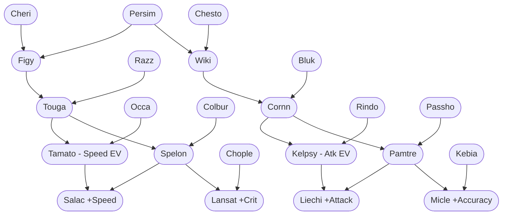
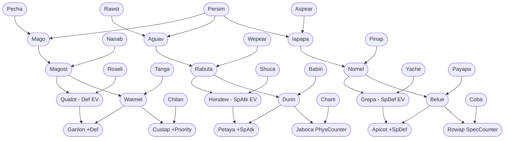
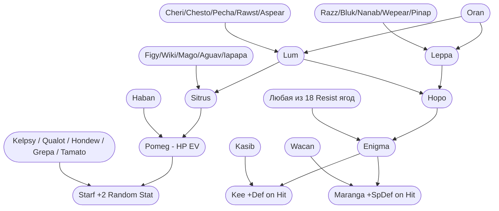

# 🍓 Полный аудит механики ягод и мутаций в Cobblemon (Cobblebackported 1.5.2)

> **Статус:** 🟢 Полностью верифицировано по байткоду (`com.cobblemon.mod.common.block.BerryBlock`, `BerryBlockEntity`) и JSON-датапакам (`data/cobblemon/berries/*.json`) из `Sunlit_Cobblebackported-forge-1.5.2-1.3_1.20.1.jar`.
> **Дата аудита:** Сентябрь 2026

---

## 📑 Содержание
1. [Архитектура и формулы механики (Bytecode Audit)](#1-архитектура-и-формулы-механики-bytecode-audit)
2. [Классификация всех 70 ягод (Тиры, Роли, Эффекты)](#2-классификация-всех-70-ягод-тиры-роли-эффекты)
3. [Исчерпывающая таблица всех 73 рецептов мутаций](#3-исчерпывающая-таблица-всех-73-рецептов-мутаций)
4. [Полный граф эволюции и мутаций ягод (Mermaid)](#4-полный-граф-эволюции-и-мутаций-ягод-mermaid)
5. [Практическое руководство для игрока и фермера](#5-практическое-руководство-для-игрока-и-фермера)

---

## 1. Архитектура и формулы механики (Bytecode Audit)

### 🔬 1.1. Базовые правила и математическая модель
| Параметр | Точное значение из кода | Источник в байткоде / JSON |
| :--- | :--- | :--- |
| **Базовый шанс мутации** | **12.5%** ($125 / 1000$) | `BerryBlock.class` (инструкция `bipush 125`, деление на `sipush 1000`) |
| **Шанс с Сюрприз-мульчой** | **50.0%** ($125 \times 4 = 500 / 1000$) | `BerryBlock.class` (`MulchVariant.SURPRISE -> iconst 4; imul`) |
| **Расположение родителей** | Ортогональные соседи (Манхэттенское расстояние = 1) | `pos.offset(direction)` по 4 горизонтальным сторонам |
| **Поведение при неудаче** | Вырастает обычная родительская ягода куста | `BerryBlock.class` ветка `else` при `random.nextInt(1000) >= chance` |
| **Сохранение куста** | **Куст НЕ уничтожается** и не деградирует | При мутации заменяется только урожай (`ItemState`), куст переходит в фазу созревания |
| **Повторные попытки** | Каждую стадию плодоношения (Replant/Regrow cycle) | Куст плодоносит каждые $N$ минут повторно |
| **Влияние почвы/биома** | **НЕ блокирует мутацию**, даёт бонус к урожаю (+1..+2) | `BerryData.preferredSoil`, `BerryData.bonusYield` |

### 🧪 1.2. Виды мульчи (Mulch) и их механика
Мульча наносится ПКМ на вспаханную грядку с ягодой и имеет ограниченное число циклов плодоношения (`decrementMulchDuration`):

1. **🌱 Сюрприз-мульча (`cobblemon:surprise_mulch`)**:
   - **Эффект:** Умножает базовый шанс любой мутации на **$\times 4$** (с 12.5% до **50.0%**).
   - **Назначение:** Главный инструмент селекционера для ускоренного выведения редких гибридов.
2. **🌿 Перегнойная мульча (`cobblemon:loamy_mulch`)**:
   - **Эффект:** Увеличивает урожай ягод с предпочтением равнинной почвы (`preferredSoil: LOAMY`).
3. **🍂 Торфяная мульча (`cobblemon:peat_mulch`)**:
   - **Эффект:** Увеличивает урожай ягод с предпочтением лесной/болотистой почвы (`preferredSoil: PEAT`).
4. **💧 Влажная мульча (`cobblemon:humid_mulch`)**:
   - **Эффект:** Сохраняет влажность грядки без прямого источника воды + буст ягод джунглей (`HUMID`).
5. **🏜️ Песчаная мульча (`cobblemon:sandy_mulch`)**:
   - **Эффект:** Позволяет эффективно растить ягоды засушливых регионов (`SANDY`).
6. **🪨 Грубая мульча (`cobblemon:coarse_mulch`)**:
   - **Эффект:** Урожай для горных и таёжных ягод (`COARSE`).

---

## 2. Классификация всех 70 ягод (Тиры, Роли, Эффекты)

Все 70 ягод в игре строго разделены на **4 Тира** в зависимости от их происхождения и глубины селекции:

### 🟢 ТИР 0: Базовые природные ягоды (Дикорастущие — 30 ягод)
*Эти ягоды можно найти в дикой природе (в луте, на деревьях и кустах в различных биомах).*

| Категория | Количество | Список ягод | Назначение / Эффект |
| :--- | :---: | :--- | :--- |
| **Лечение статусов** | 6 | `Cheri` (Паралич), `Chesto` (Сон), `Pecha` (Отравление), `Rawst` (Ожог), `Aspear` (Заморозка), `Persim` (Замешательство) | Базовые расходники + ключевые компоненты Тира 1 |
| **Лечение / Крафт** | 6 | `Oran` (10 HP), `Razz`, `Bluk`, `Nanab`, `Wepear`, `Pinap` | Покеболлы, крафт приманок, базовое скрещивание |
| **Защита от стихий (Resist)** | 18 | `Occa` (Fire), `Passho` (Water), `Wacan` (Electric), `Rindo` (Grass), `Yache` (Ice), `Chople` (Fighting), `Kebia` (Poison), `Shuca` (Ground), `Coba` (Flying), `Payapa` (Psychic), `Tanga` (Bug), `Charti` (Rock), `Kasib` (Ghost), `Haban` (Dragon), `Colbur` (Dark), `Babiri` (Steel), `Chilan` (Normal), `Roseli` (Fairy) | Снижают урон от суперэффективных атак на 50%. Нужны для мутаций Тира 3 и ягоды Enigma! |

---

### 🟡 ТИР 1: Первичные гибриды (Вкусовые, Лечебные и Восстановление PP — 8 ягод)
*Получаются скрещиванием двух базовых ягод Тира 0.*

| Ягода | Родители (A + B) | Внутриигровой эффект | Почва / Время роста |
| :--- | :--- | :--- | :--- |
| **Figy** | Cheri + Persim | Восстанавливает 1/3 HP (конфуз если -Atk характер) | `LOAMY` (20 мин / 4 мин) |
| **Wiki** | Chesto + Persim | Восстанавливает 1/3 HP (конфуз если -Sp.Atk характер) | `LOAMY` (20 мин / 4 мин) |
| **Mago** | Pecha + Persim | Восстанавливает 1/3 HP (конфуз если -Spe характер) | `LOAMY` (20 мин / 4 мин) |
| **Aguav** | Rawst + Persim | Восстанавливает 1/3 HP (конфуз если -Sp.Def характер) | `LOAMY` (20 мин / 4 мин) |
| **Iapapa** | Aspear + Persim | Восстанавливает 1/3 HP (конфуз если -Def характер) | `LOAMY` (20 мин / 4 мин) |
| **Lum** | Oran + (Cheri / Chesto / Pecha / Rawst / Aspear) | **Лечит ЛЮБОЙ статус** (Сон, Яд, Паралич, Ожог, Заморозка) | `LOAMY` (48 мин / 12 мин) |
| **Leppa** | Oran + (Razz / Bluk / Nanab / Wepear / Pinap) | **Восстанавливает 10 PP** при истощении приёма | `LOAMY` (60 мин / 15 мин) |
| **Hopo** | Leppa + Lum | Восстанавливает PP (Cobblemon эксклюзив) | `LOAMY` (60 мин / 15 мин) |

---

### 🟠 ТИР 2: Вторичные гибриды (Промежуточные компоненты — 6 ягод)
*Служат ключевыми мостами между базовыми гибридами и ягодами сброса EV.*

| Ягода | Родители (A + B) | Роль в селекции | Почва / Время роста |
| :--- | :--- | :--- | :--- |
| **Sitrus** | Lum + (Figy / Wiki / Mago / Aguav / Iapapa) | Восстанавливает 25% HP без побочных эффектов. Родитель `Pomeg` | `LOAMY` (36 мин / 8 мин) |
| **Touga** | Figy + Razz | Мост к `Tamato` (Скорость) и `Spelon` | `LOAMY` (60 мин / 15 мин) |
| **Cornn** | Wiki + Bluk | Мост к `Kelpsy` (Атака) и `Pamtre` | `LOAMY` (60 мин / 15 мин) |
| **Magost** | Mago + Nanab | Мост к `Qualot` (Защита) и `Watmel` | `LOAMY` (60 мин / 15 мин) |
| **Rabuta** | Aguav + Wepear | Мост к `Hondew` (Спец. Атака) и `Durin` | `LOAMY` (60 мин / 15 мин) |
| **Nomel** | Iapapa + Pinap | Мост к `Grepa` (Спец. Защита) и `Belue` | `LOAMY` (60 мин / 15 мин) |

---

### 🔴 ТИР 3: Третичные гибриды (Сброс EV, Редкие плоды и Enigma — 12 ягод)
*Ягоды сброса EV понижают ненужные статы на -10 EV и повышают счастье (+10). Ключевое топливо для Таинственной Шахты (`#cobblemon_farmers:rare_berries`)!*

| Ягода | Родители (A + B) | Внутриигровой эффект / Назначение | Почва / Время |
| :--- | :--- | :--- | :--- |
| **Pomeg** | Sitrus + Haban | **-10 HP EV** (+Счастье). Компонент `Starf` | `LOAMY` (72 мин / 18 мин) |
| **Kelpsy** | Cornn + Rindo | **-10 Attack EV** (+Счастье). Компонент `Liechi`, `Starf` | `LOAMY` (72 мин / 18 мин) |
| **Qualot** | Magost + Roseli | **-10 Defense EV** (+Счастье). Компонент `Ganlon`, `Starf` | `LOAMY` (72 мин / 18 мин) |
| **Hondew** | Rabuta + Shuca | **-10 Sp. Atk EV** (+Счастье). Компонент `Petaya`, `Starf` | `LOAMY` (72 мин / 18 мин) |
| **Grepa** | Nomel + Yache | **-10 Sp. Def EV** (+Счастье). Компонент `Apicot`, `Starf` | `LOAMY` (72 мин / 18 мин) |
| **Tamato** | Touga + Occa | **-10 Speed EV** (+Счастье). Компонент `Salac`, `Starf` | `LOAMY` (72 мин / 18 мин) |
| **Pamtre** | Cornn + Passho | Редкий плод. Компонент `Liechi`, `Micle` | `LOAMY` (72 мин / 18 мин) |
| **Watmel** | Magost + Tanga | Редкий плод. Компонент `Ganlon`, `Custap` | `LOAMY` (72 мин / 18 мин) |
| **Durin** | Rabuta + Babiri | Редкий плод. Компонент `Petaya`, `Jaboca` | `LOAMY` (72 мин / 18 мин) |
| **Belue** | Nomel + Payapa | Редкий плод. Компонент `Apicot`, `Rowap` | `LOAMY` (72 мин / 18 мин) |
| **Spelon** | Touga + Colbur | Редкий плод. Компонент `Salac`, `Lansat` | `LOAMY` (72 мин / 18 мин) |
| **Enigma** | Hopo + (Любая из 18 Resist) | Восстанавливает 25% HP при получении суперэффективного удара | `LOAMY` (96 мин / 24 мин) |

---

### 🟣 ТИР 4: Легендарные ягоды (Pinch Berries & Ультимативные бафы — 14 ягод)
*Вершина селекции. Дают мощнейшие бафы к характеристикам при здоровье ниже 25% (Pinch).*

| Ягода | Родители (A + B) | Боевой эффект (Pinch / Trigger) | Время роста |
| :--- | :--- | :--- | :--- |
| **Liechi** | Kelpsy + Pamtre | **+1 стадия Атаки** при HP $\le 25\%$ | 96 мин / 24 мин |
| **Ganlon** | Qualot + Watmel | **+1 стадия Защиты** при HP $\le 25\%$ | 96 мин / 24 мин |
| **Salac** | Spelon + Tamato | **+1 стадия Скорости** при HP $\le 25\%$ | 96 мин / 24 мин |
| **Petaya** | Durin + Hondew | **+1 стадия Спец. Атаки** при HP $\le 25\%$ | 96 мин / 24 мин |
| **Apicot** | Belue + Grepa | **+1 стадия Спец. Защиты** при HP $\le 25\%$ | 96 мин / 24 мин |
| **Lansat** | Chople + Spelon | **+2 стадии Шанса Крита** при HP $\le 25\%$ | 96 мин / 24 мин |
| **Starf** | Pomeg + (Kelpsy/Qualot/Hondew/Grepa/Tamato) | **+2 стадии Случайного стата** при HP $\le 25\%$ | 96 мин / 24 мин |
| **Micle** | Kebia + Pamtre | **+20% к Точности** следующего приёма при HP $\le 25\%$ | 96 мин / 24 мин |
| **Custap** | Chilan + Watmel | **Гарантирует приоритет первого хода** при HP $\le 25\%$ | 96 мин / 24 мин |
| **Jaboca** | Charti + Durin | Наносит атакующему урон $1/8$ HP при физ. атаке | 96 мин / 24 мин |
| **Rowap** | Belue + Coba | Наносит атакующему урон $1/8$ HP при спец. атаке | 96 мин / 24 мин |
| **Kee** | Enigma + Kasib | **+1 стадия Защиты** при получении физ. урона | 96 мин / 24 мин |
| **Maranga** | Enigma + Wacan | **+1 стадия Спец. Защиты** при получении спец. урона | 96 мин / 24 мин |

---

## 3. Исчерпывающая таблица всех 73 рецептов мутаций

Ниже приведена полная матрица всех 73 уникальных комбинаций скрещивания, зашитых в датапаке мода (`data/cobblemon/berries/*.json`):

| # | Результат (Child) | Родитель A | Родитель B | Базовый шанс | С Сюрприз-мульчой | Время 1-го созревания | Цикл повторного урожая |
| :---: | :--- | :--- | :--- | :---: | :---: | :---: | :---: |
| 1 | **Figy** | Cheri | Persim | 12.5% | 50.0% | 20 мин | 4 мин |
| 2 | **Wiki** | Chesto | Persim | 12.5% | 50.0% | 20 мин | 4 мин |
| 3 | **Mago** | Pecha | Persim | 12.5% | 50.0% | 20 мин | 4 мин |
| 4 | **Aguav** | Rawst | Persim | 12.5% | 50.0% | 20 мин | 4 мин |
| 5 | **Iapapa** | Aspear | Persim | 12.5% | 50.0% | 20 мин | 4 мин |
| 6 | **Lum** | Oran | Cheri | 12.5% | 50.0% | 48 мин | 12 мин |
| 7 | **Lum** | Oran | Chesto | 12.5% | 50.0% | 48 мин | 12 мин |
| 8 | **Lum** | Oran | Pecha | 12.5% | 50.0% | 48 мин | 12 мин |
| 9 | **Lum** | Oran | Rawst | 12.5% | 50.0% | 48 мин | 12 мин |
| 10 | **Lum** | Oran | Aspear | 12.5% | 50.0% | 48 мин | 12 мин |
| 11 | **Leppa** | Oran | Razz | 12.5% | 50.0% | 60 мин | 15 мин |
| 12 | **Leppa** | Oran | Bluk | 12.5% | 50.0% | 60 мин | 15 мин |
| 13 | **Leppa** | Oran | Nanab | 12.5% | 50.0% | 60 мин | 15 мин |
| 14 | **Leppa** | Oran | Wepear | 12.5% | 50.0% | 60 мин | 15 мин |
| 15 | **Leppa** | Oran | Pinap | 12.5% | 50.0% | 60 мин | 15 мин |
| 16 | **Hopo** | Leppa | Lum | 12.5% | 50.0% | 60 мин | 15 мин |
| 17 | **Sitrus** | Lum | Figy | 12.5% | 50.0% | 36 мин | 8 мин |
| 18 | **Sitrus** | Lum | Wiki | 12.5% | 50.0% | 36 мин | 8 мин |
| 19 | **Sitrus** | Lum | Mago | 12.5% | 50.0% | 36 мин | 8 мин |
| 20 | **Sitrus** | Lum | Aguav | 12.5% | 50.0% | 36 мин | 8 мин |
| 21 | **Sitrus** | Lum | Iapapa | 12.5% | 50.0% | 36 мин | 8 мин |
| 22 | **Touga** | Figy | Razz | 12.5% | 50.0% | 60 мин | 15 мин |
| 23 | **Cornn** | Wiki | Bluk | 12.5% | 50.0% | 60 мин | 15 мин |
| 24 | **Magost** | Mago | Nanab | 12.5% | 50.0% | 60 мин | 15 мин |
| 25 | **Rabuta** | Aguav | Wepear | 12.5% | 50.0% | 60 мин | 15 мин |
| 26 | **Nomel** | Iapapa | Pinap | 12.5% | 50.0% | 60 мин | 15 мин |
| 27 | **Tamato** | Touga | Occa | 12.5% | 50.0% | 72 мин | 18 мин |
| 28 | **Kelpsy** | Cornn | Rindo | 12.5% | 50.0% | 72 мин | 18 мин |
| 29 | **Qualot** | Magost | Roseli | 12.5% | 50.0% | 72 мин | 18 мин |
| 30 | **Hondew** | Rabuta | Shuca | 12.5% | 50.0% | 72 мин | 18 мин |
| 31 | **Grepa** | Nomel | Yache | 12.5% | 50.0% | 72 мин | 18 мин |
| 32 | **Pomeg** | Sitrus | Haban | 12.5% | 50.0% | 72 мин | 18 мин |
| 33 | **Pamtre** | Cornn | Passho | 12.5% | 50.0% | 72 мин | 18 мин |
| 34 | **Watmel** | Magost | Tanga | 12.5% | 50.0% | 72 мин | 18 мин |
| 35 | **Durin** | Rabuta | Babiri | 12.5% | 50.0% | 72 мин | 18 мин |
| 36 | **Belue** | Nomel | Payapa | 12.5% | 50.0% | 72 мин | 18 мин |
| 37 | **Spelon** | Touga | Colbur | 12.5% | 50.0% | 72 мин | 18 мин |
| 38 | **Enigma** | Hopo | Occa | 12.5% | 50.0% | 96 мин | 24 мин |
| 39 | **Enigma** | Hopo | Passho | 12.5% | 50.0% | 96 мин | 24 мин |
| 40 | **Enigma** | Hopo | Wacan | 12.5% | 50.0% | 96 мин | 24 мин |
| 41 | **Enigma** | Hopo | Rindo | 12.5% | 50.0% | 96 мин | 24 мин |
| 42 | **Enigma** | Hopo | Yache | 12.5% | 50.0% | 96 мин | 24 мин |
| 43 | **Enigma** | Hopo | Chople | 12.5% | 50.0% | 96 мин | 24 мин |
| 44 | **Enigma** | Hopo | Kebia | 12.5% | 50.0% | 96 мин | 24 мин |
| 45 | **Enigma** | Hopo | Shuca | 12.5% | 50.0% | 96 мин | 24 мин |
| 46 | **Enigma** | Hopo | Coba | 12.5% | 50.0% | 96 мин | 24 мин |
| 47 | **Enigma** | Hopo | Payapa | 12.5% | 50.0% | 96 мин | 24 мин |
| 48 | **Enigma** | Hopo | Tanga | 12.5% | 50.0% | 96 мин | 24 мин |
| 49 | **Enigma** | Hopo | Charti | 12.5% | 50.0% | 96 мин | 24 мин |
| 50 | **Enigma** | Hopo | Kasib | 12.5% | 50.0% | 96 мин | 24 мин |
| 51 | **Enigma** | Hopo | Haban | 12.5% | 50.0% | 96 мин | 24 мин |
| 52 | **Enigma** | Hopo | Colbur | 12.5% | 50.0% | 96 мин | 24 мин |
| 53 | **Enigma** | Hopo | Babiri | 12.5% | 50.0% | 96 мин | 24 мин |
| 54 | **Enigma** | Hopo | Chilan | 12.5% | 50.0% | 96 мин | 24 мин |
| 55 | **Enigma** | Hopo | Roseli | 12.5% | 50.0% | 96 мин | 24 мин |
| 56 | **Salac** | Spelon | Tamato | 12.5% | 50.0% | 96 мин | 24 мин |
| 57 | **Liechi** | Kelpsy | Pamtre | 12.5% | 50.0% | 96 мин | 24 мин |
| 58 | **Ganlon** | Qualot | Watmel | 12.5% | 50.0% | 96 мин | 24 мин |
| 59 | **Petaya** | Durin | Hondew | 12.5% | 50.0% | 96 мин | 24 мин |
| 60 | **Apicot** | Belue | Grepa | 12.5% | 50.0% | 96 мин | 24 мин |
| 61 | **Lansat** | Chople | Spelon | 12.5% | 50.0% | 96 мин | 24 мин |
| 62 | **Starf** | Pomeg | Kelpsy | 12.5% | 50.0% | 96 мин | 24 мин |
| 63 | **Starf** | Pomeg | Qualot | 12.5% | 50.0% | 96 мин | 24 мин |
| 64 | **Starf** | Pomeg | Hondew | 12.5% | 50.0% | 96 мин | 24 мин |
| 65 | **Starf** | Pomeg | Grepa | 12.5% | 50.0% | 96 мин | 24 мин |
| 66 | **Starf** | Pomeg | Tamato | 12.5% | 50.0% | 96 мин | 24 мин |
| 67 | **Micle** | Kebia | Pamtre | 12.5% | 50.0% | 96 мин | 24 мин |
| 68 | **Custap** | Chilan | Watmel | 12.5% | 50.0% | 96 мин | 24 мин |
| 69 | **Jaboca** | Charti | Durin | 12.5% | 50.0% | 96 мин | 24 мин |
| 70 | **Rowap** | Belue | Coba | 12.5% | 50.0% | 96 мин | 24 мин |
| 71 | **Kee** | Enigma | Kasib | 12.5% | 50.0% | 96 мин | 24 мин |
| 72 | **Maranga** | Enigma | Wacan | 12.5% | 50.0% | 96 мин | 24 мин |

---

## 4. Полный граф эволюции и мутаций ягод (Mermaid)

### 🌿 Ветка 1: Скорость и Атака (Speed & Attack Tree)


### 🛡️ Ветка 2: Защита и Спец. Характеристики (Defense & Special Tree)


### ✨ Ветка 3: Исцеление, PP, Starf и ягода Enigma


---

## 5. Практическое руководство для игрока и фермера

> ⚠️ **Физика мутации в Cobblemon:**
> Мутация происходит **на самом родительском кусте**, а не на пустой грядке между ними. Игра проверяет 4 ортогональных соседа куста в момент созревания/сбора урожая.

### 🚜 5.1. Эффективные схемы рассадки
1. **Минимальная пара (1+1):**
   ```
   [ Родитель A ] <---> [ Родитель B ]
   ```
   - Оба куста соприкасаются друг с другом.
   - Каждый сбор урожая даёт 2 попытки мутации.

2. **Селекционный блок 2×2:**
   ```
   [ A ] [ B ]
   [ B ] [ A ]
   ```
   - Каждый куст имеет 2 соседей противоположного типа $\rightarrow$ 4 попытки мутации за цикл.

3. **Шахматное поле (N×N):**
   ```
   [ A ] [ B ] [ A ] [ B ]
   [ B ] [ A ] [ B ] [ A ]
   [ A ] [ B ] [ A ] [ B ]
   [ B ] [ A ] [ B ] [ A ]
   ```
   - Каждый внутренний куст имеет 4 ортогональных контакта, давая максимальный выход гибридов.

---

### 💡 5.2. Пошаговый маршрут к топливу Таинственной Шахты (Rare Berries)
Если у вас есть стартовый набор: `Haban`, `Chesto`, `Oran`, `Nanab`, `Pecha`, `Chilan`:

1. **Шаг 1: Получение Lum**
   - Сажаем `Oran` рядом с `Chesto` (или `Pecha`).
   - Получаем **Lum** (12.5% баз. / 50% с мульчой).
2. **Шаг 2: Получение базового 1/3 HP гибрида (Mago или Wiki)**
   - Находим или покупаем `Persim`.
   - Сажаем `Pecha` + `Persim` $\rightarrow$ **Mago**.
   - (Или `Chesto` + `Persim` $\rightarrow$ **Wiki**).
3. **Шаг 3: Получение Sitrus**
   - Сажаем `Lum` + `Mago` (или `Wiki`) $\rightarrow$ **Sitrus**.
4. **Шаг 4: Получение Pomeg (Топливо Редких Ягод!)**
   - Сажаем `Sitrus` + `Haban` $\rightarrow$ **Pomeg**!
   - **Результат:** Ягода **Pomeg** принадлежит тегу `#cobblemon_farmers:rare_berries` и активирует поиск окаменелостей в **Таинственной Шахте (Mystery Mine)**!

