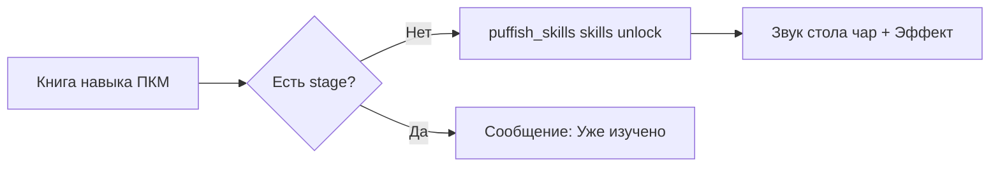

# ⚡ Технический аудит механик навыков: Society Sunlit Cobblemon

> **Объект аудита:** Древо навыков «Уровень тренера» (`sunlit_cobblemon:trainer_level`) и 7 новых литературных книг навыков Puffish Skills.  
> **Расположение файлов в сборке:** `G:\curseforge\minecraft\Instances\Society Sunlit Cobblemon`  
> **Дата аудита:** 13.09.2026  

---

## 1. Древо навыков: Уровень тренера (`trainer_level`)

Категория находится в меню навыков `K` (`sunlit_cobblemon.skills.trainer_level.category.title`).  
Иконка: `cobblemon:master_ball`. Фон: терракотовые кирпичи Clayworks.  

### 📊 Линейка прогрессии (8 ступеней)

| Ранг | Stage в KubeJS | Бонус фермы (`worker_cap`) | Ключевые игровые разблокировки |
| :--- | :--- | :---: | :--- |
| 🌿 **Twig** (Прут) | `trainer_lvl_1` | **+3** | Доступ к **Great Ball** в Покемарте; покупка Перьев усиления за Капли солнца. |
| 🪨 **Rock** (Камень) | `trainer_lvl_2` | **+3** *(всего +6)* | Расширение ассортимента семян ягод и поке-инструментов. |
| ⛓️ **Iron** (Железо) | `trainer_lvl_3` | **+3** *(всего +9)* | Доступ к **Ultra Ball** в Покемарте; доступ к продвинутым приманкам. |
| 🟡 **Gold** (Золото) | `trainer_lvl_4` | **+3** *(всего +12)* | **Апгрейд лутболов:** `sunlit_cobblemon:poke_loot_ball` переключается на улучшенную таблицу дропа `poke_loot_ball_gold_tier`. |
| 💎 **Diamond** (Алмаз) | `trainer_lvl_5` | **+3** *(всего +15)* | Открытие книг навыков за Медальоны лиги в Покемарте (`berry_labor_and_capital`, `bottlecaps_and_nothingness`). |
| 🟣 **Iridium** (Иридий) | `trainer_lvl_6` | **+3** *(всего +18)* | Доступ к редким TM-дискам и приманкам на легендарных покемонов. |
| 🏺 **Ancient** (Древний) | `trainer_lvl_7` | **+3** *(всего +21)* | Доступ к призыву и алтарям древних легенд. |
| 🌈 **Prismatic** (Призматический) | `trainer_lvl_8` | **+6** *(всего +27)* | Доступ к **Master Ball** в Покемарте и книге **«Дикое солнце»** в Солнечном подношении. |

### 🎯 Как прокачивается «Уровень тренера»
Очки не фармятся пассивно за опыт. Ранги выдаются **строго за выполнение этапных квестов** в главе FTB Quests `Beginner` (`config/ftbquests/quests/chapters/beginner.snbt`).  
При сдаче квеста выполняется серверная команда:
```bash
/puffish_skills skills unlock @p sunlit_cobblemon:trainer_level <node_id>
```
Команда автоматически зажигает узел в меню `K` и начисляет stage `trainer_lvl_X`.

---

## 2. Семь новых книг навыков (Skill Books)

Все 7 книг читаются правым кликом (ПКМ), тратят предмет и навсегда открывают пассивный навык в категории `society:books` (`kubejs/server_scripts/itemEvents/skillBooks.js`).



### 📚 Детальный разбор 7 книг:

#### 1. ⚔️ «Искусство битвы» (*The Art of Battle*)
- **Первоисточник:** Сунь-цзы — *«Искусство войны»*.
- **Игровой эффект:** Победы в боях Лиги Sunlit приносят на **+25%% больше монет**.
- **Код:** `kubejs/startup_scripts/cobblemon/cobblemonHandleDeath.js`
- **🎮 Бесплатное получение в игре:**
  - **Бои Лиги:** Ровно **1% шанс (1/100)** при победе над любым тренером Лиги Sunlit (`rctmod:trainer`). Книга выдаётся автоматически в инвентарь победителя!
  - *(Альтернатива покупки: Библиотекарь на Ярмарке книг).*

#### 2. 🌾 «Ягоды, труд и капитал» (*Berry, Labor, and Capital*)
- **Первоисточник:** Карл Маркс — *«Капитал»*.
- **Игровой эффект:** **+5 слотов** для покемонов-работников на ферме (`cobblemon_farmers:worker_cap`).
- **Код:** Прямой модификатор атрибута Puffish Attributes.
- **🎮 Бесплатное получение в игре:**
  - **Медальоны Лиги:** Обменивается в Покемарте за **5 Медальонов лиги Sunlit** (`sunlit_league_medallion`), которые выпадают каждые 15 побед над элитными тренерами Лиги (требуется ранг тренера `trainer_lvl_5` / Алмаз).

#### 3. 🍾 «Крышки от бутылок и ничто» (*Bottlecaps and Nothingness*)
- **Первоисточник:** Жан-Поль Сартр — *«Бытие и ничто»*.
- **Игровой эффект:** Открывает шанс находить **Крышки от бутылок** (Bottlecaps, шанс 3%) во всех сундуках с сокровищами.
- **Код:** `kubejs/server_scripts/cobblemon/cobblemonLoot.js`
- **🎮 Бесплатное получение в игре:**
  - **Медальоны Лиги:** Обменивается в Покемарте за **20 Медальонов лиги Sunlit** за победы над элитными тренерами (требуется ранг тренера `trainer_lvl_5` / Алмаз).

#### 4. 🌿 «Плетение травы-сюрприза» (*Braiding Surprisegrass*)
- **Первоисточник:** Робин Уолл Киммерер — *«Плетение сладкой травы»*.
- **Игровой эффект:** В **1.5 раза выше шанс** обнаружить скрытого покемона при добыче руды и сборе урожая (при экипированном Silph Scope с модификацией Surprise).
- **Код:** `kubejs/server_scripts/cobblemon/cobblemonPokeCrop.js` и `cobblemonPokeOre.js`
- **🎮 Бесплатное получение в игре:**
  - **Фермерство:** Шанс **1/80 (1.25%)** при сборе любого созревшего урожая мотыгой.
  - **Шахтёрство:** Шанс **1/80 (1.25%)** при разрушении любых руд (без Silk Touch). Книга выпадает на землю из блока.

#### 5. 🎰 «Игрок в гачамонов» (*The Gachamonbler*)
- **Первоисточник:** Ф. М. Достоевский — *«Игрок»*.
- **Игровой эффект:** Шанс на получение шайни-покемона из капсул Гачамона **удвоен (x2)**. Капсулы золотого качества и выше спавнят покемонов **исключительно из бонусного пула**.
- **Код:** `kubejs/server_scripts/cobblemon/cobblemonGachaPools.js`
- **🎮 Бесплатное получение в игре:**
  - **Капсулы Гачамона:** Ровно **1% шанс (1/100)** прямого выпадения книги в инвентарь при открытии любой капсулы Гачамона (`rollGacha`).

#### 6. 🧪 «Макбет» (*Mukbeth*)
- **Первоисточник:** Уильям Шекспир — *«Макбет»* (каламбур с покемоном Muk).
- **Игровой эффект:** Граймер, Мук, Траббиш и Гарбодор **полностью исключаются из пула клёва** при ловле на Поке-поплавки (никакого ядовитого мусора на рыбалке).
- **Код:** `kubejs/startup_scripts/cobblemon/cobblemonFishing.js` и `cobblemon_farmers/muk.json`
- **🎮 Бесплатное получение в игре:**
  - **Ранчо:** Посадите Мука (`Muk / Alolan Muk`) на Станцию ранчо с **$\ge 6$ сердцами Affection** $\rightarrow$ шанс **1% (1/100)** каждое утро получить книгу с утреннего фуража.

#### 7. ☀️ «Дикое солнце» (*Savage Sun*)
- **Первоисточник:** *«Дикое солнце»*.
- **Игровой эффект:** Статуи Солнечных рейдов имеют **15%% шанс мгновенно перезарядиться**, проигнорировав кулдаун активации.
- **Код:** `kubejs/server_scripts/cobblemon/cobblemonRaid.js` и `sun_offering.json`
- **🎮 Бесплатное получение в игре:**
  - **Рейды Солнца:** Фармится в битвах со статуями Солнечного рейда (требуется 64 Капли солнца + 20 Веток мистики, выбиваемых из рейдовых боссов). Открывается на ранге `trainer_lvl_8` (Призматический).
