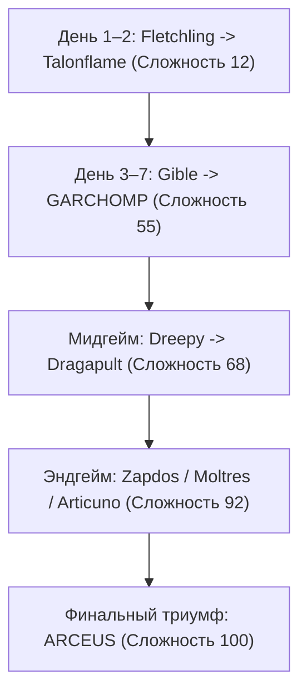

# 🦅 «Особенная восьмёрка» летунов: Полный аудит характеристик, добычи и сложности (Шкала 1–100)

В конфигурации сборки (`saves/serverconfig/pokemonRideConfig.json`) зарегистрировано **75 летающих покемонов**. 
Из них **67 видов** имеют одинаковые базовые параметры (`Скорость: 1.00`, `Стамина: 200` = 10 сек спринта), и **ровно 8 видов** обладают уникальными множителями скорости или увеличенным запасом выносливости.

Ниже представлен детальный аудит каждого из 8 покемонов с точными формулами, биомами, шансами и оценкой сложности поимки.

---

## 📋 Сводная таблица параметров из `pokemonRideConfig.json`

| Покемон | Скорость (`speedModifier`) | В спринте (`Ctrl`) | Стамина (сек спринта) | Точка посадки (`offset`) | Режимы |
| :--- | :---: | :---: | :---: | :---: | :---: |
| 👑 **Garchomp** (*Гарчомп*) | **`1.45`** | **`2.18x`** | **`1000` (50.0 сек)** | `[0.0, 0.7, 0.0]` | `WALK`, `FLY` |
| 🚀 **Dragapult** (*Драгапулт*) | **`1.50`** | **`2.25x`** | `200` (10.0 сек) | `[0.0, 0.8, 0.0]` | `FLY` |
| 🔥 **Talonflame** (*Талонфлейм*) | **`1.20`** | **`1.80x`** | **`400` (20.0 сек)** | `[0.0, 0.3, 0.0]` | `WALK`, `FLY` |
| ❄️ **Articuno** (*Артикуно*) | **`1.20`** | **`1.80x`** | **`600` (30.0 сек)** | `[0.0, 0.6, 0.0]` | `WALK`, `FLY` |
| ⚡ **Zapdos** (*Запдос*) | **`1.60`** | **`2.40x`** | **`300` (15.0 сек)** | `[0.0, 0.6, 0.0]` | `WALK`, `FLY` |
| 🔥 **Moltres** (*Молтрес*) | **`1.60`** | **`2.40x`** | **`300` (15.0 сек)** | `[0.0, 0.6, 0.0]` | `WALK`, `FLY` |
| ☁️ **Altaria** (*Альтария*) | `1.00` | `1.50x` | **`400` (20.0 сек)** | `[0.0, 0.7, 0.0]` | `FLY` |
| 🌌 **Arceus** (*Аркеус*) | **`2.00`** | **`3.00x`** | `200` (10.0 сек) | `[0.0, 1.3, 0.0]` | `WALK`, `FLY`, `SWIM` |

---

## 🔍 Детальный разбор каждого покемона

---

### 1. 🔥 Talonflame (Талонфлейм) — «Лучший ранний летун»
* **Параметры:** Скорость **`1.20`** *(спринт: 1.80x)* | Стамина: **`400` (20 сек спринта)** | Режимы: `WALK`, `FLY`.
* **Способ добычи:** Дикий спавн базовой формы **Fletchling** $\rightarrow$ Эволюция: **Fletchinder** (ур. 17) $\rightarrow$ **Talonflame** (ур. 35).
* **Где искать:**
  * Биомы: Леса (`#cobblemon:is_forest`), тайга (`#cobblemon:is_taiga`), небо (`#cobblemon:is_sky`), а также багровые леса Незера.
  * Условия: Дневное время (`timeRange: day`), свет `minSkyLight: 8`.
* **Шанс спавна:** **Common (вес 5.4)** — встречается часто уже в первые игровые дни.
* **Сложность поимки:** **12 / 100** (Очень легко). Ловится обычным Poké Ball (Catch Rate 255 у Fletchling).
* **Стоит ли затрат:** **100% ДА.** Это лучший стартовый маунт: летает на 20% быстрее Пиджеота и спринтует в 2 раза дольше (20 секунд).

---

### 2. 👑 Garchomp (Гарчомп) — «Абсолютный чемпион игры»
* **Параметры:** Скорость **`1.45`** *(спринт: 2.18x)* | Стамина: **`1000` (50 секунд непрерывного спринта!)** | Режимы: `WALK`, `FLY`.
* **Способ добычи:** Дикий спавн **Gible** $\rightarrow$ Эволюция: **Gabite** (ур. 24) $\rightarrow$ **Garchomp** (ур. 48).
* **Где искать:**
  * В горах (`#cobblemon:is_mountain`) — на поверхности.
  * В глубоких пещерах (`#cobblemon:is_overworld`, $Y < 0$, темнота `skyLight: 0–7`).
* **Шанс спавна:**
  * Gible в горах: **Rare (вес 5.4)**.
  * Gible в пещерах: **Ultra-Rare (вес 9.0)**.
  * Дикий Garchomp: **0.06% – 0.1%** (практически не встречается, лучше эволюционировать).
* **Сложность поимки:** **55 / 100** (Средняя). Потребуется спуститься в глубокие шахты или исследовать горные хребты, а затем прокачать до 48 уровня.
* **Стоит ли затрат:** **200% ДА (S++ Тир).** 50 секунд непрерывного сверхзвукового полёта позволяют пересекать тысячи блоков без единой остановки.

---

### 3. 🚀 Dragapult (Драгапулт) — «Реактивный перехватчик»
* **Параметры:** Скорость **`1.50`** *(спринт: 2.25x)* | Стамина: `200` (10 сек спринта) | Режимы: `FLY`.
* **Способ добычи:** Дикий спавн **Dreepy** $\rightarrow$ Эволюция: **Drakloak** (ур. 50) $\rightarrow$ **Dragapult** (ур. 60).
* **Где искать:**
  * Биомы: Побережья (`#cobblemon:is_coast`), пляжи, океаны и туманные водоёмы.
  * Условия: Светлое время суток / побережья.
* **Шанс спавна:** **Rare (вес 9.0)** для Dreepy. Взрослый Dragapult в дикой природе — **0.1%**.
* **Сложность поимки:** **68 / 100** (Выше среднего). Dreepy найти несложно, но прокачка до 60 уровня требует значительного гринда опыта.
* **Стоит ли затрат:** **ДА.** Дает максимальную скорость рывка (`2.25x`), хотя стамина заканчивается быстрее, чем у Гарчомпа.

---

### 4. ☁️ Altaria (Альтария) — «Облачный планер»
* **Параметры:** Скорость: `1.00` *(спринт: 1.50x)* | Стамина: **`400` (20 сек спринта)** | Режимы: `FLY`.
* **Способ добычи:** Дикий спавн **Swablu** $\rightarrow$ Эволюция на 35 уровне.
* **Где искать:** Горные холмы, цветочные леса, ясные дневные биомы.
* **Шанс спавна:** **Uncommon (вес 4.0)** для Swablu.
* **Сложность поимки:** **30 / 100** (Легко-средне).
* **Стоит ли затрат:** **Ситуативно.** Скорость стандартная (`1.0`), но двойной запас стамины (20 сек) делает перелёты комфортнее обычных птиц.

---

### 5. ⚡ Zapdos (Запдос) — «Легендарный громовержец»
* **Параметры:** Скорость **`1.60`** *(спринт: 2.40x)* | Стамина: **`300` (15 сек спринта)** | Режимы: `WALK`, `FLY`.
* **Способ добычи:**
  * **Статуя Солнечного Рейда:** Рейды ранга Мастер (Tier 2) при активации Солнечными Кристаллами (*Sun Crystals*).
  * **Священный Алтарь Молний:** Зарядка Статической сферы (*Orb of Static Souls*) победой над 375 электрическими покемонами $\rightarrow$ призыв в Саванне / Грозовых пиках.
* **Сложность поимки:** **92 / 100** (Эндгейм). Требует тяжелой подготовки, победы над 375 мобами или редких кристаллов рейда. Catch Rate: 3.
* **Стоит ли затрат:** **ДА.** Второй по скорости летун в игре (`2.40x` в спринте).

---

### 6. 🔥 Moltres (Молтрес) — «Легендарный феникс»
* **Параметры:** Скорость **`1.60`** *(спринт: 2.40x)* | Стамина: **`300` (15 сек спринта)** | Режимы: `WALK`, `FLY`.
* **Способ добычи:**
  * **Статуя Солнечного Рейда:** Tier 2 Мастер-рейд.
  * **Священный Алтарь Огня:** Зарядка Огненной сферы (*Orb of Fiery Souls*) на 375 огненных покемонах $\rightarrow$ призыв на вулканических пиках / в Незере.
* **Сложность поимки:** **92 / 100** (Эндгейм). Catch Rate: 3.
* **Стоит ли затрат:** **ДА.** Идентичен Запдосу по характеристикам скорости и стамины.

---

### 7. ❄️ Articuno (Артикуно) — «Легендарный ледяной марафонец»
* **Параметры:** Скорость **`1.20`** *(спринт: 1.80x)* | Стамина: **`600` (30 сек спринта!)** | Режимы: `WALK`, `FLY`.
* **Способ добычи:**
  * **Статуя Солнечного Рейда:** Tier 2 Мастер-рейд.
  * **Священный Алтарь Льда:** Зарядка Ледяной сферы (*Orb of Frozen Souls*) на 375 ледяных покемонах $\rightarrow$ призыв в ледяных пиках (*Frozen Peaks*).
* **Сложность поимки:** **90 / 100** (Эндгейм). Catch Rate: 3.
* **Стоит ли затрат:** **ДА.** Имеет огромный запас стамины среди легенд (30 секунд спринта).

---

### 8. 🌌 Arceus (Аркеус) — «Создатель Вселенной»
* **Параметры:** Скорость **`2.00`** *(спринт: **`3.00x`** — рекорд игры!)* | Стамина: `200` (10 сек) | Режимы: `WALK`, `FLY`, `SWIM`.
* **Способ добычи:**
  * Сбор **всех 17 стихийных плит (*Plates*)** по всему миру.
  * Создание **Лазурной флейты (*Azure Flute*)** $\rightarrow$ ритуал на Вершине мира (Зал Истока).
* **Сложность поимки:** **100 / 100** (Финальный трофей). Самый трудоемкий квест в игре. Catch Rate: 3.
* **Стоит ли затрат:** **Трофей абсолютного превосходства.** Летает со скоростью 3.0x и умеет плавать по воде.

---

## 🏆 Стратегический роадмап охоты: Кого ловить?

1. 🥇 **Приоритет №1 (Старт):** **Talonflame** (Сложность 12) — ловится сразу у дома, дает `1.8x` спринт на 20 секунд.
2. 👑 **Приоритет №2 (Основной транспорт на всю игру):** **Garchomp** (Сложность 55) — 50 секунд спринта на скорости `2.18x` закрывают любые потребности в перемещении.
3. ⚡ **Приоритет №3 (Скоростной драйв):** **Dragapult** (Сложность 68) или **Zapdos/Moltres** (Сложность 92) — для максимальной скорости рывка.
4. 🌌 **Трофей финала:** **Arceus** (Сложность 100) — статусная награда за полное прохождение сборки.
