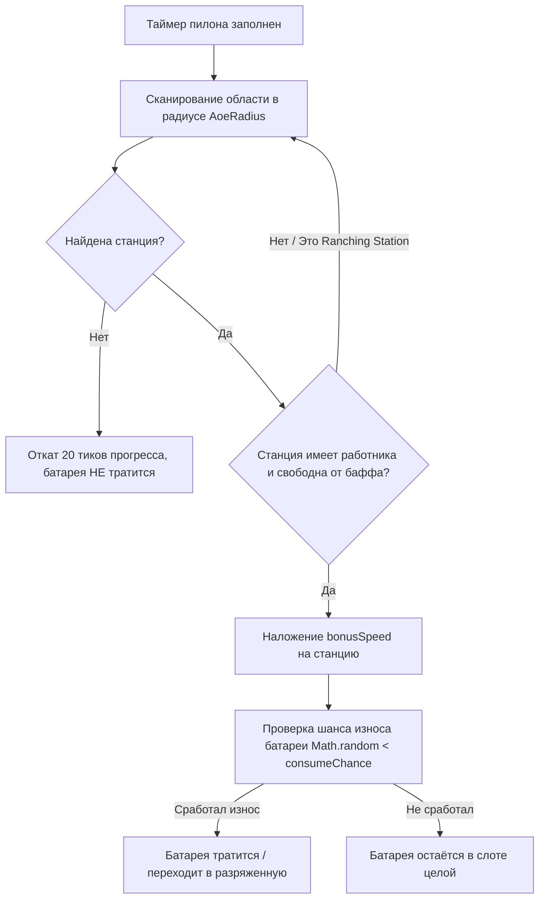

# ⚡ Глубокий аудит механики «Пилон энергии» (Energy Pylon)

> **Мод / Механика:** `cobblemon_farmers` (Cobblemon Farmers 2.4)  
> **Классы байткода:** `EnergyPylonBlockEntity.class`, `EnergyPylonRecipe.class`, `StationBaseBlockEntity.class`  
> **Предмет / Блок:** `cobblemon_farmers:energy_pylon`  
> **Методология:** Технический аудит Уровня 1–2 (декомпиляция байткода Forge, сверка рецептов KubeJS/JSON).

---

## 1. 🏗️ Назначение, крафт и интерфейс

**Пилон энергии (`Energy Pylon`)** — это специализированная вспомогательная станция-ускоритель. Она периодически посылает энергетические импульсы на соседние рабочие станции в округе, временно наделяя их дополнительным множителем скорости (`BonusSpeed`).

### Рецепт крафта (`energy_pylon.json`):
* **Верхний ряд:** `Громоотвод` | *пусто* | `Громоотвод`
* **Средний ряд:** `Железный блок` | `Железный блок` | `Железный блок`
* **Нижний ряд:** `Железный блок` | `Ультрабол (Ultra Ball)` | `Железный блок`

```
[ ⚡ ]   [    ]   [ ⚡ ]
[ 🧱 ]   [ 🧱 ]   [ 🧱 ]
[ 🧱 ]   [ 🟡 ]   [ 🧱 ]
```

---

## 2. 🔌 Требования к работнику и расчёт статов

В слот работника пилона устанавливается **строго покемон Электрического типа (`ELECTRIC`)** (проверка в `PokeUtils.validWorkerType(station, ELECTRIC)`).

### Математические формулы работы пилона:

1. **⚡ Скорость зарядки самого пилона (`SpeedModifier`):**
   Зависит от характеристики **Специальная атака (`SPECIAL_ATTACK`)**:
   $$\text{SpeedModifier} = \left(\frac{\lfloor (\text{Sp.Atk} / 127.5) \times 100 \rfloor}{100}\right) \times (\text{isShiny ? } 2.0 : 1.0)$$
   * При $\text{Sp.Atk} = 128 \rightarrow 1.0\times$ скорости.
   * При $\text{Sp.Atk} = 255 \rightarrow 2.0\times$ (у Шайни-покемона — **$4.0\times$**).

2. **📐 Радиус поиска целевых станций (`AoeRadius`):**
   Зависит от характеристики **Здоровье (`HP`)**:
   $$\text{AoeRadius} = \operatorname{clamp}\Big(\lfloor (\text{HP} / 500.0) \times 10.0 \times (\text{isShiny ? } 2.0 : 1.0) \rfloor, 0, 10\Big)$$
   * Базовый покемон с $\text{HP} = 250$ даёт Манхэттенский радиус **$R = 5$ блоков**.
   * Шайни-покемон со статом $\text{HP} \ge 250$ моментально даёт **максимальный радиус $R = 10$ блоков** во все стороны.

---

## 3. 🔋 Типы батарей (Топливо пилона)

Для работы пилону необходимо топливо — заряженные батареи. В зависимости от типа батареи пилон передаёт разный бонус скорости и имеет разный шанс износа:

| Батарея | Бонус скорости (`BonusSpeed`) | Шанс расхода (`ConsumeChance`) | Результат после разрядки | Как получить / зарядить |
| :--- | :---: | :---: | :--- | :--- |
| **Батарейка**<br>`cobblemon:cell_battery` | **$+0.10$**<br>*(+10% к скорости)* | **$100\%$**<br>*(сгорает каждый цикл)* | `minecraft:iron_nugget`<br>*(Железный самородок)* | Крафт из кремня и меди |
| **Бесконечная батарея**<br>`cobblemon_farmers:endless_battery` | **$+0.15$**<br>*(+15% к скорости)* | **$0\%$**<br>*(🟢 **ВЕЧНАЯ!** Не тратится)* | *Не разряжается* | Редкий крафт на `Craft Station` (*Electric* + Def) |
| **Батарея-ускоритель**<br>`cobblemon_farmers:booster_battery` | **$+0.50$**<br>*(+50% к скорости)* | **$25\%$**<br>*(в 75% случаев сохраняется)* | `cobblemon_farmers:uncharged_battery`<br>*(Разряженная батарея)* | Зарядка `uncharged_battery` на `Craft Station` (*Electric* + Sp.Atk) |
| **Спектральная батарея**<br>`cobblemon_farmers:spectral_battery` | **$+2.00$**<br>*(🔥 **+200%**, в 3 раза быстрее!)* | **$75\%$**<br>*(в 25% случаев сохраняется)* | `cobblemon_farmers:uncharged_battery`<br>*(Разряженная батарея)* | Зарядка `booster_battery` на `Craft Station` (*Ghost* + HP) |

---

## 4. ⚙️ Алгоритм баффа станций (`buffNearestStation`)

Каждый рабочий цикл пилона (базово `CRAFTING_TIME = 2400` тиков = 120 сек, делённые на `SpeedModifier`):



### Важные технические нюансы из кода:
1. **Какие станции ускоряются:**
   * ✅ **Станция ремесла (`Craft Station`)** — ускоряет плавку, крафты и переработку.
   * ✅ **Станция садоводства (`Gardening Station`)** — ускоряет циклы посадки и сбора урожая.
   * ✅ **Загадочная шахта (`Mystery Mine`)** — сокращает время между раскопками руды.
   * ✅ **Хрустальный шар (`Crystal Ball`)** — ускоряет гадание и генерацию ресурсов.
2. 🚫 **Исключение — Станция ранчо (`Ranching Station`):**
   В коде присутствует явная проверка `instanceof RanchingStationBlockEntity -> skip`. Ранчо ускорять пилоном **нельзя** (время ранчо строго привязано к механике производства продуктов).
3. **Умное сохранение топлива:**
   Если все станции в радиусе уже получили бафф или заняты, пилон **не сжигает батарею впустую**, а делает паузу (`progress -= 20`), ожидая, пока освободится хотя бы одна станция.
4. **Сброс бонуса:**
   Целевая станция расходует полученный `BonusSpeed` ровно на один свой технологический цикл. Как только её операция завершается, `bonusSpeed` сбрасывается в `0.0`, и станция снова готова принять импульс от пилона.

---

## 5. 🔄 Замкнутый цикл производства батарей

Батареи не являются одноразовым мусором — в игре реализован полноценный замкнутый цикл:

```
[Верстак] 4 Железа + 3 Редстоуна 
       │
       ▼
[Разряженная батарея (Uncharged)]
       │
       ├─► [Craft Station + Electric-покемон (Sp.Atk)] ──► [Батарея-ускоритель (+50%)]
       │                                                                │
       │                                        ┌───────────────────────┴───────────────────────┐
       │                                        ▼                                               ▼
       │                    [Craft Station + Ghost-покемон (HP)]        [Craft Station + Electric-покемон (Def)]
       │                                        │                                               │
       │                                        ▼                                               ▼
       │                         [Спектральная батарея (+200%)]              [Бесконечная батарея (+15%)]
       │                                        │                                               │
       └────────────────────────────────────────┴───────────────────────────────────────────────┘
```

---

## 6. 🏆 Резюме и лучшие кандидаты в работники Пилона

* **Идеальный кандидат:** **Zapdos, Raikou, Magnezone, Miraidon, Electivire, Vikavolt** (высокие показатели `Special Attack` для ускорения циклов + `HP` для максимального радиуса покрытия базы).
* **Для автономной базы:** Скрафтить **Бесконечную батарею (`Endless Battery`)**, поставить в пилон — и все станции крафта/садоводства вокруг получат постоянное пассивное ускорение $+15\%$ без необходимости следить за топливом.
* **Для супер-разгона крафтов:** Использовать **Спектральные батареи (`Spectral Battery`)** для утроения скорости ($+200\%$) при крафте сложных эндгейм-рецептов.
