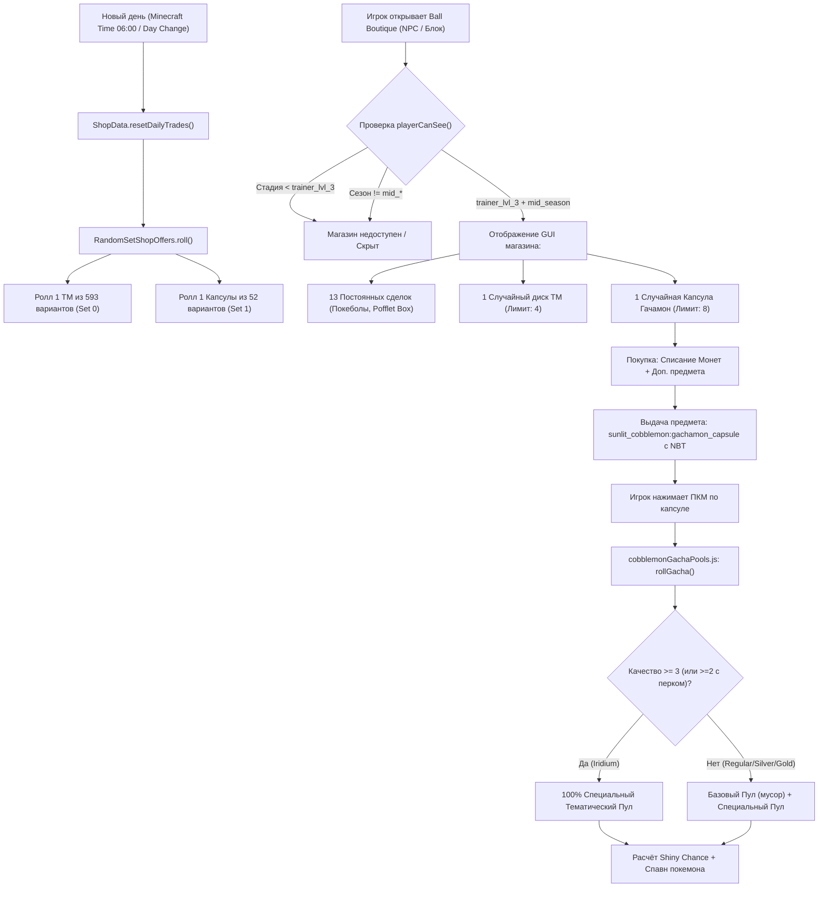

# 🏛️ 01_ARCHITECTURE — Архитектура магазина Ball Boutique

## 1. Компоненты системы

Магазин **Ball Boutique** (`shop.society_trading.ball_boutique`) построен на базе связки серверных скриптов KubeJS, кастомного Java-мода `society_trading` и системы спавна покемонов `cobblemon`.

| Компонент | Файл / Путь | Класс / Ресурсный ID | Назначение | Ключевые методы / Поля |
| :--- | :--- | :--- | :--- | :--- |
| **Shop JSON Definition** | `kubejs/data/society_trading/shops/ball_boutique.json` | `society_trading:ball_boutique` | Определение ассортимента, цен, случайных сетов, лимитов и условий видимости | `random_sets`, `trades`, `requires_season`, `requires_stage` |
| **Shop Core Logic** | `mods/society_trading-1.2.8.jar` | `com.kyanite.society_trading.common.Shop` | Хранение и сериализация структуры магазина, загрузка трейдов из DataPack | `fromNetwork`, `toNetwork`, `requiresStage`, `requiresSeason` |
| **Random Offers Handler** | `mods/society_trading-1.2.8.jar` | `com.kyanite.society_trading.common.RandomSetShopOffers` | Формирование ежедневных роллов случайных сетов с учётом условий видимости | `roll`, `getRolledOffers`, `playerCanSee` |
| **Shop Server Data** | `mods/society_trading-1.2.8.jar` | `com.kyanite.society_trading.common.ShopData` | Серверное сохранение текущего состояния роллов и синхронизация с клиентом | `getOrCreate`, `getShop`, `save` |
| **Trade Limit Capability** | `mods/society_trading-1.2.8.jar` | `com.kyanite.society_trading.common.capability.TradeLimitCapability` | Отслеживание количества покупок игрока по каждой сделке и ежедневный сброс | `getTradeCount`, `incrementTradeCount`, `resetTrades` |
| **Capsule Loot & Mechanics** | `kubejs/server_scripts/cobblemon/cobblemonGachaPools.js` | `ItemEvents.rightClicked` | Обработка открытия капсул, фильтрация пулов по качеству и генерация покемонов | `rollGacha`, `getGachaPool`, `getShinyChance` |
| **Item Quality System** | `kubejs/server_scripts/` & `mods/` | NBT: `{quality_food: {quality: X}}` / `{quality: X}` | Система качества предметов (0=Regular, 1=Silver, 2=Gold, 3=Iridium) | Чтение NBT-тегов качества в трейдах и при открытии |

---

## 2. Жизненный цикл магазина Ball Boutique

---

## 3. Точки интеграции и хранение данных

1. **Место хранения состояния роллов магазина**:
   - Хранится на сервере в `World Saved Data` (NBT мира) через класс `ShopData`.
   - Для магазинов со стилем `per_day` роллы привязаны к игровому дню Minecraft (`level.getDayTime() / 24000L`).
2. **Место хранения лимитов покупок игрока**:
   - Привязано к игроку через Forge Capability `TradeLimitCapability`.
   - Сбрасывается при наступлении нового игрового дня.
3. **Открытие магазина**:
   - Магазин имеет `selector_weight: -101`, что означает невозможность его случайного вызова через универсальный Auto-Trader. Он вызывается строго через диалог соответствующего NPC или интерактивный интерфейс тренера.
