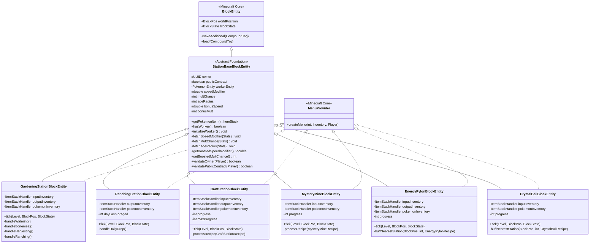
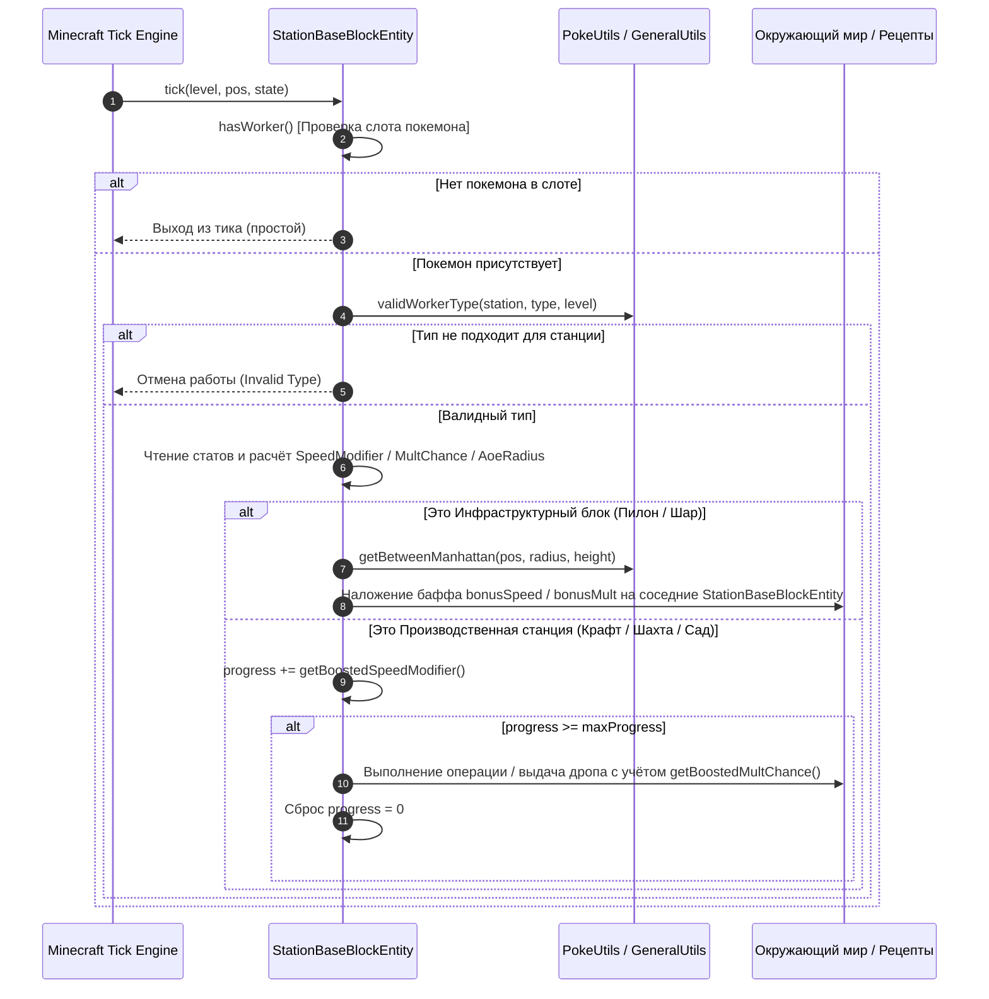

# 🏗️ Архитектура системы рабочих Cobblemon Farmers

> **Статус исследования:** Level 2 Deep Architectural Audit  
> **Исходные файлы:** `cobblemon_farmers-2.4-all.jar` (декомпиляция байткода `javap`)  
> **Маркировка:** Все утверждения строго снабжены тегами `[FACT]`, `[DERIVED]`, `[INFERRED]`.

---

## 1. 📐 Диаграмма объектно-ориентированной иерархии

---

## 2. 🔄 Жизненный цикл рабочего цикла (Tick Dataflow Pipeline)

Каждый игровой такт (Tick) рабочие станции выполняют строго последовательный цикл валидации и обработки:

---

## 3. 🌐 Сетевая модель и синхронизация (Client/Server Packet Architecture)

### 3.1. Синхронизация данных блока (NBT Sync)
[FACT: Байткод `StationBaseBlockEntity.m_58483_` и `onDataPacket`]
1. **Сервер:** При изменении состояния формирует пакет `ClientboundBlockEntityDataPacket.create(this)`.
2. **Клиент:** Получает NBT-тег блока через метод `onDataPacket()`, обновляя угол поворота модели покемона (`getPokemonRotation`), визуальный рендер и параметры частиц.

### 3.2. Клиент-серверное управление приоритетами
[FACT: Байткод `ServerBoundSwapPriorityPacket.class` и `PacketHandler.class`]
* Кнопка в GUI `TogglePriorityButton` отправляет сетевой пакет `ServerBoundSwapPriorityPacket` на сервер.
* Серверный метод `setPrioritySwapped()` переключает режим работы станции (например, Садоводство: переключение между поливом, сбором и костной мукой; Шахта: Каменный vs Земляной режим).

---

## 4. 🔒 Система безопасности и прав доступа (Ownership & Contracts)

### 4.1. Валидация владельца (`validateOwner`)
[FACT: Байткод `StationBaseBlockEntity.validateOwner`]
* Блок хранит UUID владельца (`owner`).
* Если блок приватный, только игрок с совпадающим `player.getUUID()` может открывать GUI и извлекать покемона.
* Если игрок не является владельцем, отправляется локализованное сообщение об ошибке с красным форматированием `ChatFormatting.RED`.

### 4.2. Механика публичного контракта (`publicContract`)
[FACT: Байткод `validatePublicContract` и `PublicContractItem.class`]
* При применении предмета `cobblemon_farmers:public_contract` блок переходит в состояние `publicContract = true`.
* **Эффект:** Любой игрок сервера может использовать станцию и получать продукцию, однако сам контракт резервирует 1 слот работника из лимита владельца (`Attribute.PUBLIC_CONTRACTS`).
