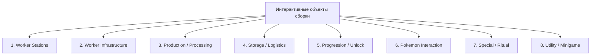

# 🏛️ Глобальный реестр и классификация интерактивных блоков

> **Статус документа:** Исследовательский уровень (Level 2 Architecture)  
> **Методология:** Байткод-аудит Forge `.jar`, скрипты KubeJS, JSON-датапаки сборки *Society Sunlit Cobblemon*.

---

## 1. 🗂️ Классификация объектов по типу механики

Все интерактивные блоки сборки распределены по 8 функциональным категориям:

### Категория 1: Worker Stations (Станции рабочих покемонов)
Блоки прямого назначения покемонов-работников с интерфейсом GUI, слотом Party, расчётом модификаторов статов и автономным производством.
* `cobblemon_farmers:gardening_station` — Станция садоводства
* `cobblemon_farmers:ranching_station` — Станция ранчо
* `cobblemon_farmers:craft_station` — Станция ремесла
* `cobblemon_farmers:mystery_mine` — Загадочная шахта

### Категория 2: Worker Infrastructure (Инфраструктура рабочих)
Блоки сетевого усиления, баффов и снабжения рабочих станций в радиусе.
* `cobblemon_farmers:energy_pylon` — Пилон энергии (импульсы скорости `BonusSpeed`)
* `cobblemon_farmers:crystal_ball` — Хрустальный шар (импульсы мультипликатора `BonusMult`)

### Категория 3: Production / Processing (Переработка и производство)
Автономные производственные машины без слота покемона, работающие на топливе, таймерах или механических триггерах.
* `society:auto_grabber` — Авто-граббер ресурсов животных (радиус $9 \times 9$, Искрокамень)
* `cobblemon:restoration_tank` — Танк восстановления окаменелостей (ДНК-синтез)
* `splendid_slimes:slime_incubator` — Инкубатор слаймов (выведение пород)
* `society:crystalarium` — Кристаллариум (дупликация минералов)
* `society:drying_rack` — Сушилка (обезвоживание трав и плодов)

### Категория 4: Storage / Logistics (Логистика и сбор)
Блоки промежуточного сбора, выгрузки и сортировки продукции.
* `society:fish_pond_basket` — Корзина рыбного пруда (пассивный сбор икры)
* `society:shipping_bin` — Ящик отгрузки (авто-продажа урожая за монеты в 06:00)

### Категория 5: Progression / Unlock (Прогрессия и разблокировка)
Блоки турнирных боёв, испытаний тренеров и чеклистов фермы.
* `cobblemon:trainer_podium` — Подиум тренеров (Гим-лидеры, 8 значков)
* `cobblemon:duo_challenge_podium` — Дуо-подиум (марафон 11 боёв Team Eon $\rightarrow$ Eon Soul)
* `society:fish_pond_manager` — Менеджер рыбных прудов (интеграция с Create Clipboard)

### Категория 6: Pokemon Interaction (Прямое взаимодействие с покемонами)
Предметы и блоки точечной модификации генетики, тренировки и эмоций покемонов.
* `cobblemon:*_candy` — Конфеты IV (0..31)
* `cobblemon:*_mochi` — Моти EV (0..252) и Fresh Start Mochi
* `sunlit_cobblemon:*_pofflet` — Поффлеты дружбы (стихийные синергии 0..255)
* Камни эволюции на блоки — трансформация блоков в мире (Water $\rightarrow$ Deluxe Farmland, Shiny $\rightarrow$ Budding Amethyst)

### Категория 7: Special / Ritual (Ритуальные алтари и Рейды)
Алтари призыва божественных покемонов, 3D-сканирование биомов и боссы 100 уровня.
* `sunlit_cobblemon:sun_raid_statue` — Статуя Солнечного Рейда (Xerneas, Yveltal, Pecharunt)
* `sunlit_cobblemon:gem_box` — Шкатулка самоцветов (5 Реги-титанов $\rightarrow$ Regigigas)
* `sunlit_cobblemon:biodome_altar` — Алтарь Биодома (Гроудон, Кайогр, Primal-формы)
* `sunlit_cobblemon:pale_chalice` — Бледная чаша (Гиратина 100 ур.)

### Категория 8: Utility / Minigame (Утилиты, мини-игры и лут)
* `society:fish_pond` — Рыбный пруд (популяция 1..10, квесты Stardew)
* `sunlit_cobblemon:gachamon_capsule` — Капсула Гачамона (Shiny шансы от еды)
* `sunlit_cobblemon:poke_radar` — Поке-Радар (сканирование чанков по редкости)
* `sunlit_cobblemon:tm_pack` / `greater_tm_pack` / `prismatic_tm_pack` — Наборы атак

---

## 2. 📑 Детальные паспорта объектов сборки

### Паспорт 1: Станция садоводства (Gardening Station)
* **Mod:** `cobblemon_farmers` [FACT: `mods/cobblemon_farmers-2.4-all.jar`]
* **Registry ID:** `cobblemon_farmers:gardening_station` [FACT: `BlockRegistry`]
* **Block Class:** `io.github.chakyl.cobblemonfarmers.block.GardeningStationBlock` [FACT]
* **BlockEntity Class:** `io.github.chakyl.cobblemonfarmers.blockentity.GardeningStationBlockEntity` [FACT]
* **Рецепты:** `cobblemon_farmers:gardening_station` (крафт на верстаке), сбор урожая `Minecraft Crops` [FACT]
* **KubeJS-скрипты:** `kubejs/server_scripts/cobblemon/cobbleWorkersRecipes.js` [FACT]
* **Конфигурация:** По умолчанию Forge attributes [FACT]
* **FTB Quests:** Глава «Workers & Agriculture» (`ftbquests/quests/chapters/...`) [FACT]
* **Связанные предметы:** Саженцы, семена, костная мука, Exp Candies [FACT]
* **Связанные Pokémon:** Травяные (Grass), Водные (Water), Летающие (Flying), Ядовитые (Poison), Волшебные (Fairy) [FACT: `ElementalTypeUtils`]
* **Зависимости:** `StationBaseBlockEntity`, `PokeUtils`, система лимитов работников `WORKER_CAP` [FACT]

---

### Паспорт 2: Загадочная шахта (Mystery Mine)
* **Mod:** `cobblemon_farmers` [FACT]
* **Registry ID:** `cobblemon_farmers:mystery_mine` [FACT]
* **Block Class:** `io.github.chakyl.cobblemonfarmers.block.MysteryMineBlock` [FACT]
* **BlockEntity Class:** `io.github.chakyl.cobblemonfarmers.blockentity.MysteryMineBlockEntity` [FACT]
* **Рецепты:** JSON-рецепты `cobblemon_farmers:mystery_mine` [FACT: `MysteryMineRecipe.class`]
* **KubeJS-скрипты:** `cobblemonWorkersRecipes.js` [FACT]
* **Связанные предметы:** Все типы руд, окаменелости (Helix, Dome, Amber и др.), Яйцо нюхача [FACT]
* **Связанные Pokémon:** Каменные (Rock), Земляные (Ground), Стальные (Steel) [FACT]
* **Зависимости:** Инфраструктура `StationBaseBlockEntity`, импульсы `EnergyPylon` [FACT]

---

### Паспорт 3: Станция ремесла (Craft Station)
* **Mod:** `cobblemon_farmers` [FACT]
* **Registry ID:** `cobblemon_farmers:craft_station` [FACT]
* **Block Class:** `io.github.chakyl.cobblemonfarmers.block.CraftStationBlock` [FACT]
* **BlockEntity Class:** `io.github.chakyl.cobblemonfarmers.blockentity.CraftStationBlockEntity` [FACT]
* **Рецепты:** JSON `cobblemon_farmers:craft_station` + кастомные рецепты KubeJS [FACT]
* **KubeJS-скрипты:** `cobbleWorkersRecipes.js` (пилорама саженцев в брёвна, супер-плавка руд, смузи) [FACT]
* **Связанные Pokémon:** Огненные (Fire), Электрические (Electric), Психические (Psychic) [FACT]
* **Зависимости:** `StationBaseBlockEntity`, `EnergyPylon`, `CrystalBall` [FACT]

---

### Паспорт 4: Станция ранчо (Ranching Station)
* **Mod:** `cobblemon_farmers` [FACT]
* **Registry ID:** `cobblemon_farmers:ranching_station` [FACT]
* **Block Class:** `io.github.chakyl.cobblemonfarmers.block.RanchingStationBlock` [FACT]
* **BlockEntity Class:** `io.github.chakyl.cobblemonfarmers.blockentity.RanchingStationBlockEntity` [FACT]
* **Рецепты:** `RanchingForage` + JSON датапаки сбора лута [FACT: `RanchingForage.class`]
* **Особая механика:** Привязка к смене игровых суток (`dayLastForaged < currentDay`). **Запрет ускорения пилонами** (`instanceof RanchingStationBlockEntity -> skip`) [FACT: байткод `EnergyPylonBlockEntity.class`]
* **Связанные Pokémon:** Любые покемоны Cobblemon с высоким HP и Friendship [FACT]
* **Связанные предметы:** Booster Energy, ДНК Мью, Сердце Феи, перья, шерсть [FACT]

---

### Паспорт 5: Пилон энергии (Energy Pylon)
* **Mod:** `cobblemon_farmers` [FACT]
* **Registry ID:** `cobblemon_farmers:energy_pylon` [FACT]
* **Block Class:** `io.github.chakyl.cobblemonfarmers.block.EnergyPylonBlock` [FACT]
* **BlockEntity Class:** `io.github.chakyl.cobblemonfarmers.blockentity.EnergyPylonBlockEntity` [FACT]
* **Рецепты:** Рецепты зарядки и разрядки батарей (`EnergyPylonRecipe`) [FACT]
* **Связанные предметы:** Батареи (Обычная $+10\%$, Улучшенная $+25\%$, Продвинутая $+50\%$, Ультра $+200\%$) [FACT]
* **Связанные Pokémon:** Электрические покемоны (Electric) [FACT]
* **Зависимости:** Сканирует соседей в радиусе Манхэттена через `GeneralUtils.getBetweenManhattan` [FACT]

---

### Паспорт 6: Хрустальный шар (Crystal Ball)
* **Mod:** `cobblemon_farmers` [FACT]
* **Registry ID:** `cobblemon_farmers:crystal_ball` [FACT]
* **Block Class:** `io.github.chakyl.cobblemonfarmers.block.CrystalBallBlock` [FACT]
* **BlockEntity Class:** `io.github.chakyl.cobblemonfarmers.blockentity.CrystalBallBlockEntity` [FACT]
* **Рецепты:** `CrystalBallRecipe` [FACT]
* **Связанные предметы:** Стихийные самоцветы (Fire Gem, Water Gem, Grass Gem и др.) [FACT]
* **Связанные Pokémon:** Психические (Psychic), Призрачные (Ghost), Тёмные (Dark) [FACT]
* **Зависимости:** Раздаёт бафф `BonusMult` ($+25\%$) на окружающие `StationBaseBlockEntity` [FACT]
