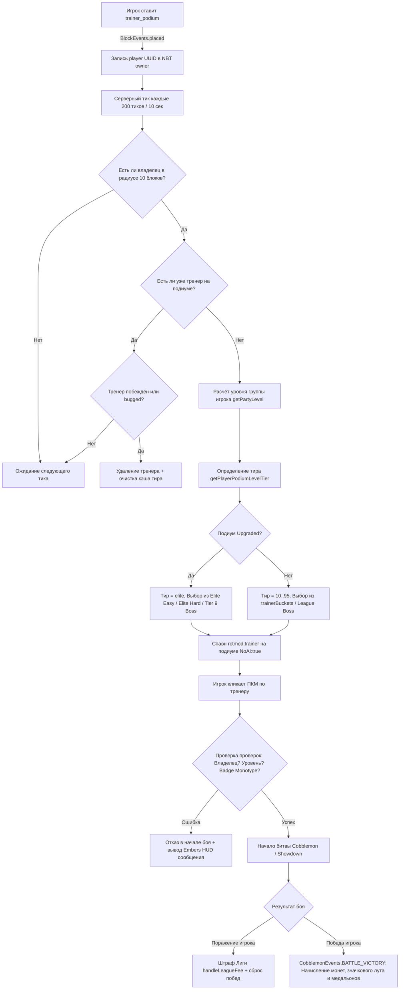

# 01_ARCHITECTURE — Poké Gym System Lifecycle & Cross-Mod Flow

## 📌 Обзор Архитектуры

Система **Poké Gyms** в сборке *Society: Sunlit Cobblemon* построена на интеграции нескольких модов и скриптовых подсистем:
1. **KubeJS (Startup & Server)** — управляет регистрацией блоков, логикой подиума, таймерами спавна, проверками легальности, монотипа и начислением наград.
2. **RCTMod (Radical Cobblemon Trainers)** — предоставляет сущность `rctmod:trainer`, систему диалогов, парсинг JSON-файлов тренеров и инициирование битвы.
3. **Cobblemon & Cobblemon Showdown** — обрабатывает саму пошаговую боевую систему по правилам Pokémon (IV, EV, movesets, AI levels).
4. **Curios API** — отслеживает надетый значок игрока в слоте `gym_badge`.
5. **Numismatics / Society Economy** — осуществляет выплаты вознаграждений за победу и списание лиги-штрафов при поражениях.

---

## 🏗️ Реестр блоков и сущностей

| Идентификатор | Тип | Назначение |
| :--- | :--- | :--- |
| `sunlit_cobblemon:trainer_podium` | Block / BlockEntity | Основной подиум зала. Спавнит регулярных тренеров, боссов и элитных соперников. |
| `sunlit_cobblemon:duo_challenge_podium` | Block / BlockEntity | Специальный подиум испытаний Team Eon / Eon Souls (бои 4v4 раз в день). |
| `rctmod:trainer` | Entity (Mob) | NPC-тренер, стоящий на подиуме (`NoAI: true`). Вступает в бой при правом клике. |
| `sunlit_cobblemon:elite_stone` | Item | Камень улучшения, переводящий подиум в состояние `upgraded: true`. |
| `sunlit_cobblemon:*_badge` (18 шт.) | Item (Curio) | Значки стихий зала (Слот `gym_badge`), удваивающие награды при монотипной команде. |
| `sunlit_cobblemon:sunlit_league_medallion`| Item | Валюта Лиги, выбиваемая каждые 15 побед на Elite-подиуме. |

---

## 💾 NBT-схема Подиума (`BlockEntity`)

Блок `sunlit_cobblemon:trainer_podium` регистрируется как Cardinal-блок с поддержкой BlockEntity и синхронизацией данных:

```json
{
  "data": {
    "owner": "<UUID игрока-владельца>",
    "upgraded": false,
    "lastBossSpawn": -1,
    "trainers": {
      "10": "bug_catcher_anthony_0213",
      "25": "picnicker_nancy_0097",
      "95": "the_legendary_mew_n",
      "elite": "gym_crusher_alexander"
    }
  }
}
```

* `owner` — строковый UUID игрока, поставившего подиум. Только этот игрок может вызывать тренеров на бой.
* `upgraded` — булевый флаг (`true`/`false`). Управляет моделью блока и переключением на Elite-пулы.
* `lastBossSpawn` — числовое значение серии побед (`wins`), на которой в последний раз был призван Босс Лиги. Предотвращает повторный спавн босса на одном и том же майлстоуне.
* `trainers` — хэш-таблица кэша сгенерированных тренеров для каждого тира. Тренер сохраняется в NBT блока даже при смене покемонов игрока до тех пор, пока не будет побеждён или принудительно удалён.

---

## 🔄 Жизненный цикл и диаграмма состояний (Mermaid)



---

## 📜 Детальный анализ обработчиков событий

### 1. Серверный тик спавнера (`serverTick: 200`)
* **Файл**: `kubejs/startup_scripts/cobblemon/registerCobblemonTrainerPodium.js`
* **Метод**: `global.runTrainerPodium(entity)`
* **Период**: 200 игровых тиков (ровно 10 секунд).
* **Логика**:
  1. Сканирует область в радиусе 10 блоков вокруг подиума (`inflate(10)`).
  2. Ищет игрока, чей `getUuid().toString()` равен `nbt.data.owner`.
  3. Проверяет наличие редстоун-сигнала (`!block.level.hasNeighborSignal(block.pos)`). Если на подиум подан редстоун, спавн блокируется.
  4. Если старый тренер побеждён (`Defeats > 0`) или выиграл (`Wins > 0`) — удаляет его со спецэффектами `species:ascending_dust` и очищает кэш для текущего тира.
  5. Создает сущность `rctmod:trainer` с `TrainerId = newTrainer`, координатами блока и направлением взгляда по свойству `facing`.

### 2. Взаимодействие игрока с тренером (`ItemEvents.entityInteracted`)
* **Файл**: `kubejs/server_scripts/cobblemon/cobblemonTrainerPodium.js`
* **Проверки**:
  1. Тренер должен стоять строго на подиуме (`target.onPos.above() == trainer_podium`).
  2. Владелец: `target.persistentData.gymLeader === player.getUuid().toString()`.
  3. Ограничение уровня: если подиум не улучшен, а уровень партии > 100 (например, есть легендарка), бой блокируется (`"banned_mon"`).
  4. Ограничение значка: если надет значок, вызывается `global.partyIsMonotype(player, badge)`. Если хотя бы один покемон не имеет типа значка — бой отменяется (`"badge_restricts"`).
  5. Соответствие уровня: если игрок изменил уровень команды после появления тренера, бой отменяется (`"too_high"` / `"too_low"`), а тренер удаляется для респавна.

### 3. Завершение боя (`CobblemonEvents.BATTLE_VICTORY`)
* **Файл**: `kubejs/startup_scripts/cobblemon/cobblemonHandleDeath.js`
* **Метод**: `global.handleCobblemonDefeat(e)`
* **Логика наград**:
  - Рассчитывает базовые деньги на основе уровней покемонов побежденного тренера и ранга `trainer_lvl_X` игрока.
  - Удваивает деньги и вызывает дроп из `sunlit_cobblemon:badge_reward/<type>_type_gym`, если надет значок.
  - Удваивает деньги и выдаёт `sunlit_cobblemon:sunlit_league_medallion` каждые 15 побед, если подиум улучшен.
  - Увеличивает деньги на +25%, если открыт перк `the_art_of_battle`.
  - При поражении игрока вызывает `global.handleLeagueFee(server, player, "loss")` со списанием процента от баланса.
