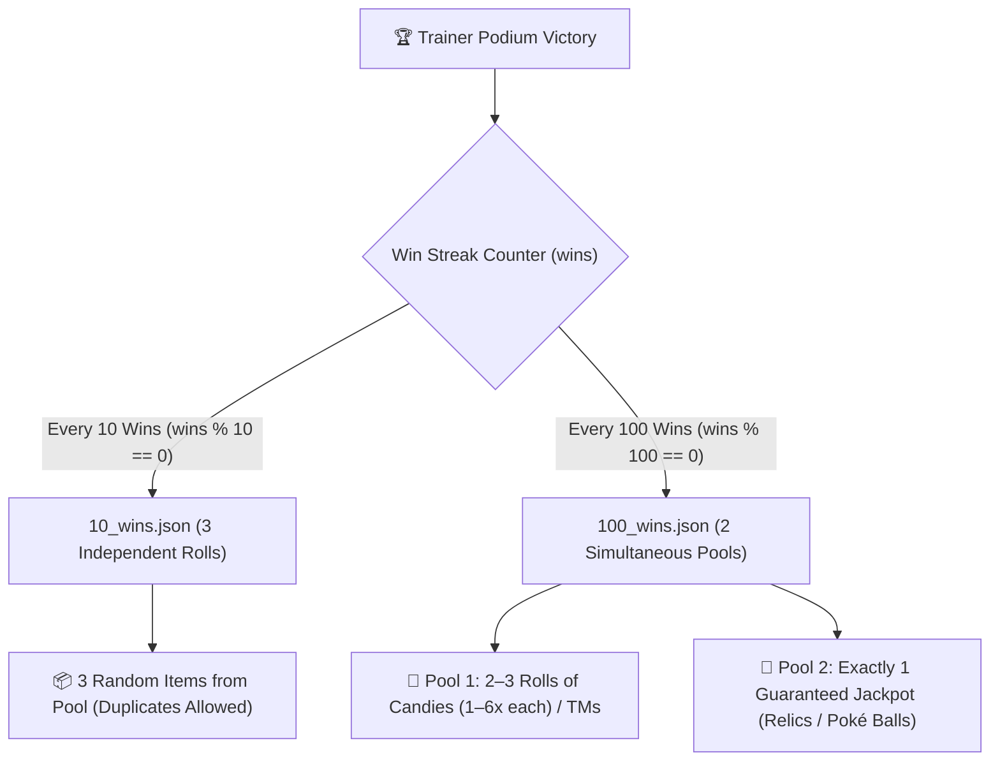

# 04_LOOT_SYSTEM — Economy, Rewards & Loot Tables

## 💰 Архитектура наград и денежной экономики

Система наград Poké Gym состоит из 4 независимых уровней поощрения:
1. **Денежное вознаграждение** (прямое начисление в кошелек Numismatics с каскадными мультипликаторами).
2. **Стихийный лут значка** (выпадает при каждой победе при надетом `gym_badge`).
3. **Майлстоуны серии побед** (сундучный лут каждые 10 и 100 побед).
4. **Элитные награды Лиги** (гарантированные медали Лиги каждые 15 побед на Elite-подиуме).

---

## 🧮 1. Математическая модель денежного вознаграждения

* **Исходный код**: `kubejs/startup_scripts/cobblemon/cobblemonHandleDeath.js` (строки 27–78)

### Шаг 1: Базовый расчёт за каждого побежденного покемона
Для каждого покемона в побежденной команде противника:
$$\text{variance} \in [0.5, 1.5] \quad (\text{равномерное случайное})$$
$$\text{monReward} = \min\Big(2000, \max\big(\text{round}(\text{loserLevel} \times 4 \times \text{trainerLevel} \times \text{variance}), 16\big)\Big)$$

* `loserLevel` — фактический уровень вражеского покемона (от 5 до 100).
* `trainerLevel` — ранг игрока от 1 до 10 по стадиям `trainer_lvl_1` ... `trainer_lvl_10`.
* `variance` — случайный разброс доходности от 50% до 150%.

### Шаг 2: Базовый суммарный кап
$$\text{baseReward} = \min\Big(5000, \sum \text{monReward}\Big)$$
> ⚠️ **Важно**: Базовая сумма до применения глобальных модификаторов жестко ограничена значением **5 000 монет**.

### Шаг 3: Применение глобальных мультипликаторов
$$\text{finalReward} = \text{baseReward} \times M_{\text{badge}} \times M_{\text{elite}} \times M_{\text{art}}$$

| Мультипликатор | Условие | Значение |
| :--- | :--- | :---: |
| **$M_{\text{badge}}$ (Значок Зала)** | Надет любой `*_badge` в Curios-слоте | **× 2.0** |
| **$M_{\text{elite}}$ (Элитный подиум)** | Подиум улучшен (`levelTier == "elite"`) | **× 2.0** |
| **$M_{\text{art}}$ (Искусство боя)** | Открыта стадия `the_art_of_battle` | **× 1.25** |

### Итоговый диапазон дохода за 1 бой:
* Без значка, обычный подиум: **~500 – 5 000 монет**.
* Со значком (×2) на обычном подиуме: **до 10 000 монет**.
* Со значком (×2) на улучшенном подиуме (×2): **до 20 000 монет**.
* Максимальный билд (Значок + Elite + The Art of Battle): **до 25 000 монет за победу** (множитель **×5.0**).

---

## 🎁 2. Стихийный лут значка (`badge_reward`)

При надетом значке в слоте `gym_badge` после каждой победы вызывается:
`Utils.rollChestLoot("sunlit_cobblemon:badge_reward/<type>_type_gym")`

Все 18 лут-тейблов имеют единую сбалансированную структуру (1 ролл):

| Предмет | Вес | Шанс выпадения | Количество |
| :--- | :---: | :---: | :---: |
| `sunlit_cobblemon:pristine_<type>_gem` | 6 | **25.0%** (6/24) | 1 |
| `sunlit_cobblemon:sun_drops` | 4 | **16.67%** (4/24) | 1–4 |
| `cobblemon:relic_coin` | 4 | **16.67%** (4/24) | 1–4 |
| `cobblemon:exp_candy_s` | 4 | **16.67%** (4/24) | 1–4 |
| `sunlit_cobblemon:mystica_branch` | 2 | **8.33%** (2/24) | 1 |
| `cobblemon:rare_candy` | 2 | **8.33%** (2/24) | 1 |
| ТМ соответствующего типа (`simpletms:type_<type>_tm`) | 2 | **8.33%** (2/24) | 1 |

---

## 🏆 3. Майлстоуны серии побед (`trainer_podium_reward`)

При достижении круглых значений счётчика побед на Подиуме Тренеров (`wins % 10 === 0` или `wins % 100 === 0`) вызываются специализированные таблицы добычи сундучного типа:

---

### 📦 Каждые 10 побед (`10_wins.json` — 3 независимых ролла)

Таблица выполняет **3 независимых ролла с возвращением** (`rolls: 3`).
* **Механика дубликатов**: Поскольку каждый из 3 роллов выбирается независимо, один и тот же предмет может выпасть 2 или даже 3 раза подряд (например, выпадет `1× Pofflet Box` и дважды по `6× Protein`).
* **Суммарный вес пула**: **63 единицы**.

| Предмет | Вес | Количество | Шанс за 1 ролл | Шанс получить $\ge 1$ за 3 ролла |
| :--- | :---: | :---: | :---: | :---: |
| 📦 `sunlit_cobblemon:pofflet_box` *(Коробка с поффлетами)* | 7 | 1 шт. | **11.11%** (7/63) | **29.9%** |
| 💊 `cobblemon:hp_up` *(Витамин HP Up)* | 6 | 1 шт. | **9.52%** (6/63) | **26.0%** |
| 💊 `cobblemon:protein` *(Витамин Protein)* | 6 | 1 шт. | **9.52%** (6/63) | **26.0%** |
| 💊 `cobblemon:iron` *(Витамин Iron)* | 6 | 1 шт. | **9.52%** (6/63) | **26.0%** |
| 💊 `cobblemon:calcium` *(Витамин Calcium)* | 6 | 1 шт. | **9.52%** (6/63) | **26.0%** |
| 💊 `cobblemon:zinc` *(Витамин Zinc)* | 6 | 1 шт. | **9.52%** (6/63) | **26.0%** |
| 💊 `cobblemon:carbos` *(Витамин Carbos)* | 6 | 1 шт. | **9.52%** (6/63) | **26.0%** |
| 💊 `cobblemon:pp_up` *(Витамин PP Up)* | 6 | 1 шт. | **9.52%** (6/63) | **26.0%** |
| 🪙 `cobblemon:relic_coin` *(Монеты реликвий)* | 4 | 8–64 шт. | **6.35%** (4/63) | **17.9%** |
| 💿 `sunlit_cobblemon:tm_pack` *(Набор ТМ)* | 3 | 1 шт. | **4.76%** (3/63) | **13.6%** |
| 🍬 `cobblemon:rare_candy` *(Редкая конфета)* | 3 | 1 шт. | **4.76%** (3/63) | **13.6%** |
| 🍪 `sunlit_cobblemon:mystica_cookie` *(Печенье Мистики)* | 2 | 1–4 шт. | **3.17%** (2/63) | **9.2%** |
| 🔮 `cobblemon:mana_ball` *(Манабол)* | 2 | 1–4 шт. | **3.17%** (2/63) | **9.2%** |

---

### 👑 Каждые 100 побед (`100_wins.json` — 2 одновременных пула)

Награда за вековую серию побед разделена на **два параллельных пула (`pools: [ {...}, {...} ]`)**, которые срабатывают **одновременно**. Игрок гарантированно получает добычу **из обоих пулов сразу**:
1. **Пул 1 (Расходники прокачки)**: Даёт массивную пачку конфет характеристик и ТМ (от 2 до 18 конфет).
2. **Пул 2 (Гарантированный Джекпот)**: Ровно **1 гарантированный ролл** ценнейшей реликвии или редчайшего покебола.

#### 🍬 Пул 1: Набор конфет и ТМ (`rolls: 2..3`, суммарный вес = 232)
Делается 2 или 3 независимых ролла:

| Предмет | Вес | Количество | Шанс за 1 ролл | Описание |
| :--- | :---: | :---: | :---: | :--- |
| 🍬 `cobblemon:rare_candy` | 32 | **1–6 шт.** | **13.79%** (32/232) | Редкая конфета (+1 уровень) |
| 🍬 `cobblemon:courage_candy` | 32 | **1–6 шт.** | **13.79%** (32/232) | Конфета Храбрости |
| 🍬 `cobblemon:health_candy` | 32 | **1–6 шт.** | **13.79%** (32/232) | Конфета Здоровья |
| 🍬 `cobblemon:mighty_candy` | 32 | **1–6 шт.** | **13.79%** (32/232) | Конфета Силы |
| 🍬 `cobblemon:quick_candy` | 32 | **1–6 шт.** | **13.79%** (32/232) | Конфета Скорости |
| 🍬 `cobblemon:tough_candy` | 32 | **1–6 шт.** | **13.79%** (32/232) | Конфета Стойкости |
| 🍬 `cobblemon:smart_candy` | 32 | **1–6 шт.** | **13.79%** (32/232) | Конфета Разума |
| 🌈 `sunlit_cobblemon:prismatic_tm_pack` | 8 | 1 шт. | **3.45%** (8/232) | Призматический набор ТМ |

#### 👑 Пул 2: Гарантированный Джекпот Реликвий (`rolls: 1`, суммарный вес = 29)
Делается **ровно 1 ролл (100% гарантия получения одного из главных призов Лиги)**:

| Джекпот-награда | Вес | Точный шанс (1 ролл) | Количество | Назначение предмета |
| :--- | :---: | :---: | :---: | :--- |
| 🪞 **Зеркало Солнца** (`sunlit_cobblemon:sun_mirror`) | 8 | **27.59%** (8/29) | 1 шт. | Телепортация и управление погодой/солнцем |
| 🎖️ **Медальон Лиги** (`sunlit_cobblemon:sunlit_league_medallion`) | 8 | **27.59%** (8/29) | **1–4 шт.** | Валюта Poké Mart для значков и Камней Элиты |
| 🗿 **Статуя Солнечного Рейда** (`sunlit_cobblemon:sun_raid_statue`) | 6 | **20.69%** (6/29) | 1 шт. | Активация ежедневных рейдов на легендарных покемонов |
| 📜 **Разрешение на работу** (`cobblemon_farmers:worker_permit`) | 3 | **10.34%** (3/29) | 1 шт. | Назначение покемонов на фермерские работы |
| 🟣 **Мастербол** (`cobblemon:master_ball`) | 2 | **6.90%** (2/29) | 1 шт. | 100% поимка любого дикого покемона |
| ⚪ **Древний Ориджин Болл** (`cobblemon:ancient_origin_ball`) | 1 | **3.45%** (1/29) | 1 шт. | Редчайший исторический покебол Хисуи |
| 🌸 **Блоссом Болл** (`cobblemon:blossom_ball`) | 1 | **3.45%** (1/29) | 1 шт. | Эстетический редкий болл |

---

## 🎖️ 4. Награды Элитного подиума (Elite 15-Win Guarantee)

При активном улучшении `upgraded: true`:
* **Каждые 15 побед** (`wins % 15 == 0`) гарантированно дропается **`sunlit_cobblemon:sunlit_league_medallion`** (1 шт.).
* Медальоны используются в Poké Mart для покупки новых значков (1 медальон) и Камней Элиты (4 медальона).

---

## 💀 5. Механика штрафов Лиги (`handleLeagueFee`)

При поражении или убийстве тренера взимается штраф:

### Поражение в битве (`reason === "loss"`):
$$\text{fee} = \min\Big(\text{round}(\text{balance} \times 0.05) \times (\text{wins} + 1), 10000\Big)$$
* Минимум: **512 монет**.
* Максимум: **10 000 монет**.
* Если у игрока открыт ранг `trainer_level_8`, штраф **удваивается (×2)**.
* Серия побед сбрасывается (`bagItemsUsed = 0`).
* Если на балансе не хватает денег, образуется долг в `server.persistentData.debts`.

### Убийство тренера оружием (`reason === "murder"`):
$$\text{fee} = \min\Big(\text{round}(\text{balance} \times 0.20) \times (\text{wins} + 1), 50000\Big)$$
* Минимум: **10 000 монет**.
* Максимум: **50 000 монет** (удваивается до 100 000 при `trainer_level_8`).
