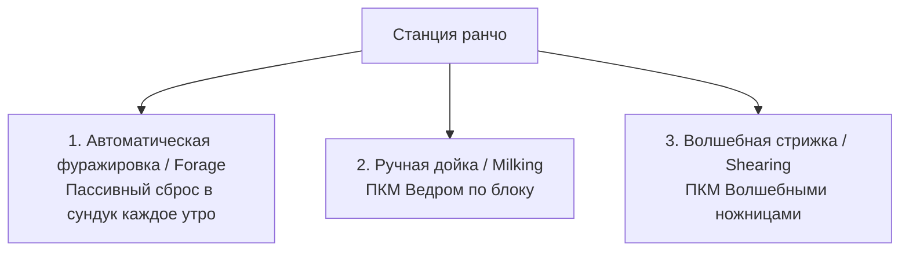

# 🐑 Полное руководство по Станции ранчо (Ranching Station)

> **Мод:** `cobblemon_farmers`  
> **Блок:** `cobblemon_farmers:ranching_station`  
> **Интеграция:** `society`, `society_skills`, `sunlit_cobblemon`  

---

## 📌 Что такое Станция ранчо?

**Станция ранчо (`Ranching Station`)** — это специализированный интерактивный блок автоматизации животноводства и сбора био-ресурсов с покемонов. 

Вместо убийства или загона в тесные фермы, вы назначаете покемона жить и работать на станции. Покемон ежедневно производит уникальные ресурсы: молоко, шерсть, драгоценные минералы, камни эволюции, тотемы и даже книги навыков!

---

## 🛠 Крафт и установка блока

### Рецепт на верстаке:
```text
[Солома]          [Грейтбол]         [Солома]
[Кристалл земли]  [Солома]           [Кристалл земли]
[Огненное бревно] [Огненное бревно]  [Огненное бревно]
```
- **Ингредиенты:**
  - `3x` Огненное бревно (`meadow:fire_log`)
  - `3x` Солома (`farmersdelight:straw`)
  - `2x` Кристалл земли (`society:earth_crystal`)
  - `1x` Грейтбол (`cobblemon:great_ball`)

---

## 🎮 Три способа взаимодействия и получения продукции

Станция ранчо поддерживает **3 независимых режима сбора ресурсов**, каждый из которых обновляется **1 раз в игровой день** (каждое утро):



### 1. 🌾 Автоматическая фуражировка (Foraging) — Пассивный режим
* **Как работает:** Каждое утро покемон «находит» и производит ресурсы.
* **Куда идёт лут:** Если перед станцией (по направлению стрелки блока `FACING`) стоит **Сундук** или контейнер, продукция автоматически складывается внутрь. Если сундука нет — выбрасывается перед станцией в виде дропа.

### 2. 🥛 Ручная дойка (Milking)
* **Как работает:** Подойдите к станции и нажмите **ПКМ обычным ведром** (`minecraft:bucket`).
* Ведро наполнится уникальным молоком:
  - *Miltank / Tauros* $\rightarrow$ Молоко Му-му (`Moomoo Milk`).
  - *Mareep / Flaaffy / Wooloo* $\rightarrow$ Овечье молоко (`Sheep Milk`).
  - *Shuckle* $\rightarrow$ Ягодный сок (`Berry Juice`).
  - *Goodra / Sliggoo* $\rightarrow$ Слизь и чистая вода.
* **Качество:** При высокой силе ранчо ведро может наполниться **Большим молоком** (`Large Moomoo Milk`) золотого или алмазного качества!

### 3. ✂️ Волшебная стрижка (Magic Shearing)
* **Как работает:** Кликните **ПКМ Волшебными ножницами** (`society:magic_shears`).
* Стрижёт шерсть, электро-пряжу (`Electro Wool`), перья или драгоценные чешуйки без вреда для покемона.

---

## 📊 Точный расчёт сердец Affection (Сила ранчо: от 0 до 10)

Сила ранчо (**`Ranching Power`**) отображается в интерфейсе в виде **шкалы сердец (от 0 до 10)**. Именно она определяет, какие ресурсы способен производить покемон:

$$\text{Итоговая сила} = \text{Сердца дружбы (0–5)} + \text{Сердца здоровья (0–5)}$$

### 1. Сердца дружбы (Friendship Hearts) — от 0 до 5:
Дружба покемона прокачивается от 0 до 255 (подробнее см. [Гайд по Дружбе](friendship_guide.md)):

| Уровень дружбы | Количество сердец |
| :---: | :---: |
| **0 – 50** | 🤍 **0 сердец** |
| **51 – 101** | ❤️ **1 сердце** |
| **102 – 152** | ❤️❤️ **2 сердца** |
| **153 – 203** | ❤️❤️❤️ **3 сердца** |
| **204 – 254** | ❤️❤️❤️❤️ **4 сердца** |
| **255 (максимум)** | ❤️❤️❤️❤️❤️ **5 сердец** |

### 2. Сердца здоровья (HP Hearts) — от 0 до 5:
Зависят от максимального запаса здоровья покемона (`Stat.HP`):

| Запас HP покемона | Количество сердец |
| :---: | :---: |
| **< 50 HP** | 🤍 **0 сердец** |
| **50 – 99 HP** | 💚 **1 сердце** |
| **100 – 149 HP** | 💚💚 **2 сердца** |
| **150 – 199 HP** | 💚💚💚 **3 сердца** |
| **200 – 249 HP** | 💚💚💚💚 **4 сердца** |
| **≥ 250 HP** *(высокий уровень)* | 💚💚💚💚💚 **5 сердец** |

### 🌟 Шайни-бонус (Shiny x2):
У **Шайни-покемонов** очки сердец дружбы и здоровья **умножаются на 2**!  
*Пример:* Шайни-покемон с дружбой 130 (2 сердца) и 150 HP (3 сердца) сразу получает $(2 \times 2) + (3 \times 2) = \mathbf{10\text{ сердец}}$ (максимум)!

---

## 🎁 Таблица ключевого лута фуражировки (Что производят покемоны)

| Покемон | Требуемые сердца | Производимый ресурс | Шанс в день |
| :--- | :---: | :--- | :---: |
| ⚡ **Raging Bolt** | **4 сердца**<br>**7 сердец**<br>**10 сердец** | Камень грома (`thunder_stone`)<br>Громовой тотем (`thunder_totem`)<br>⚡ **Booster Energy** | $27\%$<br>$1\%$<br>**$75\%$** |
| 🧪 **Muk / Alolan Muk** | **1 сердце**<br>**7 сердец**<br>**10 сердец** | Слизь (`slime_ball`)<br>Ядовитая капля (`poison_drop`)<br>📚 **Книга «Макбет»** (*Mukbeth*) | $67\%$<br>$27\%$<br>**$100\%$** |
| 🪨 **Tyranitar** | **1 сердце**<br>**7 сердец** | Гладкий камень (`smooth_rock`)<br>Песчаниковая плита (`sandstone_slate`) | $67\%$<br>$27\%$ |
| 🦕 **Iron Thorns** | **1 сердце**<br>**7 сердец**<br>**10 сердец** | Железный шар (`iron_ball`)<br>Чистое громовое яйцо (`thunder_egg`)<br>⚡ **Booster Energy** | $67\%$<br>$27\%$<br>**$75\%$** |
| 🌸 **Venusaur / Meganium** | **4 сердца**<br>**7 сердец** | Камень листа (`leaf_stone`)<br>Чистый травяной самоцвет (`pristine_grass_gem`) | $27\%$<br>$5\%$ |
| ❄️ **Lapras / Glaceon** | **4 сердца**<br>**7 сердец** | Камень льда (`ice_stone`)<br>Вечная мерзлота (`permafrost_drop`) | $27\%$<br>$10\%$ |

---

## 💡 Топ-3 секрета максимальной эффективности:

1. **Экспресс-прокачка 10 сердец за 2 минуты:**
   Покормите покемона 15–20 ягодами дружбы (*Pomeg, Kelpsy, Qualot, Hondew, Grepa, Tamato*) $\rightarrow$ дружба моментально станет **255** (5 сердец). Повысьте уровень покемона конфетами EXP до 50+ уровня (HP $\ge 250$) $\rightarrow$ станция выйдет на **максимальные 10 сердец** в первый же день!
2. **Шайни на Ранчо:**
   Всегда старайтесь сажать на Ранчо Шайни-версии покемонов: они достигают 10 сердец даже на низких уровнях.
3. **Полная автоматизация через воронку:**
   Поставьте Станцию ранчо лицевой стороной к воронке или сундуку $\rightarrow$ все утренние дропы будут автоматически сортироваться по складам без участия игрока.
