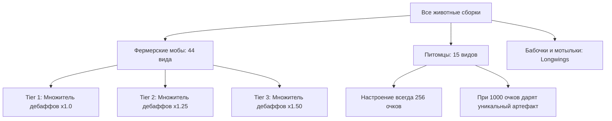

# Углублённый технический аудит механик животных, предметов и взаимодействий
## Society: Sunlit Valley (Minecraft 1.20.1 Forge)

**Дата аудита:** 02.09.2026  
**Версия сборки:** Society: Sunlit Valley  
**Методология:** 100% реверс-инжиниринг серверных и клиентских скриптов KubeJS, регистраций Capability, NBT-структур и конфигураций сборки.

---

## 📑 1. Реестр категорий животных и Tier-множители

В сборке все животные разделены на три независимые системы: **Фермерские (`society:husbandry_animal`)**, **Питомцы (`society:pet_animal`)** и **Насекомые (`society:longwing`)**.



### Разделение по Tier (Сложность содержания):
* **Tier 1 (Базовые мобы, множитель дебаффов $\times 1.0$):**  
  Обычная корова (`minecraft:cow`), обычная овца (`minecraft:sheep`), курица (`minecraft:chicken`), утка (`untitledduckmod:duck`), снежная свинья (`snowpig:snow_pig`), мухоморная корова (`minecraft:mooshroom`), карликовая овечка (`wildernature:minisheep`), летучая мышь (`minecraft:bat`), кошениль (`atmospheric:cochineal`), обычный и светящийся кальмары.
* **Tier 2 (Продвинутые мобы, множитель дебаффов $\times 1.25$):**  
  Свинья (`minecraft:pig`), Шерстяная корова (`meadow:wooly_cow`), Бизон (`wildernature:bison`), Енот (`wildernature:raccoon`), Красная панда (`crittersandcompanions:red_panda`), Большая панда (`minecraft:panda`), Водяной буйвол (`meadow:water_buffalo`), Гусь (`untitledduckmod:goose`), Кролик (`minecraft:rabbit`), Белка (`wildernature:squirrel`), Индюк (`autumnity:turkey`), Черепаха (`minecraft:turtle`).
* **Tier 3 (Экзотические/Сложные мобы, множитель дебаффов $\times 1.5$):**  
  Коза (`minecraft:goat`), Мублюм (`buzzier_bees:moobloom`), Маммутилейшн (`species:mammutilation`), Губер (`species:goober`), Кранчер (`species:cruncher`), Домашний трибулл (`farmlife:domestic_tribull`), Фростбайтер (`windswept:frostbiter`), Враптор (`species:wraptor`), Чэппл (`etcetera:chapple`), Фламинго (`wildernature:flamingo`), Пингвин (`wildernature:penguin`), Галлираптор (`farmlife:galliraptor`), Шима-энага (`crittersandcompanions:shima_enaga`).

---

## 🔍 2. Механика «Тесноты» (Cramped Conditions)

В коде сборки проверка свободного пространства реализована функцией `global.getAnimalIsNotCramped`:

```javascript
global.getAnimalIsNotCramped = (target, scale = 1.1, applyGlowing) => {
  const level = target.getLevel();
  const entities = level
    .getEntitiesWithin(target.boundingBox.inflate(1.1))
    .filter((e) => global.checkEntityTag(e, "society:husbandry_animal"));
  let cramped = entities.length > 5; // Если в радиусе 6 и более животных!
  if (cramped && applyGlowing) {
    entities.forEach((entity) => {
      entity.potionEffects.add("minecraft:glowing", 200, 0, false, false);
    });
  }
  return !cramped;
};
```

### 📏 Точные параметры проверки:
* **Дистанция / Зона проверки:** `target.boundingBox.inflate(1.1)` — хитбокс животного, расширенный на **1,1 блока во все стороны** (куб размером примерно **$3 \times 3 \times 3$ блока** вокруг животного).
* **Порог срабатывания:** **Более 5 животных** (`entities.length > 5`). Это означает, что если в этой зоне находятся **6 и более животных** (само животное + 5 соседей):
  * Животное переходит в состояние **Тесноты / Скученности (`cramped`)**.
  * Сканер настроения (`Mood Scanner`) подсвечивает сгрудившихся животных эффектом **Свечения (`Glowing`)** на 10 секунд.
  * **Штраф к Настроению (Mood):** **$-96$ очков** (из 256).
  * **Штраф к Привязанности (Affection) при поглаживании:** вместо прироста очков списывается **$-25$ очков привязанности** (`data.affection = affection - 25`), появляются злые частицы `angry_villager` и выводится предупреждение: *«Животному слишком тесно!»*.

---

## ⚙️ 3. Автоматизация и машины: Радиусы, таймеры и скрытые апгрейды

### 1. Кормушка (`society:feeding_trough`)
* **Что делает:** Автоматически кормит голодных животных в радиусе действия.
* **Зона действия:** `AABB.ofBlock(block).inflate(6)` $\rightarrow$ **куб $13 \times 13 \times 13$ блоков** ($\pm 6$ блоков от кормушки).
* **Периодичность проверки:** Каждые **300 тиков (15 секунд)**.
* **Приоритет расхода корма (Скрытая механика):**  
  `candied_animal_feed` (+100 очков) $\rightarrow$ `mana_feed` (+30 очков) $\rightarrow$ `animal_feed` (+0 очков). Кормушка всегда сначала тратит самый дорогой корм!
* **Вместимость и визуальные стадии:**  
  Инвентарь $9 \times 1$ слотов. Текстура наполнения меняется: Стадия 1 ($\ge 8$ корма), Стадия 2 ($\ge 128$), Стадия 3 ($\ge 256$), Стадия 4 ($\ge 512$ шт.).
* **Спец-эффект:** Кормление через кормушку восстанавливает животному **4 HP** и сбрасывает статус голода на 2 дня вперед.
* **Статус:** `Подтверждено кодом` (`feedingTrough.js`).

---

### 2. Авто-поглаживатель (`society:auto_petter`)
* **Что делает:** Автоматически гладит животных, предотвращая дебафф за отсутствие поглаживания ($-96$ очков).
* **Зона действия:** `AABB.ofBlock(block).inflate(6)` $\rightarrow$ **куб $13 \times 13 \times 13$ блоков**.
* **Периодичность:** Каждые **300 тиков (15 секунд)**.
* **🚨 Скрытая ловушка авто-поглаживателя:**  
  Если животное находится в состоянии тесноты (`cramped`) или голодно (`hungry`), авто-поглаживатель **списывает $-25$ очков привязанности** каждый день!
* **Исключение:** Животные с модификатором **«Заводное» (`clockwork = true`)** полностью защищены от штрафов авто-поглаживателя.
* **Статус:** `Подтверждено кодом` (`autoPetter.js` & `animalBase.js`).

---

### 3. Авто-сборщик (`society:auto_grabber`)
* **Что делает:** Автоматически доит, стрижёт и собирает побочные продукты с животных.
* **Зона действия:** `AABB.ofBlock(block).inflate(4)` $\rightarrow$ **куб $9 \times 9 \times 9$ блоков**.
* **Периодичность:** Каждые **200 тиков (10 секунд)**.
* **Скрытый апгрейд (Механизация):**  
  Клик ПКМ по блоку Авто-сборщика предметом **«Точный механизм» (`create:precision_mechanism`)** навсегда даёт авто-сборщику пассивный навык **`mana_hand`**, который **УДВАИВАЕТ (x2) всю собранную продукцию**!
* **Статус:** `Подтверждено кодом` (`autoGrabber.js`).

---

## 🧬 4. Скрытые модификации и уникальные предметы животных

| Предмет / Действие | Условие / Навык | Что реально происходит с животным | Статус |
| :--- | :--- | :--- | :--- |
| **Печенье для животных (`society:animal_cracker`)** | Навык `husbandry_mastery` | Навсегда ставит флаг `animalCracker = true`. **Удваивает всё молоко, шерсть и спец-лут** со стрижек и доения. | `Подтверждено кодом` |
| **Точный механизм (`create:precision_mechanism`)** | Навык `clockwork` | Превращает моба в **Заводное животное (`clockwork = true`)**. Животное **игнорирует штраф тесноты**, игнорирует штраф голода при поглаживании и получает **пассивный бонус настроения $+64$**. | `Подтверждено кодом` |
| **Ожерелье дружбы (`society:friendship_necklace`)** | Навык `bff` | Делает животное лучшим другом (`bff = true`). Снимает заводную механизацию. | `Подтверждено кодом` |
| **Алмазное сердце (`quark:diamond_heart`)** | Навык `transplanting` | ПКМ по животному мгновенно даёт **$+100$ очков привязанности (+1 целое сердце)** (кулдаун 1 сек, работает до 10 сердец). | `Подтверждено кодом` |
| **Солнечный кристалл (`society:sunlit_crystal`)** | 10 сердец + Плюшевая игрушка в Offhand | **Запечатывает душу живого моба в плюшевую игрушку**, удаляя моба из мира. Плюшевая игрушка генерирует ресурсы на полке без лагов и еды. | `Подтверждено кодом` |
| **Магические ножницы (`society:magic_shears`)** | $\ge 5$ сердец | Срезают лут существа (мясо, перья, рога) без его убийства. Тратят 7 очков привязанности. При настроении $\ge 160$ лут имеет **Иридиевое качество**! | `Подтверждено кодом` |
| **Жертвенный агнец** | Навык `sacrificial_lamb` | Убийство овцы с $\ge 200$ очками привязанности пугает других овец ($-100$), но даёт **$+50\%$ от её сердец** всем другим видам вокруг с шансом 50%! | `Подтверждено кодом` |
| **Зелье чуда (`society:miracle_potion`)** | Животное не бесплодно | Единственный способ размножения животных (ванильная еда заблокирована). Панды имеют **80% шанс провала** зелья! | `Подтверждено кодом` |

---

## 💎 5. Подарки питомцев при 1000 очков Привязанности (`society:pet_animal`)

У всех 15 видов питомцев шкала настроения всегда зафиксирована на **256 очков** (они не страдают от голода и погоды). При достижении **1000 очков привязанности (10 сердец)** они гарантированно дарят игроку эксклюзивный предмет:

| Питомец | Уникальный подарок |
| :--- | :--- |
| 🐻 **Гризли (`buzzier_bees:grizzly_bear`)** | Медвежья печать (`society:beemonican_seal`) |
| 🐺 **Волк (`minecraft:wolf`)** | Лисьи ушки (`simplehats:longfoxears`) / Окаменелость волка |
| 🐱 **Кошка (`minecraft:cat`)** | Кошачьи ушки (`simplehats:nekoears`) / Окаменелость оцелота |
| 🔥 **Фоксхаунд (`quark:foxhound`)** | Шапка-фейерверк (`simplehats:fireworks`) |
| 🐕 **Сиба-ину (`quark:shiba`)** | Ушки Иви (`simplehats:eevee_ears`) |
| 🧚 **Эллэй (`minecraft:allay`)** | Ушки Чи (`simplehats:chi_ears`) |
| 🐎 **Лошадь (`minecraft:horse`)** | Флейта призыва лошади (`relics:horse_flute`) |
| 🐻‍❄️ **Белый медведь (`minecraft:polar_bear`)** | Плюшевый мишка (`simplehats:teddy_bear`) |
| 🐹 **Хомяк (`hamsters:hamster`)** | Крошечный гном (`society:tiny_gnome`) |
| 🦔 **Ёж (`wildernature:hedgehog`)** | Капюшон Соника (`simplehats:sonichood`) |
| 🐺 **Красный волк (`wildernature:red_wolf`)** | Знамя ловца волков (`wildernature:wolf_trapper_banner`) |
| 🦉 **Сова (`wildernature:owl`)** | Настенные часы-сова (`tanukidecor:owl_clock`) |
| 🐶 **Пёс (`wildernature:dog`)** | Окаменелость овцы (`betterarcheology:sheep_fossil`) |
| 🦎 **Аксолотль (`minecraft:axolotl`)** | Аксолотль на голову / Надувной круг Аксолотль |
| 🦡 **Феррет (`crittersandcompanions:ferret`)** | Яйцо призыва паука-скакуна |

---

## 🧪 6. Полная математика Настроения (Mood) и Качества продукции

### Дебаффы настроения за день:
```text
Итоговый дебафф = (Сумма штрафов) × Множитель сложности породы
```

| Причина дебаффа | Базовый штраф | Условие и защита |
| :--- | :---: | :--- |
| **Не поглажено сегодня** | **$-96$** | Погладить рукой (ПКМ) или установить `Auto-Petter` |
| **Не покормлено $\ge 2$ дней** | **$-128$** | Кормить с руки или поставить `Feeding Trough` |
| **Теснота ($\ge 6$ мобов в 1.1 блоке)** | **$-96$** | Расширить загон, не допускать сбивания в кучу |
| **Дождь под открытым небом** | **$-32$** | Построить крышу над загоном |
| **Зимний мороз без крыши** | **$-32$** | Держать животных под крышей зимой |
| **Недостаток холода** *(для снежных мобов)* | **до $-32$** | Разместить $\ge 5$ блоков снега/льда в радиусе 5 блоков |

### Формула качества продукции:
Качество молока, шерсти, яиц и срезаемого ножницами мяса определяется функцией `getHusbandryQuality(hearts, mood)`:
* **Качество 0 (Обычное):** Сердечки $< 5$ или Настроение $< 160$.
* **Качество 1 (Серебряное):** $\ge 5$ сердец, Настроение $\ge 160$.
* **Качество 2 (Золотое):** $\ge 8$ сердец, Настроение $\ge 200$.
* **Качество 3 (Алмазное):** 10 сердец, Настроение $\ge 230$.
* **Качество 4 (Иридиевое / Фиолетовая звезда):** 10 сердец, Настроение $= 256$ (идеальные условия).

---

## 🏗️ 7. Чертеж и стандарты оптимизированной фермы

Для создания фермы, где животные дают максимальный доход и не теряют настроение:

1. **Крытый хлев (100% защита от погоды):**  
   Крыша полностью предотвращает штрафы за дождь ($-32$) и зимний холод ($-32$).
2. **Расчёт площади против тесноты:**  
   * Не размещать более **4–5 животных в замкнутом пространстве $3 \times 3$**.
   * Для группы из 6–10 животных рекомендуемый размер вольера — **не менее $6 \times 6$ или $8 \times 8$ блоков**.
3. **Автоматизация:**  
   * **Кормушка (`society:feeding_trough`):** радиус действия — **$13 \times 13 \times 13$ блоков** (куб $\pm 6$ блоков от кормушки). Поддерживает загрузку корма до 512 шт.
   * **Авто-поглаживатель (`society:auto_petter`):** автоматически гладит всех животных в радиусе каждый день.
   * **Авто-сборщик (`society:auto_grabber`):** автоматически собирает яйца, шерсть, молоко и перья (улучшить Точным механизмом для удвоения).
4. **Особый загон для морозных животных:**  
   Для пингвинов (`penguin`), снежных свиней (`snow_pig`), снаффлов (`snuffle`), фростбайтеров (`frostbiter`) и маммутилейшнов (`mammutilation`) пол или стены должны содержать **не менее 5 блоков льда или снега** в радиусе 5 блоков.

---

# 🔥 20 самых неочевидных микромеханик сборки

1. **Ванильное размножение полностью заблокировано:** Пшеница, морковь и семена не вводят животных в режим любви — размножение работает **только через Зелье чуда (`society:miracle_potion`)**.
2. **Панды бесплодны на 80%:** При использовании Зелья чуда на пандах и красных пандах код с шансом **80% выдаёт ошибку и сжигает зелье**.
3. **Апгрейд Авто-сборщика Точным механизмом:** ПКМ точным механизмом по блоку авто-сборщика навсегда включает `mana_hand` и удваивает всю собираемую продукцию.
4. **Теснота проверяет куб $3 \times 3$, а не загон:** Лимит в 6 мобов считается по расстоянию 1,1 блока от хитбокса животного, а не по площади забора.
5. **Авто-поглаживатель может убить привязанность:** Если животные стоят в тесноте или голодны, авто-поглаживатель снимает по $-25$ очков привязанности ежедневно.
6. **Заводные животные неуязвимы к стрессу:** Модификатор `clockwork` полностью отключает штрафы за тесноту и голод при поглаживании.
7. **Печенье удваивает спец-дропы навсегда:** `society:animal_cracker` перманентно удваивает сбор ресурсов с моба до конца игры.
8. **Магические ножницы добывают мясо живьём:** `magic_shears` позволяют срезать мясо, кожу и перья иридиевого качества, не убивая моба.
9. **Жертвоприношение овцы прокачивает всю ферму:** Навык `sacrificial_lamb` передаёт 50% сердец убитой овцы окружающим коровам и свиньям.
10. **Запечатывание в плюшевую игрушку:** При 10 сердцах душу моба можно запечатать в плюшевую игрушку через `sunlit_crystal`, получая ресурсы с декоративной фигурки.
11. **Холодным мобам нужны физические блоки льда:** Пингвинам и снежным свиньям требуется минимум 5 блоков льда/снега в радиусе 5 блоков, иначе они теряют $-32$ настроения.
12. **Зимний мороз бьёт через небо:** Любое животное без крыши зимой теряет $-32$ настроения.
13. **Дождь наносит дебафф настроения:** Дождь под открытым небом снижает настроение на $-32$ очка.
14. **Кормушка сначала сжигает самый дорогой корм:** `Feeding Trough` всегда в первую очередь тратит `candied_animal_feed` (+100) и `mana_feed` (+30), даже если положен обычный корм.
15. **Детёныши прокачиваются в 10 раз быстрее:** Поглаживание детёныша с навыком `fostering` даёт сразу $+100$ очков привязанности за 1 клик.
16. **Искажённая шерстяная корова доится раз в 2 дня:** Вариант №2 шерстяной коровы (*Meadow*) производит *Искажённое молоко*, но имеет кулдаун доения 2 дня вместо 1.
17. **Летучие мыши — фермерские животные:** Летучая мышь входит в `husbandry_animal` и при 10 сердцах производит сливы, маракуйю и бананы.
18. **Шима-энага производит ягоды мха:** Птица Шима-энага при 10 сердцах приносит редчайшие `society:mossberry`.
19. **Кальмары поддаются доению вечно:** Кальмары и светящиеся кальмары доятся ведром с кулдауном 1 день, давая чернила и легендарные чернила.
20. **Питомцы дарят уникальные шапки и реликвии:** При достижении 1000 очков привязанности каждый питомец (волк, кот, хомяк, лошадь, еж) единоразово дарит игроку эксклюзивный артефакт.
