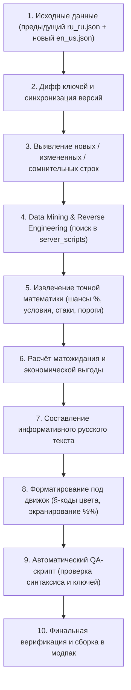

# 🧠 Knowledge Item: Методология и регламент глубокой локализации модпаков Minecraft

---

## 1. Цель проекта и философия локализации
* **Смысловая и механическая точность:** Перевод не должен быть слепым дословным калькированием английского текста. Его главная цель — дать игроку исчерпывающее и честное понимание того, **как навык/предмет работает на самом деле**.
* **Принцип «Ground Truth» (Исходный код — истина):** Английские оригинальные описания авторов часто бывают неполными, устаревшими, двусмысленными или рекламными. Если параметр можно проверить в кодовой базе (`server_scripts`, `startup_scripts`, `datapacks`, `puffish_skills`), мы обязаны подтвердить его фактами из кода.
* **Принцип прозрачной экономики для игрока:** Игрок в RPG/фермерском симуляторе распределяет ценные очки навыков. Описание обязано содержать **точные проценты, множители и условия**, чтобы игрок мог наглядно оценить окупаемость, математическое ожидание выгоды и синергии каждого пути прокачки:
  > *«Что именно я получу, если вложу очки в этот навык, при каких условиях, с какой вероятностью и как он взаимодействует с другими механиками?»*

---

## 2. Паттерн и конвейер будущих итераций (Pipeline)

---

## 3. Гайд по Data Mining: Поиск методов, шансов и формул выгоды

### 🔍 1. Где и как в кодовой базе искать шансы (`Chance / %`):
1. **Прямые вероятности в LootJS (`randomChance`):**
   * В файлах `server_scripts/loot/*.js`:  
     `p.randomChance(0.01)` = **1%%**  
     `p.randomChance(0.04)` = **4%%**  
     `p.randomChance(0.10)` = **10%%**  
     `p.randomChance(0.45)` = **45%%**  
2. **Вспомогательные генераторы рандома (`rnd`, `rnd25`):**
   * `rnd25()` $\rightarrow$ функция возвращает `Math.random() < 0.25` (**ровно 25%% шанс**).
   * `rnd(min, max)` $\rightarrow$ диапазон целых чисел (например, `rnd(1, 4)` = от 1 до 4).
3. **Веса предметов в лут-таблицах (`weight`):**
   * В файлах `data/.../loot_tables/*.json`:
     $$\text{Шанс на предмет} = \frac{\text{Weight предмета}}{\sum \text{Всех Weight в пуле}} \times 100\%$$
   * *Пример (Дар Нептуна в `treasure_chest.json`):* вес = 2, сумма всех весов = 18 $\rightarrow$ $\frac{2}{18} \approx \mathbf{11.1\%}$.
4. **Динамические процентные инъекции в пулы:**
   * *Пример (`seasonfish.js` для Нептуны):* `insertNeptuna` берёт `Math.floor(weights * 0.09)` $\rightarrow$ внедряет рыбу с **~9%% шансом** в общий пул любого водоёма.

---

### 🧮 2. Математическое ожидание выгоды и синергии:
Когда навык содержит риск или комбинируется с другими предметами, в описании нужно раскрывать реальный финансовый профиль:

1. **Навыки с риском (на примере «Горячие руки» `Hot Hands`):**
   * *Сырая рыба:* базовая цена ($1.0$).
   * *Копчёная рыба:* в коде `value: fish.value * 4` (в 4 раза дороже = $4.0$).
   * *Риск:* 25%% шанс сгореть в 1 уголь ($0.0$).
   * *Математическое ожидание:* $\mathbb{E} = (0.75 \times 4.0) + (0.25 \times 0.0) = \mathbf{3.0}$.
   * *Вывод для описания:* игрок получает **в среднем в 3 раза больше монет (+200%% чистой прибыли)** на полном автомате.

2. **Мультипликативные синергии (на примере «Собиратель мусора» + «Морской сухарь»):**
   * В коде: `if (upgraded) chance *= 2;` и `if (stage) chance *= 2;`.
   * Обе проверки перемножаются: $2 \times 2 = \mathbf{4}$ (**в 4 раза / на 300%% выше шанс** на жемчуг, драгоценности и артефакты).

3. **Последовательные аддитивно-мультипликативные бонусы (на примере «Собиратель урожая» + «Paradise Crop»):**
   * Порядок вызова модификаторов: сначала книга `count + 1`, затем навык `count * 2`.
   * Формула: $(\text{Базовый сбор} + 1) \times 2 = (1 + 1) \times 2 = \mathbf{4\text{ шт.}}$ с куста.

---

## 4. Правила принятия решений и реверс-инжиниринга

1. **Никогда не доверять слепо существующему переводу:** Старые версии часто содержат машинный перевод, контекстные ошибки (*School $\rightarrow$ Школа*, *Fence $\rightarrow$ Забор*) и устаревшие формулировки.
2. **Никогда не додумывать механику:** Любое утверждение о вероятностях, множителях, восстанавливаемом здоровье или стакаемости должно иметь подтверждение в исходниках.
3. **Переводить смысл и роль в игре, а не словарные значения:**
   * Всегда определять контекст: является ли термин именем сущности (NPC), предметом инвентаря, блоком, атрибутом или метафорой.
4. **Отражать критические игровые развилки:** Если навыки взаимоисключающие (например, путь автоматизации против пути ручной заботы) или их бонусы не суммируются (команда `attribute ... base set`), это должно быть явно указано.
5. **Фиксировать пространственно-временные модификаторы:** Если шанс зависит от сезона (зима), биома (холодный) или измерения (Незер, Пещера Черепа), эти градации нужно раскрывать в описании.
6. **Разделять механику игрока и Create-механизмы:** Механизмы *Create* (комбайны, буры) не имеют профиля игрока (`player.stages`) и не наследуют навыки. Автоматизация навыков работает только через специализированные машины с кэшированием владельца (`global.cacheOwner`).

---

## 5. Технические стандарты Minecraft-локализации

### 🔴 Символ процента: строго `%%`
* **Правило:** В файлах `lang/*.json` движок Minecraft обрабатывает строки через Java-форматтер `Component.translatable` / `String.format`.
* **Риск:** Одиночный знак `%` вызывает критический вылет игры с ошибкой `java.util.UnknownFormatConversionException` при открытии графического интерфейса.
* **Требование:** Каждый знак процента обязан быть экранирован как **`%%`** (например: `10%%`, `50%%`, `(1%%)`).
* **Стилистика:** Цветовой тег `§a` ставится перед цифрой (например: `§a10%%`, `§a100%%`).

### 🎨 Цветовые коды форматирования: нативные `§`
* **Правило:** Использовать символ параграфа `§` (`\u00A7`), а не устаревшие `&`.
* **Основные коды палитры:**
  * `§6` — Золотой / Акцентный (названия предметов, руд, ключевые параметры).
  * `§d` — Светло-фиолетовый (редкие/призматические предметы, эндгейм).
  * `§a` — Зелёный (положительные эффекты, множители x2/x4, условия активации).
  * `§b` — Голубой (сезон «зима», холодные биомы, водные свойства).
  * `§c` — Красный (предупреждения, штрафы, «Не суммируется»).
  * `§7` — Светло-серый (базовый цвет описания, возврат цвета после выделения).
  * `§f` — Белый (нейтральный текст, иконки валюты/символы).

### 🔑 Паритет ключей
* Количество и состав ключей в `ru_ru.json` должны **строго 1-в-1** соответствовать `en_us.json`.

---

## 6. Архитектура автоматизации и серверов (`global.cacheOwner`)

В сборке реализована система персистентности навыков для автоматических механизмов ([`globalMachineOwnerUtils.js`](file:///D:/ModrinthApp/profiles/Society_%20Sunlit%20Valley/kubejs/startup_scripts/globalMachineOwnerUtils.js)):
* При установке блок записывает UUID владельца (`owner`).
* Механизм кэширует список активных стадий игрока в NBT (`stages`).
* **Результат:** если чанк прогружен (прогрузчиком чанков / FTB Chunks / другими игроками на сервере), машина **применяет все навыки хозяина даже в оффлайне**!

### 4 ключевые системы с поддержкой кэширования:
1. 🐮 **Автосборщик животных (`society:auto_grabber`):**
   * Кэширует `coopmaster` (2% на Золотые яйца, 2x дроп кроликов), `triple_truffle` (3x трюфели), `mana_hand`, `bff`.
2. 🐟 **Корзина рыбного садка (`society:fish_pond_basket`):**
   * Кэширует `hot_hands` (авто-копчение), `mitosis` (2x вылов при размножении), `scum_collector` (2x/4x сокровища), `caviar_catcher` (+2 икры), `caper_catcher` (+3 икры).
3. 🐸 **Хижина квакушек (`society:ribbit_hut`):**
   * Кэширует `crop_collector` (2x урожай), `paradise_crop` (+1 к сбору), качество культур.
4. 🏺 **Ремесленная воронка (`society:artisan_hopper`):**
   * Кэширует `ancient_aging` (доступ к Древним бочкам), `rancher` (20% шанс 2x сыра/майонеза/тканей), `aged_prize` (5% на Призовые билеты).

---

## 7. Экономика и валюта (Create: Numismatics)

Иерархия монет в сборке ([`startup_scripts/globalRegistry.js`](file:///D:/ModrinthApp/profiles/Society_%20Sunlit%20Valley/kubejs/startup_scripts/globalRegistry.js)):
* **1 Spur (Медная шпора)** = 1 базовая единица валюты.
* **1 Bevel** = 8 монет.
* **1 Sprocket** = 16 монет.
* **1 Cog (Серебряная шестерня)** = 64 монеты.
* **1 Crown (Золотая монета)** = **512 монет** (8 серебряных шестерней).
* **1 Sun** = 4 096 монет.
* **1 Neptunium Coin** = 32 768 монет.
* **1 Ancient Coin** = 262 144 монеты.
* **1 Prismatic Coin** = 16 777 216 монет.

*Правило локализации:* В описаниях руд и наград писать в единственном числе с точным эквивалентом: `1 Золотая монета (= 512 монет)`.

---

## 8. Прецеденты и методологические кейсы сессии

| Английский оригинал / Термин | Ошибочный подход | Правильный перевод из кода | Почему именно так (Обоснование из исходников) |
| :--- | :--- | :--- | :--- |
| **`School Fisher`** | *Школьный рыбак* | **Ловец косяков** | Идиома *«school of fish»* означает косяк рыбы. Навык даёт `+3` рыбы за поклёвку. |
| **`Fence`** | *Забор* | **Скупщик** | В сленге *fence* — скупщик добычи. Навык повышает цену сдачи лута с мобов на 50%%. |
| **`Witch`** | *Волшебник* | **Ведьма** | В `npcInteraction.js` прописана конкретная профессия/NPC — Ведьма (*Witch*). |
| **`entity.heal(2)`** | *«Восстановить пол-сердца»* | **Восстановить целое сердце (2 HP)** | В Minecraft 1 сердце = 2 HP. `heal(2)` восстанавливает ровно 1 полное сердце. |
| **`Gold Rush`** | *«4 слитка сырого золота»* | **4 Блока необработанной руды** | В коде: `addLoot("4x minecraft:raw_gold_block")`. Это 4 блока = 36 единиц сырого золота (100%% шанс). |
| **`Excavator`** | *«Шанс получить жеоды»* | **Второй независимый ролл (10%% + 10%%)** | В коде отдельный вызов `addAdditionalGeodeRoll(e, "excavator")`. Даёт второй шанс выбить жеоду. |
| **`Biomancer`** | *«Оно должно вам доверять»* | **Требуется от 5 сердец (тратит 1 сердце)** | В коде `animalBase.js`: условие `hearts >= 5` и вычитание `data.affection -= 100` (1 сердце). |
| **`Hot Hands`** | *«25% испортится — это плохо»* | **Коптит рыбу (x4 цена), 25% уголь (+200% выгоды)** | Копчёная рыба стоит ровно в 4 раза дороже (`value * 4`). Матожидание выгоды: $0.75 \times 4 = 3.0$ (+200%% чистой прибыли). |
| **`Mitosis`** | *«Удваивает любую рыбу»* | **Удваивает (x2) естественный приплод садка** | В коде: `naturalPopulation > 0 ? 2 : 1`. Удваивает только рыбу, рождённую в садке, позволяя клонировать редкие виды. |
| **`Prismatic Bounty`** | *«Случайный осколок из рыбы»* | **100%% осколок при разрушении блока «Дар Нептуна»** | Блок `aquaculture:neptunes_bounty` без Шёлкового касания со 100%% шансом превращается в Призматический осколок. |
| **`Scum Collector`** | *«Суммируется с сухарями»* | **Удваивает (x2), а с Морским сухарём даёт x4 шанс** | Морской сухарь даёт `rewardChance *= 2`, навык даёт `rewardChance *= 2`. Итого: $2 \times 2 = 4$ (в 4 раза выше шанс на сокровища). |
| **`Ancient Aging`** | *«Даёт древние бочки»* | **Открывает Древние бочки для x2 выдержки (13-20 дней)** | Без навыка бочка заблокирована. Позволяет делать элитные дважды выдержанные вина/сыры стоимостью до 10 368 монет. |
| **`Crop Collector`** | *«Удваивает сбор»* | **Удваивает (x2), с книгой Paradise Crop даёт x4 урожай** | Модификаторы выполняются последовательно: $(1 + 1) \times 2 = 4$ плода с каждого куста. Работает в Хижинах квакушек. |
| **`Artifact/Relic Trove`** | *«Трофей с реликвиями»* | **Сундук с артефактами / Сундук с реликвиями** | Это закрытые кейсы (`item.society.artifact_trove`), открываемые в Экстрактинаторе (*Extractinator*). |

---

## 9. Инструментарий, стратегия поиска и QA

### Поисковые стратегии по кодовой базе (`kubejs`)
1. **Поиск по ID стадии навыка (`stage`):**  
   Каждый навык из `puffish_skills` выдает игроку stage с тем же ID.  
   *Поиск:* `grep_search(Query: "stage_name", SearchPath: "kubejs")`.
2. **Поиск по модификаторам лута (`LootJS`):**  
   * `miningLoot.js` — руды, жеоды, дроп с камня/глубинного сланца, Пещера Черепа.
   * `farmingLoot.js` / `havestHandling.js` — культуры, деревья, удобрения, смола.
   * `fishingLoot.js` / `seasonfish.js` — улов рыбы, сундуки, желейки, садки, сезонные пулы.
   * `adventurerLoot.js` / `generalLoot.js` — сундуки подземелий, сокровища, монеты.
3. **Поиск по механизмам и интеракциям:**
   * `startup_scripts/powerfulMachines/` — садки (`globalFish.js`), Хижины квакушек (`ribbitHut.js`), сборщики (`autoGrabber.js`).
   * `startup_scripts/customMachines/` — Статуя богини (`ancientGoddessStatue.js`), Древняя бочка (`ancientCask.js`).
   * `startup_scripts/globalRegistry.js` — мастер-таблица цен всех предметов и множителей переработки.

### Автоматизированный скрипт валидации (QA)
Для любой итерации используется автоматический скрипт валидации:
* **Проверка паритета ключей:** строгое совпадение ключей с `en_us.json`.
* **Синтаксический контроль `%`:** поиск одиночных неэкранированных `%` через регулярное выражение `(?<!%)%(?!%)`.
* **Контроль устаревших кодов:** проверка на отсутствие амперсандов `&[0-9a-fk-or]`.
* **Сверка цветовых кодов:** контроль корректности закрывающих тегов `§7` после цветных вставок `§6`, `§d`, `§a`, `§c`, `§b`.

---

## 10. Единая триггер-команда синхронизации
По запросу пользователя: **`«Обнови»`**, **`«Синхронизируй»`**, **`«F3+T»`** или **`«Сборка»`**:
1. Автоматически запускается `validate_qa.py`.
2. При отсутствии синтаксических ошибок файл `ru_ru.json` копируется напрямую в:  
   `D:\ModrinthApp\profiles\Society_ Sunlit Valley\kubejs\assets\society_skills\lang\ru_ru.json`.
