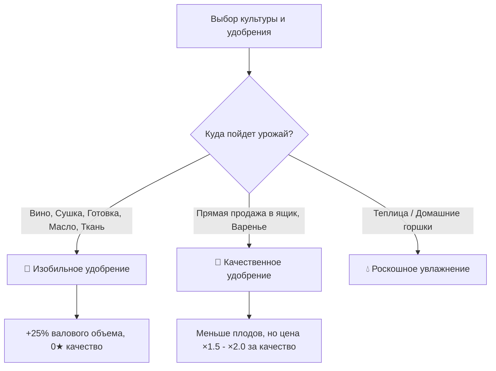
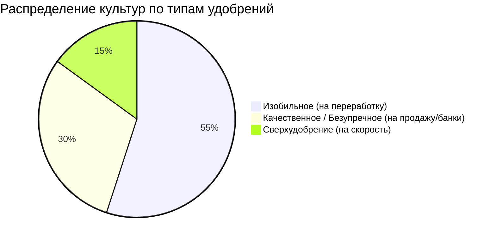

[🏠 Главная Wiki](../../../../wiki/README.md) ▸ [🌱 Земледелие](../../README.md) ▸ **Гайд по удобрениям, культурам и станкам**

# 🌱 Руководство по удобрениям, качеству культур и станкам

> **Категория:** 🌱 Земледелие и ремесло | **Моды:** Dew Drop Farmland Growth & Society | **Версия:** 1.20.1 Forge

Полное практическое руководство по выбору удобрений, расчету доходности урожая и взаимодействию культур с ремесленными станками сборки.

---

## ⚡ Быстрая шпаргалка (TL;DR)

> [!TIP]
> **Золотое правило агронома:**
> * **Изобильное удобрение** (+25% к урожаю, 0★ качество) — выбирайте для всего, что пойдет в **винодельческие бочки, сушилки, кулинарные котлы, маслобойку, кофемашину или на ткань/муку**.
> * **Качественное / Безупречное удобрение** (повышенный шанс ★ Серебра, Золота, Иридия) — выбирайте для **прямой продажи урожая** и сырья для **банок консервации (варенья/солений), сырного пресса и коптильни**.
> * **Спринклеры можно вкапывать в землю (Y=0)** на уровень грядок — они поливают пашню прямо под ногами, не мешая передвижению и сбору.

---

## 🧪 1. Разбор удобрений: Количество против Качества

В сборке действуют два принципиально разных типа агрономических улучшений пашни:

| Удобрение | Эффект на урожай | Качество продукта | Рекомендуемое назначение |
| :--- | :--- | :--- | :--- |
| **Изобильное удобрение**<br>`bountiful_fertilizer` | **+25% шанс** получить +1 дополнительный плод при сборе | **Принудительно 0★**<br>(Всегда обычное качество) | Сырье для станков глубокой переработки (вино, сушка, готовка, ткани) |
| **Слабое / Высокое / Безупречное**<br>`*_quality_fertilizer` | Базовое количество (1 шт.) | **Повышает тир качества:**<br>🥈 Серебро / 🥇 Золото / 💎 Иридий | Прямая продажа в ящик отгрузки, банки консервации |
| **Увлажняющее удобрение**<br>`hydrating_fertilizer` | Базовое количество | Стандартное | Автополив грядки до 50% созревания урожая (старт без ведра) |
| **Роскошное увлажняющее**<br>`deluxe_hydrating_fertilizer` | Базовое количество | Стандартное | Постоянное 100% увлажнение без воды и спринклеров (идеально для горшков) |
| **Сверхудобрение (Hyper)**<br>`hyper_fertilizer` | **Ускорение роста на +33%** | Стандартное | Медленнорастущие культуры (Древний плод, Тыква) |



---

## 🏭 2. Станки и ремесленные машины: Влияние качества сырья

В сборке все перерабатывающие станки делятся на **две строгие группы**: станки со сбросом качества и станки с сохранением качества.

### Группа А: Станки, ИГНОРИРУЮЩИЕ качество (Идеально под Изобильное удобрение)

В этих станках качество исходного ингредиента **полностью сгорает** и не дает никакой прибавки к цене готового продукта. Тратить на них плоды золотого или иридиевого качества — прямая потеря денег.

| Станок | Входное сырье | Итоговый продукт | Почему выгодно Изобильное удобрение? |
| :--- | :--- | :--- | :--- |
| 🍷 **Винодельческая бочка**<br>`society:wine_keg` | Любые фрукты и ягоды (виноград, дыня, карамбола...) | **Вино / Сок** (0★) | Вино всегда выходит обычного качества. Звезды (серебро/золото/иридий) повышаются исключительно выдержкой в **бочонках погреба** (`aging_cask`). 25% доп. сырья = на 25% больше бутылок дорогого вина. |
| 🍇 **Сушилка**<br>`society:dehydrator` | Фрукты, ягоды, грибы, виноград | **Сухофрукты / Изюм** (0★) | Сушеные продукты не имеют уровней качества. Вы получаете на 25% больше готовых упаковок сухофруктов. |
| 🧀 **Форма для сыра Meadow**<br>`meadow:cheese_form` | Молоко (любого качества) | **Бруски сыра** (0★) | Быстрое сбраживание за 90 секунд. Сбрасывает качество молока до обычного сыра. |
| 🍲 **Кулинарные котлы**<br>`farmersdelight:cooking_pot`<br>`candlelight:cooking_pot` | Овощи, рис, мясо, зелень | **Готовые блюда** (0★) | Блюда и супы не имеют звезд качества. Важно только валовое число порций. |
| 🛢️ **Маслобойка**<br>`society:oil_maker` | Кукуруза, семена подсолнуха, трюфели | **Масло / Трюфельное масло** | Масло имеет фиксированную высокую цену без звезд качества. |
| ☕ **Кофемашина**<br>`society:espresso_machine` | Кофейные бобы | **Кофе / Эспрессо** | Напитки не имеют качества; дают бафф скорости и продаются по фиксированной цене. |
| 🧵 **Ткацкий станок**<br>`society:loom` | Хлопок, шерсть, лен | **Ткань / Нити** | Ткань не имеет качества. +25% хлопка = +25% рулонов ткани. |
| ⚙️ **Мельница Create**<br>`create:millstone` | Пшеница, рис, сахарный тростник | **Мука, Сахар** | Продукты помола не имеют качества. |

---

### Группа Б: Станки, СОХРАНЯЮЩИЕ качество сырья (Требуют Качественного удобрения)

В этих машинах качество готового продукта **напрямую зависит** от качества заложенного сырья:

| Станок | Механика переноса качества | Совет по удобрению |
| :--- | :--- | :--- |
| 🫙 **Банка консервации**<br>`society:preserves_jar` | Варенье и джемы наследуют множитель цены исходного плода. | **Безупречное удобрение** дает максимальную цену банок. |
| 🧀 **Сырный пресс Society**<br>`society:cheese_press` | Качественное молоко превращается в сыр со звездами (в отличие от формы Meadow). | Использовать молоко от счастливых коров 5★. |
| 🥚 **Майонезный автомат**<br>`society:mayonnaise_machine` | Крупные золотые/иридиевые яйца производят золотой майонез. | Использовать яйца высшего качества. |
| 🐟 **Коптильня для рыбы**<br>`society:fish_smoker` | Копченая рыба наследует качество выловленной рыбы. | Ловить рыбу на идеальных забросах. |
| 🌾 **Экстрактор семян**<br>`society:seed_maker` | Высокое качество плода повышает шанс получить 2–3 пакета семян. | Закладывать плоды золотого качества. |

---

## 📊 3. Матрица культур: Какое удобрение выбрать?



### 1. Многоурожайные культуры (Постоянное плодоношение)
Культуры, которые не нужно пересаживать после сбора (дают урожай каждые 2–4 дня).
* **Культуры:** Черника, Клюква, Клубника, Баклажан, Фасоль, Кукуруза, Помидоры, Перец.
* **Лучшее удобрение:** 🌾 **Изобильное удобрение**.
* **Почему:** Однократное внесение удобрения действует на **все последующие сборы весь сезон**! Вы получаете стабильные +25% плодов с каждого куста до конца лета/осени для сушилок и бочек.

### 2. Дорогие монокультуры (Одноразовый урожай)
* **Культуры:** Древний плод, Карамбола, Дыня, Тыква, Ананас, Цветная капуста.
* **Стратегия А (В бочки на вино):** 🌾 **Изобильное удобрение** → максимальное число бутылок.
* **Стратегия Б (На сундуки отгрузки / фестивали):** 💎 **Безупречное удобрение** → гигантская цена за иридиевые экземпляры.
* **Стратегия В (Ускорение длинного цикла):** ⚡ **Сверхудобрение (Hyper)** → сокращение роста Древнего плода с 28 до 19–20 дней.

### 3. Технические и кулинарные культуры
* **Культуры:** Пшеница, Хлопок, Лен, Сахарный тростник, Кофейные бобы, Рис, Чеснок, Лук.
* **Лучшее удобрение:** 🌾 **Изобильное удобрение**.
* **Почему:** Эти культуры используются исключительно в крафтах, готовке и помоле, где качество равно нулю.

---

## 🚰 4. Инженерные хитрости со спринклерами и горшками

### 1. Вкапывание спринклеров в уровень земли (Y = 0)
В коде мода проверка полива охватывает диапазон высоты от `Y = 0` (уровень самой пашни) до `Y = +1` (уровень стеблей).
* Вы можете выкопать блок земли в центре поля, поставить туда спринклер — и он будет **заподлицо с грядками**.
* По такому полю удобно бегать, на нем не застревают мобы и автосборщики.

```text
[Грядка] [Грядка] [ СПРИНКЛЕР ] [Грядка] [Грядка]  <--- Y = 0 (Уровень земли)
[ Камень/Земля под пашней ]                        <--- Y = -1
```

### 2. Радиусы действия спринклеров
* **Железный:** 3 × 3 (радиус 1 блок вокруг себя, поливает 8 грядок).
* **Золотой:** 5 × 5 (радиус 2 блока, поливает 24 грядки).
* **Алмазный:** 7 × 7 (радиус 3 блока, поливает 48 грядок).
* **Незеритовый:** 9 × 9 (радиус 4 блока, поливает 80 грядок).

> [!TIP]
> **Декоративный колышек:** Нажмите **ПКМ обычной палкой** по любому спринклеру, чтобы выдвинуть декоративную деревянную стойку.

### 3. Роскошный садовый горшок (`garden_pot`)
* Обычный горшок в доме требует полива лейкой каждый день.
* Если применить на горшок **Роскошное увлажняющее удобрение** (`deluxe_hydrating_fertilizer`), земля в горшке темнеет навсегда и **никогда не пересыхает**.
* Это позволяет создавать автономные круглогодичные комнатные мини-фермы редких культур (например, чайные кусты, кофейные деревья или кактусы).

---

## ❓ FAQ и частые ошибки

> [!WARNING]
> **Частая ошибка 1:** Внесение Безупречного удобрения под кукурузу для маслобойки.
> *Результат:* Качество масла останется стандартным, а дорогое удобрение будет потрачено впустую. Под маслобойку и сушилки используйте только Изобильное!

> [!WARNING]
> **Частая ошибка 2:** Попытка удобрить уже посаженную культуру.
> *Результат:* Удобрение применяется строго на **вскопанную пашню ДО посадки семян**.

> [!NOTE]
> **Сохранение удобрения:** При сборе культур многократного сбора (ягоды, томаты) удобрение **не исчезает** и продолжает работать все последующие циклы урожая.
