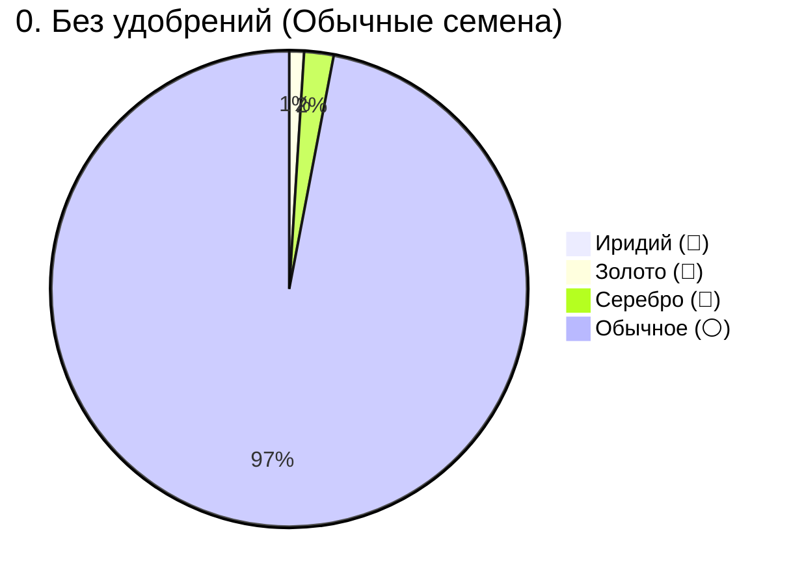
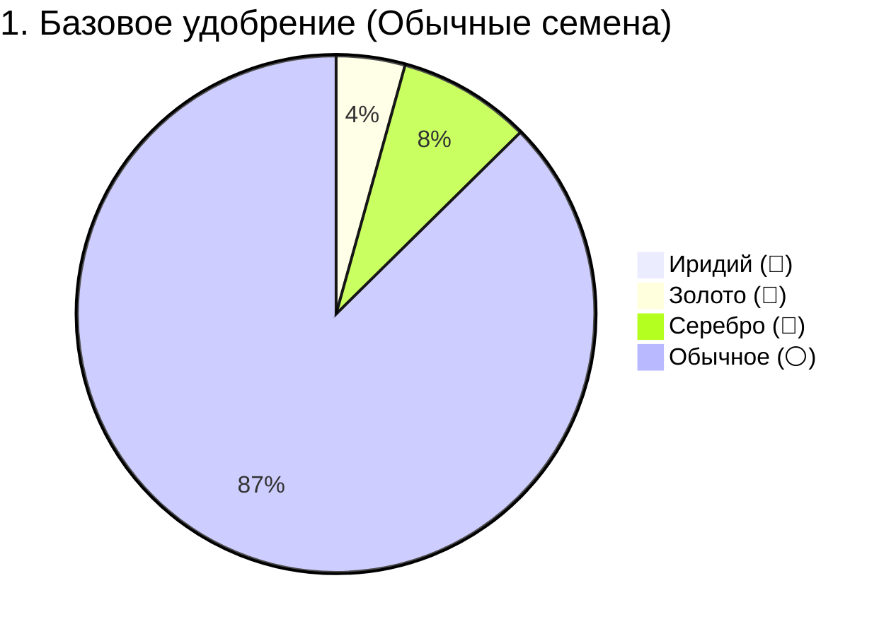
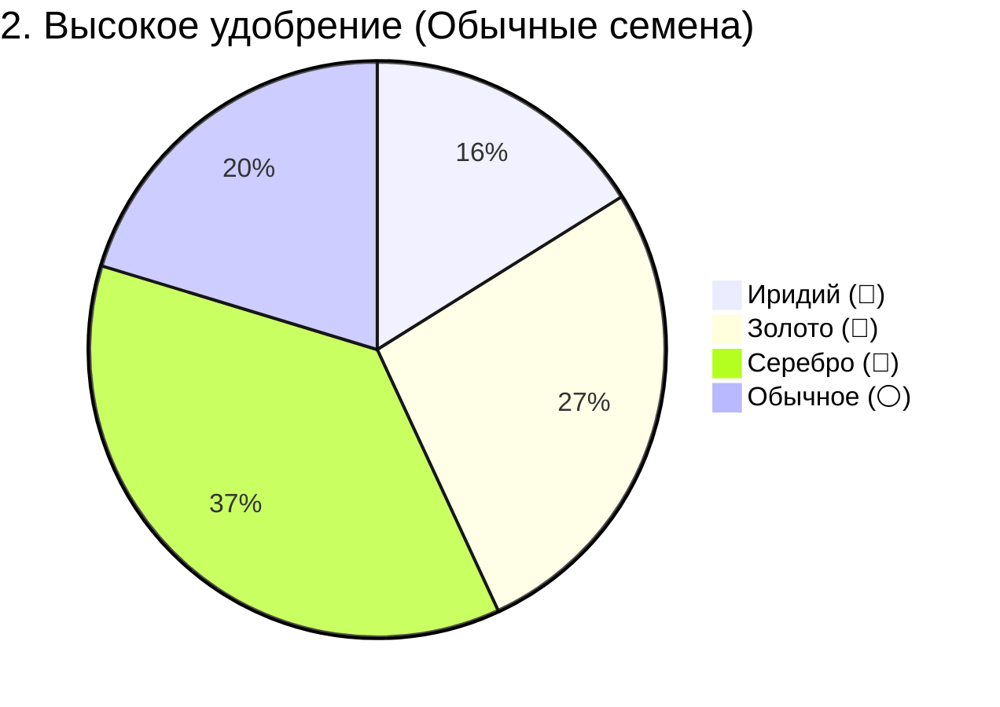
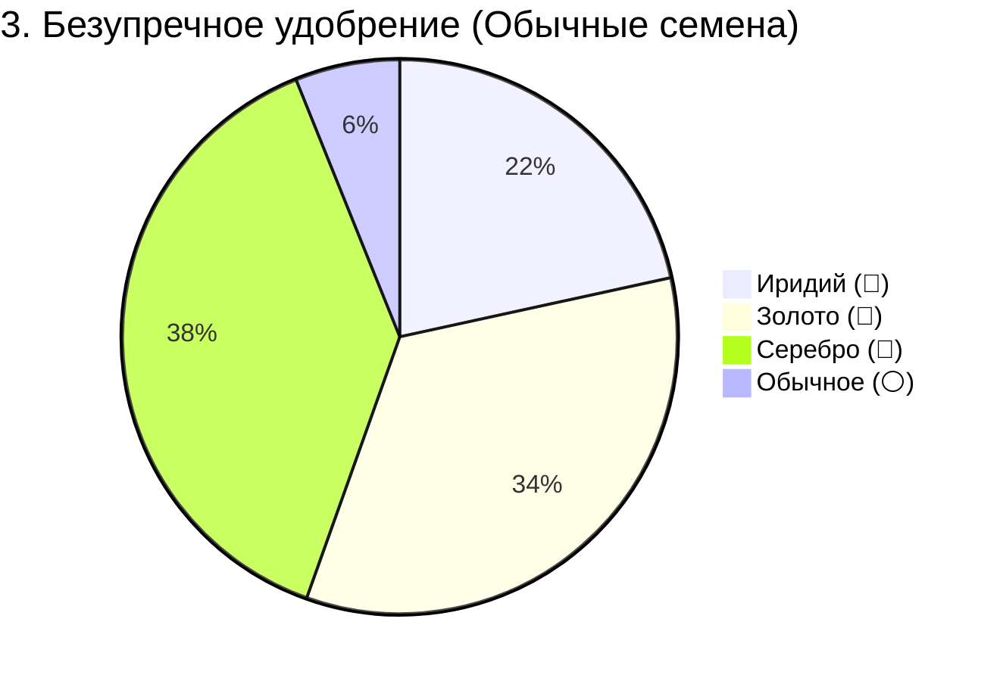

[🏠 Главная Wiki](../../../../wiki/README.md) ▸ [🌱 Земледелие](../../README.md) ▸ **Математика качества и шансы удобрений**

# 🔬 Математика качества урожая и вероятности удобрений

> **Категория:** 🌱 Земледелие и ремесло | **Файл кода:** `globalBlockEntityHandlers.js:1201-1226` | **Версия:** 1.20.1 Forge

Полный технический и практический разбор формулы расчёта качества урожая в сборке Society: точные шансы выпадения Серебра, Золота и Иридия для всех типов удобрений и уровней семян.

---

## ⚡ Главные выводы (TL;DR)

> [!TIP]
> **Ключевые факты о механике качества:**
> 1. **Иридий заблокирован без удобрений:** Получить иридиевый урожай (💎) в принципе невозможно без **Высокого** или **Безупречного** удобрения (`fertilizer ≥ 2`).
> 2. **Скрытый апгрейд обычных семян:** Если на грядку внесено Высокое или Безупречное удобрение, игра автоматически повышает качество любых обычных семян до 1★ (серебряных).
> 3. **Скачок качества с Безупречным удобрением:** На обычных семенах шанс качественного урожая возрастает с **3%** (без удобрений) до **94%** (с Безупречным), при этом **55%** урожая будет Золотом или Иридием.
> 4. **100% гарантия качества:** При посадке золотых семян на Высокое или Безупречное удобрение обычный урожай (0★) **полностью исключён** (вероятность 0%).

---

## 📐 1. Исходный код и алгоритм расчёта

В кодовой базе сборки (`game_data/startup_scripts/globalBlockEntityHandlers.js`) функция качества урожая реализована следующим образом:

```javascript
global.getCropQuality = (crop) => {
  let resolvedCrop = crop;
  if (crop.id === "farmersdelight:rice_panicles") 
    resolvedCrop = crop.getLevel().getBlock(crop.getPos().below());

  const fertilizer = getFertilizer(resolvedCrop);
  if (fertilizer == -1) return 0; // Изобильное удобрение сбрасывает качество в 0

  const qualityName = LevelData.get(resolvedCrop.getLevel(), resolvedCrop.getPos(), false);
  let seedQuality = qualityToInt(qualityName); // 0 = Обычные, 1 = Серебро, 2 = Золото, 3 = Иридий

  // Скрытый бонус: высокое удобрение подтягивает качество семян до 1-го уровня
  if (fertilizer > 1 && seedQuality < 1) seedQuality = 1;

  // Базовая переменная вероятности золота
  const goldChance =
    0.2 * ((seedQuality * 4.6) / 10) +
    0.2 * fertilizer * ((seedQuality * 4.6 + 2) / 12) +
    0.01;

  // Последовательные броски вероятности:
  if (fertilizer >= 2 && Math.random() < goldChance / 2) return 3; // 💎 ИРИДИЙ
  if (Math.random() < goldChance) return 2;                        // 🥇 ЗОЛОТО
  if (Math.random() < goldChance * 2) return 1;                    // 🥈 СЕРЕБРО
  return 0;                                                        // ⚪ ОБЫЧНОЕ
};
```

---

## 🧮 2. Математическая модель вероятностей

Так как проверки выполняются последовательно:

1. **Вероятность Иридия (💎 Quality 3):**
   * Доступна только при `fertilizer ≥ 2`.
   * `P(Иридий) = goldChance ÷ 2`
2. **Вероятность Золота (🥇 Quality 2):**
   * `P(Золото) = (1 - P(Иридий)) × goldChance`
3. **Вероятность Серебра (🥈 Quality 1):**
   * `P(Серебро) = (1 - P(Иридий)) × (1 - goldChance) × min(1.0, goldChance × 2)`
4. **Вероятность Обычного урожая (⚪ Quality 0):**
   * `P(Обычное) = 1.0 - P(Иридий) - P(Золото) - P(Серебро)`

---

## 📊 3. Сводные таблицы вероятностей

### Таблица 1: Обычные семена (0★) — покупные из магазина или мира
*Самый частый сценарий для большинства культур.*

| Удобрение | goldChance | 💎 Иридий | 🥇 Золото | 🥈 Серебро | ⚪ Обычное | 🎯 Всего качественного |
| :--- | :---: | :---: | :---: | :---: | :---: | :---: |
| **0. Без удобрения** | 1,0% | **0,0%** | 1,0% | 2,0% | **97,0%** | **3,0%** |
| **1. Базовое качество**<br>`low_quality_fertilizer` | 4,3% | **0,0%** | 4,3% | 8,3% | **87,4%** | **12,6%** |
| **2. Высокое качество**<br>`high_quality_fertilizer` | 32,2% | **16,1%** | 27,0% | 36,6% | **20,3%** | **79,7%** |
| **3. Безупречное качество**<br>`pristine_quality_fertilizer` | 43,2% | **21,6%** | 33,9% | 38,5% | **6,1%** | **93,9%** |

---

### Таблица 2: Серебряные семена (1★) — из экстрактора семян

| Удобрение | goldChance | 💎 Иридий | 🥇 Золото | 🥈 Серебро | ⚪ Обычное | 🎯 Всего качественного |
| :--- | :---: | :---: | :---: | :---: | :---: | :---: |
| **0. Без удобрения** | 10,2% | **0,0%** | 10,2% | 18,3% | **71,5%** | **28,5%** |
| **1. Базовое качество** | 21,2% | **0,0%** | 21,2% | 33,4% | **45,4%** | **54,6%** |
| **2. Высокое качество** | 32,2% | **16,1%** | 27,0% | 36,6% | **20,3%** | **79,7%** |
| **3. Безупречное качество** | 43,2% | **21,6%** | 33,9% | 38,5% | **6,1%** | **93,9%** |

> [!NOTE]
> Для удобрений 2 и 3 уровней результаты одинаковы для семян 0★ и 1★ из-за условия в коде:
> `if (fertilizer > 1 && seedQuality < 1) seedQuality = 1;`

---

### Таблица 3: Золотые семена (2★) — элитная селекция

| Удобрение | goldChance | 💎 Иридий | 🥇 Золото | 🥈 Серебро | ⚪ Обычное | 🎯 Всего качественного |
| :--- | :---: | :---: | :---: | :---: | :---: | :---: |
| **0. Без удобрения** | 19,4% | **0,0%** | 19,4% | 31,3% | **49,3%** | **50,7%** |
| **1. Базовое качество** | 38,1% | **0,0%** | 38,1% | 47,2% | **14,8%** | **85,2%** |
| **2. Высокое качество** | 56,7% | **28,4%** | 40,6% | 31,0% | **0,0%** | **100,0%** |
| **3. Безупречное качество** | 75,4% | **37,7%** | 47,0% | 15,3% | **0,0%** | **100,0%** |

---

### Таблица 4: Иридиевые семена (3★) — абсолютный максимум

| Удобрение | goldChance | 💎 Иридий | 🥇 Золото | 🥈 Серебро | ⚪ Обычное | 🎯 Всего качественного |
| :--- | :---: | :---: | :---: | :---: | :---: | :---: |
| **0. Без удобрения** | 28,6% | **0,0%** | 28,6% | 40,8% | **30,6%** | **69,4%** |
| **1. Базовое качество** | 54,9% | **0,0%** | 54,9% | 45,1% | **0,0%** | **100,0%** |
| **2. Высокое качество** | 81,3% | **40,6%** | 48,3% | 11,1% | **0,0%** | **100,0%** |
| **3. Безупречное качество** | 107,6% | **53,8%** | 46,2% | 0,0% | **0,0%** | **100,0%** |

---

## 📈 4. Наглядное сравнение эффективности (для обычных семян)









---

## 🧬 5. Механика качества семян и селекция (Seed Quality)

### Бывают ли семена разного качества?
**Да!** В сборке благодаря моду **Quality Food** семена (как и плоды) имеют 4 градации качества в NBT-теге `{quality_food: {quality: N}}`:
* ⚪ **Обычные семена (0★ / `NONE`):** Стандартные семена из магазина, дикой природы или обычного урожая.
* 🥈 **Серебряные семена (1★ / `IRON`):** Дают базовый `goldChance = 10,2%` даже без удобрений.
* 🥇 **Золотые семена (2★ / `GOLD`):** В сочетании с Высоким или Безупречным удобрением дают **100% качественный урожай** (0% обычных плодов).
* 💎 **Иридиевые семена (3★ / `DIAMOND`):** Максимальный тир селекции: с Безупречным удобрением **более 53%** урожая сразу становится Иридием.

---

### Как получить качественные семена?
Качественные семена нельзя купить у торговцев — их нужно **выводить самостоятельно** через **Аппарат для создания семян** (`society:seed_maker`):

```
3× Золотой урожай (🥇) ──► [ Аппарат для создания семян ] ──► 1–3× Золотые семена (🥇)
```

1. **Сохранение качества (`preserve_quality`):** При загрузке 3 плодов одинакового качества аппарат выдаёт семена соответствующего качества.
2. **Правило смешивания:** Если загрузить плоды разного качества, аппарат определит итоговое качество семян по **наименьшему** из загруженных плодов (`min(quality)`).
3. **Хранение в мире (`LevelData`):** При посадке качественных семян мод `Quality Food` записывает уровень качества прямо в координаты блока грядки (`de.cadentem.quality_food.capability.LevelData`). При созревании скрипт считывает этот уровень через `seedQuality` и рассчитывает качество итогового плода.

---

## 💡 6. Экономические выводы для игрока

1. **Базовое удобрение (`low_quality_fertilizer`):**
   * Даёт скромный суммарный шанс качества (**~13%**).
   * **Не способно** производить иридиевые плоды.
   * Подходит только на самых ранних этапах игры при дефиците ресурсов.

2. **Высокое удобрение (`high_quality_fertilizer`):**
   * Мощный скачок: качество урожая вырастает сразу до **~80%**.
   * Открывает доступ к **Иридию (16,1%)** и даёт высокий процент **Золота (27,0%)**.
   * Оптимальное соотношение цена/качество для большинства коммерческих полей.

3. **Безупречное удобрение (`pristine_quality_fertilizer`):**
   * Снижает шанс обычного плода до ничтожных **6,1%**.
   * Более половины всего сбора (**55,5%**) составляют Золото и Иридий.
   * Идеально для элитных монокультур (Древний плод, Дыня, Карамбола) под прямую продажу и для победы на фестивалях.

4. **Синергия с книгой «Качество земли» (`society:the_quality_of_the_earth`):**
   * Книга удваивает надбавку к цене за качество плодов.
   * В сочетании с Безупречным удобрением средняя доходность поля увеличивается в **3,0–3,5 раза** по сравнению с неудобренной пашней.
