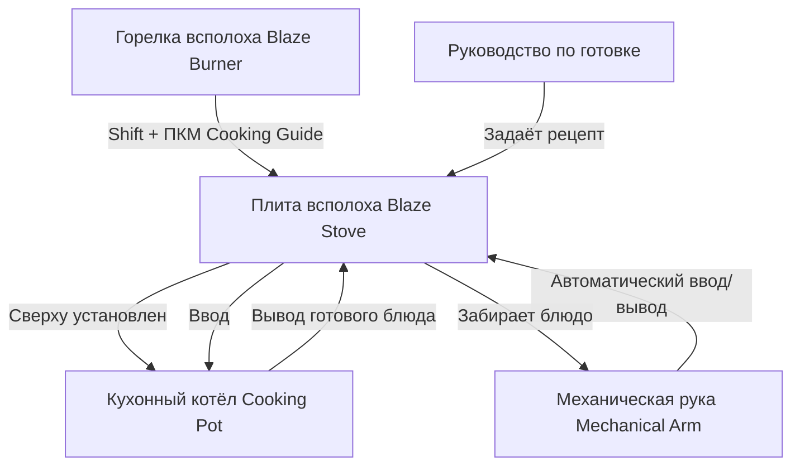

# Технический аудит механик мода Create: Central Kitchen (Level 1)

**Мод:** `Create: Central Kitchen` (`create_central_kitchen`)  
**Версия JAR:** `create_central_kitchen-1.20.1-for-create-6.0.8-1.5.0.jar`  
**Статус локализации:** ✅ 100% (180/180 строк)

---

## 1. Сводный реестр механик и доступность предметов в сборке

| Механика / Предмет | ID объекта | Статус в сборке | Способ получения / Интеграция |
| :--- | :--- | :---: | :--- |
| **Плита всполоха** | `create_central_kitchen:blaze_stove` | 🟢 Активен | `Shift + ПКМ` руководством по Горелке всполоха |
| **Руководство по готовке** | `create_central_kitchen:cooking_guide` | 🟢 Активен | 🛒 Покупка на Рынке (`market.json`) за `§e●` (крафт на верстаке удалён) |
| **Шахтёрское руководство** | `create_central_kitchen:miners_cooking_guide` | 🟡 Вторичный | Интеграция с котелками Miner's Delight |
| **Древесный сок & Ведро** | `create_central_kitchen:sap`, `...:sap_bucket` | 🟢 Активен | 🌲 Добыча сборщиком сока (`tapper.js`), пресс (`addPressingRecipes.js`) |
| **Сироп & Ведро** | `create_central_kitchen:syrup`, `...:syrup_bucket` | 🟢 Активен | 🍯 Переработка сока (варка / компактинг) |
| **Гель алоэ & Ведро** | `create_central_kitchen:aloe_gel`, `...:aloe_gel_bucket` | 🟢 Активен | 🧪 Рецепты миксера (`addMixerRecipes.js`) и розлива в бутылки |
| **Кусок тыквенного пирога** | `create_central_kitchen:pumpkin_pie_slice` | 🟢 Активен | ☕ Меню кафе Cozy Cafe (`menu/.../pumpkin_pie_slice.json`), цена 21 |
| **Полуфабрикаты сборки Create** | `create_central_kitchen:incomplete_*` | 🟢 Активен | ⚙️ Конвейерная поэтапная сборка пирогов, бургеров и сэндвичей |
| **Авто-разделочная доска** | `CuttingBoardDeployingRecipe` | 🟢 Активен | 🔪 Автономный активатор (Deployer) над разделочной доской FD |
| **Авто-сбор урожая** | `HarvesterMovementBehaviorMixin` | 🟢 Активен | 🚜 Механический комбайн Create собирает томаты, лук, рис и кусты FD |
| **Умная корзина** | `SmartBasketBlockEntity` | 🟢 Активен | 🧺 Сбор предметов прямо с конвейерных лент Create |
| **Куски тортов и пирогов (10 шт.)** | `...:sweet_berry_cake_slice`, `...:aloe_cake_slice` и др. | ⚠️ **ОТКЛЮЧЕНО** | Скрыты автором сборки в `globalRemovedItems.js:L630-640` |
| **Иконка вкладки** | `create_central_kitchen:creative_tab_icon` | ⚠️ **ОТКЛЮЧЕНО** | Технический предмет (забанен в `handleBinBans.js`) |

---

## 2. Глубокий реверс-инжиниринг ключевых систем

### 1️⃣ Плита всполоха (`BlazeStoveBlockEntity` / `BlazeStoveBlock`)
* **Превращение:** Игрок нажимает `Shift + ПКМ` по активной Горелке всполоха (`create:blaze_burner`), держа в руке `Руководство по готовке` (`create_central_kitchen:cooking_guide`). Горелка превращается в Плиту всполоха.
* **Снятие:** Нажатие `Shift + ПКМ` гаечным ключом Create (`create:wrench`) снимает установленное руководство и возвращает блок в состояние обычной горелки.
* **Интерфейс рецепта:** Нажатие `ПКМ` пустой рукой или руководством открывает GUI `BlazeStoveGuideMenu`. В нём игрок настраивает целевой рецепт для кухонного котла (поддерживает перетаскивание предметов-призраков из JEI).
* **Мост для Механической руки (Mechanical Arm):**
  - Кухонный котёл Farmer's Delight сам по себе не предоставляет интерфейса взаимодействия для Механической руки Create.
  - Плита всполоха выступает интеллектуальным прокси: Механическая рука видит Плиту всполоха как точку ввода (`INPUT`) и вывода (`OUTPUT`).
  - Рука автоматически приносит ровно те ингредиенты, которые указаны в руководстве, и забирает готовое блюдо или неподходящие предметы.
* **Уровни нагрева (`HEAT_LEVEL`):**
  - Обычный (без топлива): базовое слабое тепло для медленной готовки.
  - Нагретый (уголь, дрова): стандартная скорость готовки.
  - Перегретый (Superheated, торт всполоха): сверхбыстрая варка, но для открытой жарки без котла перегрев сжигает пищу (`BlazeStoveBlockEntity.tick`).

---

### 2️⃣ Разделочная доска и Автономный активатор (`CuttingBoardDeployingCategory`)
* **Механика:** Размещение Разделочной доски Farmer's Delight (`farmersdelight:cutting_board`) под Автономным активатором Create (`create:deployer`).
* **Логика работы:**
  - Если в руку Deployer вложен кухонный нож (`#farmersdelight:tools/knives`) или топор, активатор автоматически нарезает выложенные на доску предметы (мясо, овощи, рыбу, дерево).
  - Мод регистрирует специальную категорию JEI `recipe.create_central_kitchen.cutting_board_deploying` («Автономное разделывание»), визуализирующую все рецепты нарезки.

---

### 3️⃣ Комбайн и сбор урожая FD (`HarvesterMovementBehaviorMixin`)
* Механический комбайн Create (`create:mechanical_harvester`) на подвижных структурах (ветряки, повозки, карусели):
  - Перехватывает блоки Farmer's Delight (томаты `farmersdelight:budding_tomatoes`, кусты риса `farmersdelight:rice_panicles`).
  - Собирает спелый урожай и сбрасывает в прикреплённый сундук, **сохраняя нижний куст неповреждённым** (автоматический сбор без необходимости повторной посадки семян).

---

### 4️⃣ Умные корзины (`SmartBasketBlockEntity` / `BasketBlockEntityMixin`)
* Корзина Farmer's Delight (`farmersdelight:basket`), установленная вплотную к механическому ремню Create (`create:belt`):
  - Перехватывает проплывающие предметы с ремня без использования воронок или фильтров.
  - Может размещаться вертикально (сбор сверху) или горизонтально (захват сбоку конвейера).

---

## 3. Специфика сборки Sunlit Valley и фактчекинг KubeJS

### 🌲 Система древесного сока (`tapper.js` $\rightarrow$ `sap` $\rightarrow$ `syrup`)
* В файле `startup_scripts/customMachines/tapper.js` сборки зарегистрирован кастомный сборщик сока (Tapper):
  - При установке на кленовые и берёзовые деревья генерирует жидкость `create_central_kitchen:sap` (Древесный сок).
  - Древесный сок отжимается прессом Create (`server_scripts/recipes/addPressingRecipes.js:L31`) и уваривается в `create_central_kitchen:syrup` (Сироп).

### 🧪 Линия геля алоэ (`aloe_gel`)
* В `server_scripts/recipes/addMixerRecipes.js:L346`:
  - Листья алоэ мода Atmospheric перерабатываются в миксере Create в жидкость `create_central_kitchen:aloe_gel`.
  - В `addBottleRecipes.js:L104` гель алоэ автоматически разливается по бутылочкам для кулинарии и медицины.

### 💰 Экономика и покупка Руководства по готовке
* Крафт `create_central_kitchen:cooking_guide` удалён в `removeRecipes.js:L624`.
* Руководство продаётся у Торговца на Рынке (`kubejs/data/society_trading/shops/market.json:L1133`).
* Предмет защищён от случайной продажи в Shipping Bin через `handleBinBans.js:L222`.

---

## 4. Рекомендации по оформлению подсказок (Tooltips)

В клиентский скрипт `kubejs_scripts/client/createCentralKitchenTooltips.js` включены только действительно необходимые подсказки для 2 ключевых предметов автоматизации, исключая технический шум для фоновых жидкостей:

1. **`create_central_kitchen:cooking_guide` (Руководство по готовке):**
   * *«Модуль автоматизации кулинарии для кухонного котла.»*
   * *«§6Shift + ПКМ по Горелке всполоха:§r превращает её в Плиту всполоха.»*
   * *«§6ПКМ:§r настройка рецепта (поддерживает выбор блюда из JEI).»*
   * *«§b⚙️ Позволяет Механической руке загружать ингредиенты в котёл.§r»*

2. **`create_central_kitchen:blaze_stove` (Плита всполоха):**
   * *«Интеллектуальный источник жара для кухонного котла.»*
   * *«§6ПКМ:§r открыть интерфейс настройки рецепта.»*
   * *«§6Shift + ПКМ гаечным ключом:§r снять руководство и вернуть обычную горелку.»*
   * *«§a🤖 Служит точкой ввода/вывода для Механической руки Create.§r»*

