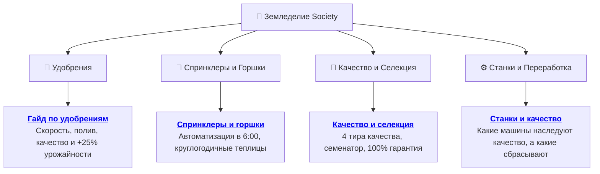

[🏠 Главная Wiki](../README.md) ▸ **🌱 Земледелие и Агрономия**

# 🌱 Раздел: Земледелие, Удобрения и Автоматизация

> **Категория:** 🌱 Земледелие | **Статей в разделе:** 4 | **Версия:** 1.20.1 Forge

Добро пожаловать в полное руководство по агрономии и автоматизации фермерства в Society. Здесь собраны подробные практические гайды, основанные на реверс-инжиниринге игрового кода и реальных игровых цепочках.

---

## 🗺️ Статьи раздела

### 📚 Список руководств:

1. 📄 **[🧪 Полный гайд по удобрениям: Скорость, Полив, Качество и Урожайность](fertilizers.md)**
   * Все 4 категории удобрений: когда использовать каждое.
   * Скорость (-1, -2, -3 дня) и сохранение урожая в конце сезона.
   * Роскошное увлажнение: 100% вечный автополив.
   * Изобильное удобрение: +25% к сбору и применение на сырье.

2. 📄 **[🚿 Спринклеры и Садовые горшки: Автоматизация и круглогодичные фермы](sprinklers_and_pots.md)**
   * Тиры спринклеров (3×3, 5×5, 7×7, 9×9) и утренний полив в 6:00.
   * Утопленный монтаж в уровень земли.
   * Садовые горшки: игнорирование сезонов и синергия с удобрением полива.

3. 📄 **[💎 Качество урожая и Селекция семян](crop_quality_and_breeding.md)**
   * Шансы Серебра, Золота и Иридия для всех комбинаций.
   * Как получать качественные семена через Аппарат для создания семян.
   * Стратегия 100% гарантии качества (0% обычных плодов).
   * Экономика и удвоение дохода с книгой «Качество земли».

4. 📄 **[⚙️ Станки и переработка: Какие машины сохраняют качество сырья?](machines_quality_guide.md)**
   * Станки с наследованием качества (Сырный пресс, Майонез, Коптильня, Семенатор).
   * Станки со сбросом качества в 0★ (Банка консервации, Винодельческая бочка, Сушилка, Маслобойка, Котлы).
   * Памятка оптимальных посадок под Изобильное vs Безупречное удобрение.

---

## 💡 Полезные советы агроному

> [!TIP]
> * **Используйте Вилы (`society:pitchfork`):** Если нужно сменить тип удобрения на грядке, снимите старое вилами — у вас будет 50% шанс вернуть его в инвентарь.
> * **Изобильное vs Безупречное:** Для монокультур под прямую продажу в магазин всегда используйте Безупречное удобрение (ради Иридия и Золота). Для культур, идущих в переработку (мука, сахар, сок), используйте Изобильное (ради +25% количества).
