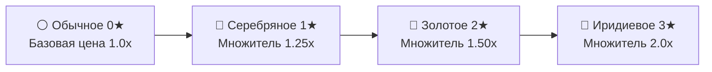

[🏠 Главная Wiki](../README.md) ▸ [🌱 Земледелие](README.md) ▸ **Качество урожая и Селекция семян**

# 💎 Качество урожая и Селекция семян

> **Категория:** 🌱 Земледелие и селекция | **Сложность:** ⭐⭐ Средняя | **Версия:** 1.20.1 Forge

В Society весь урожай делится на 4 уровня качества: **Обычное** (⚪), **Серебряное** (🥈), **Золотое** (🥇) и **Иридиевое** (💎). Чем выше качество плода, тем дороже он продаётся торговцам и тем больше пользы приносит при кулинарии и на праздничных ярмарках.

---

## ⚡ Быстрая шпаргалка (TL;DR)

> [!TIP]
> **Как стабильно получать 100% качественный урожай?**
> 1. **Иридий без удобрений невозможен:** Чтобы в поле появился хотя бы один иридиевый плод, обязательно внесите **Высокое** или **Безупречное** удобрение.
> 2. **Аппарат для создания семян:** Загрузите 3 золотых плода в **Аппарат для создания семян** (`society:seed_maker`), чтобы получить **Золотые семена** (2★).
> 3. **100% гарантия качества:** Посадив Золотые семена на Высокое или Безупречное удобрение, вы **полностью исключите обычный урожай (0%)** — каждый собранный плод будет Серебром, Золотом или Иридием.
> 4. **Книга «Качество земли»:** Прочтите книгу `society:the_quality_of_the_earth` — она удваивает бонус к стоимости качественных продуктов.

---

## 🧬 1. Четыре уровня качества



* ⚪ **Обычное (0★):** Базовые плоды без модификаторов.
* 🥈 **Серебряное (1★):** Приносит +25% к базовой стоимости.
* 🥇 **Золотое (2★):** Приносит +50% к базовой стоимости, требуется для выполнения элитных заказов.
* 💎 **Иридиевое (3★):** Удваивает базовую стоимость (+100%), даёт максимум очков на фестивалях и выставках.

---

## 📊 2. Точные шансы качества для всех комбинаций

### Сценарий А: Обычные семена (0★) — покупка в магазине или сбор в мире

| Удобрение на грядке | 💎 Иридий | 🥇 Золото | 🥈 Серебро | ⚪ Обычное | 🎯 Всего качественного |
| :--- | :---: | :---: | :---: | :---: | :---: |
| **Без удобрений** | **0%** | 1,0% | 2,0% | **97,0%** | **3,0%** |
| **Базовое качество** | **0%** | 4,3% | 8,3% | **87,4%** | **12,6%** |
| **Высокое качество** | **16,1%** | 27,0% | 36,6% | **20,3%** | **79,7%** |
| **Безупречное качество** | **21,6%** | 33,9% | 38,5% | **6,1%** | **93,9%** |

---

### Сценарий Б: Золотые семена (2★) — результат работы Семенатора

| Удобрение на грядке | 💎 Иридий | 🥇 Золото | 🥈 Серебро | ⚪ Обычное | 🎯 Всего качественного |
| :--- | :---: | :---: | :---: | :---: | :---: |
| **Без удобрений** | **0%** | 19,4% | 31,3% | **49,3%** | **50,7%** |
| **Базовое качество** | **0%** | 38,1% | 47,2% | **14,8%** | **85,2%** |
| **Высокое качество** | **28,4%** | 40,6% | 31,0% | **0,0%** | **100,0%** |
| **Безупречное качество** | **37,7%** | 47,0% | 15,3% | **0,0%** | **100,0%** |

---

### Сценарий В: Иридиевые семена (3★) — вершина селекции

| Удобрение на грядке | 💎 Иридий | 🥇 Золото | 🥈 Серебро | ⚪ Обычное | 🎯 Всего качественного |
| :--- | :---: | :---: | :---: | :---: | :---: |
| **Высокое качество** | **40,6%** | 48,3% | 11,1% | **0,0%** | **100,0%** |
| **Безупречное качество** | **53,8%** | 46,2% | 0,0% | **0,0%** | **100,0%** |

---

## 🌾 3. Как работает Аппарат для создания семян (Seed Maker)

```text
3× Золотая культура (🥇) ──► [ Аппарат для создания семян ] ──► 1–3× Золотые семена (🥇)
```

1. **Сохранение качества:** Поместите в аппарат 3 плода одного качества. На выходе вы получите от 1 до 3 пакетов семян того же ранга.
2. **Правило наименьшего ранга:** Если поместить плоды разного качества, аппарат выдаст семена по **минимальному** качеству из загруженных.
3. **Бесконечный элитный цикл:** С каждого золотого урожая откладывайте часть плодов в аппарат для создания семян. Вы получите полностью самовоспроизводящуюся золотую плантацию со 100% качественным сбором.

---

## 💰 4. Экономический эффект и максимизация дохода

* **Книга «Качество земли» (`society:the_quality_of_the_earth`):** Удваивает надбавку за качество. 
* В сочетании с Безупречным удобрением средняя доходность поля увеличивается в **3,0–3,5 раза** по сравнению с неудобренной пашней.
* **Иридиевые культуры:** Продавайте напрямую через Доставку (`Shipping Bin`) или используйте на сезонных фестивалях для гарантированной победы в конкурсах качества.

---

<details>
<summary><b>🔬 Технические детали (формулы и переменные кода)</b></summary>

Логика расчёта качества из `globalBlockEntityHandlers.js`:
```javascript
if (fertilizer > 1 && seedQuality < 1) seedQuality = 1;
const goldChance =
  0.2 * ((seedQuality * 4.6) / 10) +
  0.2 * fertilizer * ((seedQuality * 4.6 + 2) / 12) +
  0.01;

if (fertilizer >= 2 && Math.random() < goldChance / 2) return 3; // 💎 Иридий
if (Math.random() < goldChance) return 2;                        // 🥇 Золото
if (Math.random() < goldChance * 2) return 1;                    // 🥈 Серебро
return 0;                                                        // ⚪ Обычное
```
</details>
