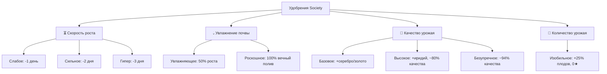

[🏠 Главная Wiki](../README.md) ▸ [🌱 Земледелие](README.md) ▸ **Полный гайд по удобрениям**

# 🧪 Полный гайд по удобрениям: Скорость, Полив, Качество и Урожайность

> **Категория:** 🌱 Земледелие и агрономия | **Сложность:** ⭐ Начальная | **Версия:** 1.20.1 Forge

В сборке Society удобрения — это ключевой инструмент для ускорения созревания культур, автоматизации полива и получения высококачественного урожая (Серебро, Золото, Иридий).

---

## ⚡ Быстрая шпаргалка (TL;DR)

> [!TIP]
> **Какое удобрение выбрать под вашу задачу?**
> * 🌾 **Для прямой продажи плодов:** Используйте **Безупречное удобрение** — до **94%** урожая будет качественным, открывая доступ к Иридию (💎).
> * ⚙️ **Для станков без сохранения качества (пресс, сушилка, бочки):** Используйте **Изобильное удобрение** — оно даёт **+25% к количеству** сырья при сборе.
> * 🏠 **Для закрытых помещений и горшков:** Используйте **Роскошное увлажняющее удобрение** — грядка **никогда не высыхает** (100% автополив без спринклеров и воды).
> * ⏳ **Для культур с долгим ростом в конце сезона:** Используйте **Гипер-удобрение** — сокращает созревание на **3 дня**, спасая урожай от гибели при смене времени года.

---

## 🧭 1. Правила внесения и замены удобрений

1. **Как удобрять:** Нажмите **ПКМ** с удобрением в руке по вспаханной пашне (`Farmland`) до или после посадки семян.
2. **Лимит на грядку:** На одной грядке может действовать **только одно удобрение**. Повторное внесение другого удобрения перезаписывает предыдущее.
3. **Сохранение при сборе:** Удобренная пашня сохраняет свои свойства после сбора урожая и готова к следующей посадке.
4. **Возврат удобрения:** Если вы хотите освободить грядку, используйте **Вилы** (`society:pitchfork`) — они с 50% шансом возвращают потраченное удобрение в инвентарь.

---

## 📋 2. Четыре типа удобрений



---

### ⏳ Категория 1: Удобрения скорости созревания

Позволяют сократить фазы роста культур. Незаменимы в конце сезона, когда растению не хватает нескольких дней до смены погоды.

| Удобрение | Эффект сокращения | Идеальное применение |
| :--- | :---: | :--- |
| **Слабое удобрение**<br>`weak_fertilizer` | **-1 день** | Ранняя игра, быстрые весенние культуры (Пастернак, Редис). |
| **Сильное удобрение**<br>`strong_fertilizer` | **-2 дня** | Средние культуры (Цветная капуста, Дыня, Тыква). |
| **Гипер-удобрение**<br>`hyper_fertilizer` | **-3 дня** | Длинные культуры (Древний плод, Карамбола) для получения экстра-урожая за сезон. |

> [!NOTE]
> Удобрения скорости не влияют на качество плодов, но позволяют собрать на 1–2 урожая больше за один сезон.

---

### 💧 Категория 2: Удобрения увлажнения почвы

Устраняют необходимость подводить воду или ставить спринклеры.

| Удобрение | Эффект полива | Особенности и синергия |
| :--- | :---: | :--- |
| **Увлажняющее удобрение**<br>`hydrating_fertilizer` | **50% времени роста** | Держит влагу первую половину созревания; затем требует полива. |
| **Роскошное увлажняющее удобрение**<br>`deluxe_hydrating_fertilizer` | **100% вечный автополив** | **Грядка никогда не высыхает.** Идеально для **Садовых горщиков** (`garden_pot`), которые не поливаются спринклерами. |

---

### 💎 Категория 3: Удобрения качества урожая

Повышают шанс вырастить плоды Серебряного (🥈), Золотого (🥇) и Иридиевого (💎) качества.

| Удобрение | 💎 Иридий | 🥇 Золото | 🥈 Серебро | ⚪ Обычное | 🎯 Итого качественного |
| :--- | :---: | :---: | :---: | :---: | :---: |
| **Без удобрений** | **0%** | 1,0% | 2,0% | **97,0%** | **3,0%** |
| **Базовое качество**<br>`low_quality_fertilizer` | **0%** | 4,3% | 8,3% | **87,4%** | **12,6%** |
| **Высокое качество**<br>`high_quality_fertilizer` | **16,1%** | 27,0% | 36,6% | **20,3%** | **79,7%** |
| **Безупречное качество**<br>`pristine_quality_fertilizer` | **21,6%** | 33,9% | 38,5% | **6,1%** | **93,9%** |

> [!IMPORTANT]
> * **Иридий заблокирован без удобрений:** Получить плоды иридиевого ранга невозможно без Высокого или Безупречного удобрения.
> * **Скрытый бонус:** Высокое и Безупречное удобрение автоматически повышают качество обычных покупных семян до уровня Серебряных (1★).

---

### 🌾 Категория 4: Изобильное удобрение (Количество)

* **Изобильное удобрение** (`bountiful_fertilizer`):
  * **+25% шанс** получить дополнительный плод при каждом сборе урожая.
  * ⚠️ **Сбрасывает качество в 0★:** Урожай **всегда** будет обычного ранга.

> [!TIP]
> **Где использовать Изобильное удобрение с максимальной выгодой?**
> На сырье для крафтов, ремесленных бочек и прессов, которые не учитывают качество входного продукта (например, изготовление муки, сахара, корма для животных, семян и соков).

---

## 🏆 3. Стратегии и выбор компромисса

```text
Прямая продажа / Ярмарка ──► Безупречное удобрение (94% качества, 💎 Иридий)
Массовая переработка     ──► Изобильное удобрение (+25% к объёму сырья)
Ферма в доме / Подвале   ──► Роскошное увлажнение (0 затрат времени на полив)
Конец сезона (дефицит дней) ──► Гипер-удобрение (ускорение созревания на 3 дня)
```

---

<details>
<summary><b>🔬 Технические детали (формулы и переменные кода)</b></summary>

Расчёт качества реализован в `globalBlockEntityHandlers.js:1201-1226`:
```javascript
if (fertilizer > 1 && seedQuality < 1) seedQuality = 1;
const goldChance = 0.2 * ((seedQuality * 4.6) / 10) + 0.2 * fertilizer * ((seedQuality * 4.6 + 2) / 12) + 0.01;
if (fertilizer >= 2 && Math.random() < goldChance / 2) return 3; // Иридий
if (Math.random() < goldChance) return 2;                        // Золото
if (Math.random() < goldChance * 2) return 1;                    // Серебро
return 0;                                                        // Обычное
```
</details>
