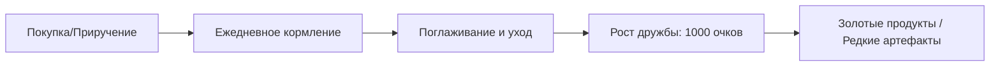

[🏠 Главная Wiki](../README.md) ▸ **🐾 Животноводство и питомцы**

# 🐾 Раздел: Животноводство и Питомцы

Добро пожаловать в руководство по животноводству сборки **Society: Sunlit Valley**!
В этой сборке животные — это не просто мобы для убоя, а полноценная фермерская механика с уровнем дружбы, настроением, качеством продукции, автоматическими кормушками и уникальными дарами питомцев.

---

## 📑 Статьи раздела:
* 📄 [**Гайд по фермерским животным**](animals_guide.md) — Тиры сложности, механика тесноты (3x3), уход, корма и как получать Золотую продукцию.
* 📄 [**Питомцы и уникальные артефакты**](pets_guide.md) — 15 видов питомцев, максимальная преданность и их редкие дары.
* 📄 [**Автоматизация фермы**](automation.md) — Радиусы кормушек, чесалок и автосборщиков шерсти и молока.

---

