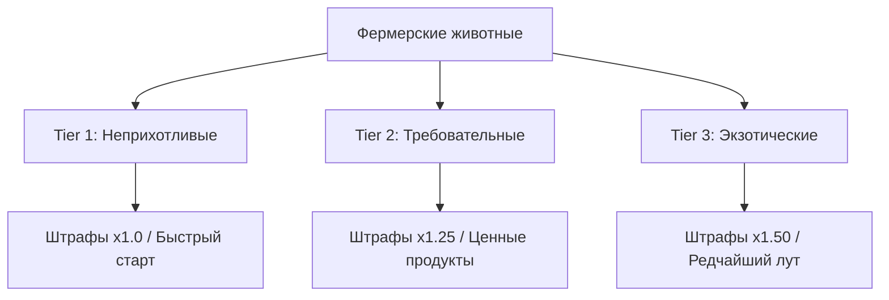

[🏠 Главная Wiki](../README.md) ▸ [🐾 Животноводство](README.md) ▸ **Гайд по фермерским животным**

# 🐮 Полный гайд по фермерским животным

> **Категория:** 🐾 Животноводство | **Сложность:** ⭐⭐ Средняя | **Версия:** Society 1.20.1

В сборке **Society: Sunlit Valley** животные требуют постоянной заботы, правильного пространства и регулярного кормления. В благодарность они дают высококачественные ресурсы, редкие ингредиенты для кулинарии и золотую продукцию.

---

> [!TIP]
> **Быстрая памятка фермеру (TL;DR):**
> 1. **Простор:** Не держите больше **5 животных** в кубе **3 × 3 блока** (иначе включится дебафф скученности).
> 2. **Уход:** Гладьте животных каждый день (ПКМ пустой рукой).
> 3. **Кормление:** Кормушка кормит в радиусе **±6 блоков** (зона **13 × 13 × 13 блоков**).
> 4. **Максимум дружбы:** При достижении **1000 очков** привязанности животные дают максимальный шанс золотой продукции.

---

## 📑 1. Классификация животных: Сложность содержания (Tiers)

Все 44 вида фермерских животных разделены на 3 уровня сложности. Чем выше уровень, тем чувствительнее животное к голоду, холоду и тесноте:



### 🟢 Tier 1 — Базовые животные (Множитель штрафов ×1.0)
Идеальны для старта вашей фермы. Медленно теряют настроение и прощают мелкие ошибки:
* **Представители:** Корова, Овца, Курица, Утка, Снежная свинья, Мухоморная корова, Карликовая овечка, Летучая мышь, Кошениль, Кальмары.

### 🟡 Tier 2 — Продвинутые животные (Множитель штрафов ×1.25)
Требуют просторных загонов и качественного корма:
* **Представители:** Свинья, Шерстяная корова, Бизон, Енот, Красная панда, Большая панда, Водяной буйвол, Гусь, Кролик, Белка, Индюк, Черепаха.

### 🔴 Tier 3 — Экзотические и капризные мобы (Множитель штрафов ×1.50)
Очень чувствительны к условиям содержания, но производят уникальные ингредиенты:
* **Представители:** Коза, Мублюм, Маммутилейшн, Губер, Кранчер, Домашний трибулл, Фростбайтер, Враптор, Чэппл, Фламинго, Пингвин, Галлираптор, Шима-энага.

---

## 🚫 2. Механика «Тесноты» (Правило 5 соседей)

В сборке действует умный алгоритм проверки жизненного пространства.

```text
       ┌───────────────┐
       │   Зона 3x3    │
       │  [🐄][🐄][🐄]  │  ❌ Если в этом объеме находится
       │  [🐄][🐄][🐄]  │     6 или более животных —
       │  [🐄][   ][  ] │     включается состояние СКУЧЕННОСТИ!
       └───────────────┘
```

> [!WARNING]
> **Что происходит при скученности (Cramped)?**
> * Животное мгновенно теряет **96 очков настроения** (из 256).
> * **Штраф дружбы:** Попытка погладить такое животное снимет **-25 очков привязанности** вместо бонуса, и животное разозлится!
> * **Решение:** Делайте загоны размером минимум **7 × 7 блоков** для группы из 6–8 животных.

---

## 🌾 3. Кормление и автоматические машины

### Виды кормов:
| Корм | Бонус настроения | Эффект |
| :--- | :---: | :--- |
| **Обычный корм** (`animal_feed`) | +0 | Базовое насыщение на 2 игровых дня |
| **Корм с маной** (`mana_feed`) | +30 | Ускоряет восстановление настроения |
| **Сахарный корм** (`candied_animal_feed`) | +100 | Максимальный прирост счастья |

### ⚙️ Автоматическая кормушка (`society:feeding_trough`)
* **Зона действия:** **13 × 13 × 13 блоков** (±6 блоков в каждую сторону от кормушки).
* **Интервал проверки:** Каждые **15 секунд**.
* **Умный расход:** Кормушка в первую очередь тратит самый ценный корм из своего инвентаря!
* **Вместимость:** 9 слотов (визуально заполняется по мере наполнения).

> [!NOTE]
> Кормушка автоматически лечит животных на **4 HP** при каждом приёме пищи.

---

## 💖 4. Прогрессия дружбы и Золотая продукция

Каждое животное накапливает до **1000 очков привязанности (Affection)**:
1. **0–200 очков:** Обычное сырьё (молоко, шерсть, перья).
2. **200–600 очков:** Повышенное количество дропа.
3. **600–1000 очков:** Появляется шанс получить **Золотое молоко**, **Золотую шерсть** и деликатесы высшего сорта.

---

## ❓ Часто задаваемые вопросы (FAQ)

<details>
<summary><b>Как узнать точный уровень счастья животного?</b></summary>

Используйте прибор **Сканер настроения (Mood Scanner)**. При наведении на животное он отобразит точную шкалу настроения и подсветит скученных животных эффектом Свечения.
</details>

<details>
<summary><b>Почему животное злится при поглаживании?</b></summary>

Проверьте два фактора:
1. Животное голодно (прошло более 2 дней без еды).
2. Животным тесно (рядом с ним в радиусе 1.1 блока находится 5 и более других мобов).
</details>
